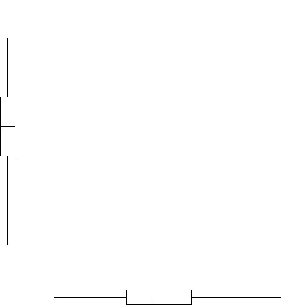

# ----Loading Packages, echo = FALSE---------------------


```r
library(readr)
library(haven)
library(tidyverse)
library(lavaan)
library(psych)
library(mirt)
library(rsample)
library(GPArotation)
library(MBESS)
library(REdaS)
library(faoutlier)
```

# ----Uploading data and cleaning------------------------
 Uploading raw data


```r
full.data <- readxl::read_xlsx("spssdata.xlsx", col_names = TRUE)
```

 Remove empty rows


```r
full.data <- full.data[1:181, ]
```

 Selecting only SPSS-related columns


```r
  # Do not select StudentIDE col bc it'd be included with EFA/CFA
  # Num of rows corresponds to StudentIDE
spss.data <- full.data %>% 
             select(SPSS1E,
                    SPSS2E,
                    SPSS3E,
                    SPSS4E,
                    SPSS5E,
                    SPSS6E,
                    SPSS7E,
                    SPSS8E,
                    SPSS9E,
                    SPSS10E)
```

 Reverse code SPSS items 2, 3, 10


```r
spss.data$SPSS2E <- car::recode(spss.data$SPSS2E, "1 = 5; 2 = 4; 3 = 3; 4 = 2; 5 = 1")
spss.data$SPSS3E <- car::recode(spss.data$SPSS3E, "1 = 5; 2 = 4; 3 = 3; 4 = 2; 5 = 1")
spss.data$SPSS10E <- car::recode(spss.data$SPSS10E, "1 = 5; 2 = 4; 3 = 3; 4 = 2; 5 = 1")
```

# ----Descriptive Stats----------------------------------


```r
describe(spss.data)
```

```
##         vars   n mean   sd median trimmed  mad min max range  skew kurtosis   se
## SPSS1E     1 180 3.49 1.04      4    3.55 1.48   1   5     4 -0.44    -0.30 0.08
## SPSS2E     2 181 3.67 1.11      4    3.76 1.48   1   5     4 -0.58    -0.58 0.08
## SPSS3E     3 180 3.51 1.11      4    3.58 1.48   1   5     4 -0.53    -0.43 0.08
## SPSS4E     4 181 3.38 0.99      3    3.39 1.48   1   5     4 -0.30    -0.42 0.07
## SPSS5E     5 180 3.70 1.05      4    3.79 1.48   1   5     4 -0.52    -0.27 0.08
## SPSS6E     6 181 3.52 1.22      4    3.64 1.48   1   5     4 -0.51    -0.60 0.09
## SPSS7E     7 181 3.32 1.18      3    3.34 1.48   1   5     4 -0.13    -0.98 0.09
## SPSS8E     8 181 3.57 0.98      4    3.63 1.48   1   5     4 -0.40    -0.22 0.07
## SPSS9E     9 181 3.43 1.03      3    3.46 1.48   1   5     4 -0.25    -0.44 0.08
## SPSS10E   10 181 3.41 1.13      4    3.46 1.48   1   5     4 -0.33    -0.71 0.08
```

 Contingency table of the counts


```r
table(spss.data$SPSS1E)
```

```
## 
##  1  2  3  4  5 
##  8 21 55 66 30
```

```r
table(spss.data$SPSS2E)
```

```
## 
##  1  2  3  4  5 
##  6 28 31 70 46
```

```r
table(spss.data$SPSS3E)
```

```
## 
##  1  2  3  4  5 
## 10 24 43 70 33
```

```r
table(spss.data$SPSS4E)
```

```
## 
##  1  2  3  4  5 
##  6 28 59 67 21
```

```r
table(spss.data$SPSS5E)
```

```
## 
##  1  2  3  4  5 
##  6 15 52 61 46
```

```r
table(spss.data$SPSS6E)
```

```
## 
##  1  2  3  4  5 
## 16 17 51 50 47
```

```r
table(spss.data$SPSS7E)
```

```
## 
##  1  2  3  4  5 
## 10 40 48 48 35
```

```r
table(spss.data$SPSS8E)
```

```
## 
##  1  2  3  4  5 
##  5 18 58 68 32
```

```r
table(spss.data$SPSS9E)
```

```
## 
##  1  2  3  4  5 
##  7 24 64 57 29
```

```r
table(spss.data$SPSS10E)
```

```
## 
##  1  2  3  4  5 
## 10 30 49 59 33
```

# Missing Data Calculations ##


```r
table(is.na(spss.data))
```

```
## 
## FALSE  TRUE 
##  1807     3
```

 FALSE  TRUE 
  1807     3
 3 / (3 + 1807) = 0.001657459
 0.001657459 * 100 = 0.1657459
# Less than 1% missing data, proceeding with complete case analyses
 ## -----------Assumptions----------
 # Checking multivariate normality
 mardia(spss.data)
 # Kurtosis = 15.17 >4. Will not assume mvn.
 
 ## -------EFA Appropriateness------
 # Barlett's Test of Sphericity which tests whether a matrix is significantly different from an identity matrix
 bart_spher(spss.data, use = "complete.obs")
 # p-value < 2.22e-16
 
 # Kaiser-Meyer-Olkin Statistics
 KMOS(spss.data, use = "complete.obs")
 # KMO-Criterion: 0.8795382
 
 ## -----------Scatterplot matrix-----------------------
 car::scatterplotMatrix(spss.data, smooth = F, regLine = F, col = 'black')
# -----------Listwise Deletion-----------
 Previous work suggests using listwise deletion when the missing data rates are extremely low (e.g., < 1%; Flora, 2018; Jakobsen et al., 2017).


```r
spss.data <- spss.data[-c(33, 141, 104), ]
full.data <- full.data[-c(33, 141, 104), ]
```

 needed later for convergent/discriminant validity


```r
spss.data <- data.frame(spss.data)
str(spss.data)
```

```
## 'data.frame':	178 obs. of  10 variables:
##  $ SPSS1E : num  4 4 3 2 4 2 4 2 3 4 ...
##  $ SPSS2E : num  4 5 3 4 5 2 3 2 4 5 ...
##  $ SPSS3E : num  4 5 3 4 4 2 1 2 5 5 ...
##  $ SPSS4E : num  3 4 2 2 3 3 2 3 3 4 ...
##  $ SPSS5E : num  3 4 3 2 4 2 4 3 3 3 ...
##  $ SPSS6E : num  3 4 2 2 4 1 4 3 1 5 ...
##  $ SPSS7E : num  4 4 2 2 3 3 2 3 4 4 ...
##  $ SPSS8E : num  4 4 3 2 4 3 3 3 3 2 ...
##  $ SPSS9E : num  4 4 3 2 3 3 2 2 2 4 ...
##  $ SPSS10E: num  4 5 3 4 5 3 3 3 4 3 ...
```

# ----Polychoric Correlations-----------------------------------


```r
poly.spss.data <- psych::polychoric(spss.data)
write.csv(poly.spss.data$rho, file = "polyCorrTable.csv", row.names = TRUE)
```

 csv for manuscript writing
 Confidence Intervals for Polychoric Correlations


```r
poly.spss.ci <- (cor.ci(spss.data, poly = TRUE, plot = FALSE))$ci
write.csv(poly.spss.ci, file = "polyCorrTableCI.csv", row.names = TRUE)
```

 csv for manuscript writing
 Polychoric correlations 
 SPSS1E SPSS2 SPSS3 SPSS4 SPSS5 SPSS6 SPSS7 SPSS8 SPSS9 SPSS10
 SPSS1E  1.00                                                         
 SPSS2E  0.38   1.00                                                  
 SPSS3E  0.35   0.69  1.00                                            
 SPSS4E  0.85   0.32  0.37  1.00                                      
 SPSS5E  0.70   0.35  0.27  0.73  1.00                                
 SPSS6E  0.55   0.27  0.23  0.56  0.58  1.00                          
 SPSS7E  0.56   0.23  0.14  0.56  0.55  0.46  1.00                    
 SPSS8E  0.78   0.32  0.35  0.74  0.73  0.61  0.60  1.00              
 SPSS9E  0.81   0.30  0.36  0.86  0.71  0.62  0.58  0.80  1.00        
 SPSS10E 0.26   0.50  0.49  0.23  0.12  0.05  0.02  0.24  0.12  1.00  
 
 with tau of 
 1     2      3    4
 SPSS1E  -1.7 -0.98 -0.099 0.96
 SPSS2E  -1.8 -0.87 -0.375 0.65
 SPSS3E  -1.6 -0.87 -0.198 0.90
 SPSS4E  -1.8 -0.87  0.014 1.19
 SPSS5E  -1.8 -1.19 -0.242 0.65
 SPSS6E  -1.3 -0.90 -0.099 0.63
 SPSS7E  -1.6 -0.60  0.085 0.85
 SPSS8E  -1.9 -1.13 -0.141 0.92
 SPSS9E  -1.8 -0.94  0.056 0.98
 SPSS10E -1.6 -0.76 -0.028 0.90
###
 Used polychoric correlations bc of 5-point Likert data
 All Qs are more correlated w each other than they are with 2,3,10. But 2,3, and 10 are more correlated to each other than other Qs.
###
 ## -------MAP and Parallel Analysis----------------------------------------
 VSS(spss.data, fm = 'minres', cor = 'poly', plot = F)
 
 # Very Simple Structure
 # Call: vss(x = x, n = n, rotate = rotate, diagonal = diagonal, fm = fm, 
 #           n.obs = n.obs, plot = plot, title = title, use = use, cor = cor)
 # VSS complexity 1 achieves a maximimum of 0.87  with  1  factors
 # VSS complexity 2 achieves a maximimum of 0.95  with  2  factors
 # 
 # The Velicer MAP achieves a minimum of 0.05  with  2  factors 
 # BIC achieves a minimum of  NA  with  2  factors
 # Sample Size adjusted BIC achieves a minimum of  NA  with  4  factors
 
 fa.parallel(spss.data, fm = 'minres', cor = 'poly', fa ='both', n.iter=100)
 
 # Parallel analysis suggests that the number of factors =  2  and the number of components =  2 
 
 ####
 # Both MAP and PA suggest 2F 
 # PA should be interpreted w caution for polychoric correlations
 # Next, running 1F, 2F and 3F model (i.e. 1 above and 1 below suggested num. of factors) next to help determine which model is best
 ####
# -------1F EFA----------------------------------------


```r
fa(r = spss.data, fm = 'minres', rotate = "oblimin", cor = 'poly', nfactors = 1)
```

```
## Factor Analysis using method =  minres
## Call: fa(r = spss.data, nfactors = 1, rotate = "oblimin", fm = "minres", 
##     cor = "poly")
## Standardized loadings (pattern matrix) based upon correlation matrix
##          MR1    h2   u2 com
## SPSS1E  0.89 0.791 0.21   1
## SPSS2E  0.45 0.203 0.80   1
## SPSS3E  0.44 0.197 0.80   1
## SPSS4E  0.89 0.801 0.20   1
## SPSS5E  0.80 0.642 0.36   1
## SPSS6E  0.66 0.429 0.57   1
## SPSS7E  0.63 0.393 0.61   1
## SPSS8E  0.88 0.768 0.23   1
## SPSS9E  0.90 0.803 0.20   1
## SPSS10E 0.27 0.071 0.93   1
## 
##                 MR1
## SS loadings    5.10
## Proportion Var 0.51
## 
## Mean item complexity =  1
## Test of the hypothesis that 1 factor is sufficient.
## 
## The degrees of freedom for the null model are  45  and the objective function was  7.36 with Chi Square of  1272.53
## The degrees of freedom for the model are 35  and the objective function was  1.36 
## 
## The root mean square of the residuals (RMSR) is  0.12 
## The df corrected root mean square of the residuals is  0.14 
## 
## The harmonic number of observations is  178 with the empirical chi square  238.29  with prob <  4.4e-32 
## The total number of observations was  178  with Likelihood Chi Square =  234.19  with prob <  2.6e-31 
## 
## Tucker Lewis Index of factoring reliability =  0.791
## RMSEA index =  0.179  and the 90 % confidence intervals are  0.158 0.201
## BIC =  52.83
## Fit based upon off diagonal values = 0.94
## Measures of factor score adequacy             
##                                                    MR1
## Correlation of (regression) scores with factors   0.97
## Multiple R square of scores with factors          0.95
## Minimum correlation of possible factor scores     0.90
```

 Factor Analysis using method =  minres
 Call: fa(r = spss.data, nfactors = 1, rotate = "oblimin", fm = "minres", 
          cor = "poly")
 Standardized loadings (pattern matrix) based upon correlation matrix
           MR1    h2   u2 com
 SPSS1E  0.89 0.791 0.21   1
 SPSS2E  0.45 0.203 0.80   1   *
 SPSS3E  0.44 0.197 0.80   1   *
 SPSS4E  0.89 0.801 0.20   1
 SPSS5E  0.80 0.642 0.36   1
 SPSS6E  0.66 0.429 0.57   1
 SPSS7E  0.63 0.393 0.61   1
 SPSS8E  0.88 0.768 0.23   1
 SPSS9E  0.90 0.803 0.20   1
 SPSS10E 0.27 0.071 0.93   1   **
 
 MR1
 SS loadings    5.10
 Proportion Var 0.51
 
 Mean item complexity =  1
 Test of the hypothesis that 1 factor is sufficient.
 
 The degrees of freedom for the null model are  45  and the objective function was  7.36 with Chi Square of  1272.53
 The degrees of freedom for the model are 35  and the objective function was  1.36 
 
 The root mean square of the residuals (RMSR) is  0.12 
 The df corrected root mean square of the residuals is  0.14 
 
 The harmonic number of observations is  178 with the empirical chi square  238.29  with prob <  4.4e-32 
 The total number of observations was  178  with Likelihood Chi Square =  234.19  with prob <  2.6e-31 
 
 Tucker Lewis Index of factoring reliability =  0.791
 RMSEA index =  0.179  and the 90 % confidence intervals are  0.158 0.201
 BIC =  52.83
 Fit based upon off diagonal values = 0.94
 Measures of factor score adequacy             
 MR1
 Correlation of (regression) scores with factors   0.97
 Multiple R square of scores with factors          0.95
 Minimum correlation of possible factor scores     0.90
###
 RMSR = 0.12 *BAD*
 Prop. var explained = 0.51 
 SPSS10E *BAD* factor loading (<.4) and communality (0.07)
 SPSS2E and SPSS3E factor loading almost <.4 and communality almost <.2

 Based on model fit (RMSR), 1F sucks
###
 ## ---------Outliers 1F ---------------
 fS1 <- forward.search(spss.data, 1, criteria = c("mah", "GOF"))
 gcdresult1 <- gCD(spss.data, 1)
 ldresults1 <- LD(spss.data, 1)
 
 plot(gcdresult1)
 plot(fS1)
 plot(ldresults1)
# ---------------2F EFA-----------------------------------


```r
fa(r = spss.data, fm = 'minres', cor = 'poly', nfactors = 2)
```

```
## Factor Analysis using method =  minres
## Call: fa(r = spss.data, nfactors = 2, fm = "minres", cor = "poly")
## Standardized loadings (pattern matrix) based upon correlation matrix
##           MR1   MR2   h2   u2 com
## SPSS1E   0.85  0.08 0.78 0.22 1.0
## SPSS2E   0.05  0.79 0.66 0.34 1.0
## SPSS3E   0.02  0.82 0.69 0.31 1.0
## SPSS4E   0.88  0.04 0.80 0.20 1.0
## SPSS5E   0.82 -0.02 0.66 0.34 1.0
## SPSS6E   0.69 -0.04 0.45 0.55 1.0
## SPSS7E   0.71 -0.12 0.44 0.56 1.1
## SPSS8E   0.86  0.04 0.77 0.23 1.0
## SPSS9E   0.93 -0.03 0.83 0.17 1.0
## SPSS10E -0.09  0.66 0.39 0.61 1.0
## 
##                        MR1  MR2
## SS loadings           4.74 1.75
## Proportion Var        0.47 0.17
## Cumulative Var        0.47 0.65
## Proportion Explained  0.73 0.27
## Cumulative Proportion 0.73 1.00
## 
##  With factor correlations of 
##      MR1  MR2
## MR1 1.00 0.42
## MR2 0.42 1.00
## 
## Mean item complexity =  1
## Test of the hypothesis that 2 factors are sufficient.
## 
## The degrees of freedom for the null model are  45  and the objective function was  7.36 with Chi Square of  1272.53
## The degrees of freedom for the model are 26  and the objective function was  0.51 
## 
## The root mean square of the residuals (RMSR) is  0.03 
## The df corrected root mean square of the residuals is  0.04 
## 
## The harmonic number of observations is  178 with the empirical chi square  16.17  with prob <  0.93 
## The total number of observations was  178  with Likelihood Chi Square =  87  with prob <  1.7e-08 
## 
## Tucker Lewis Index of factoring reliability =  0.913
## RMSEA index =  0.115  and the 90 % confidence intervals are  0.089 0.142
## BIC =  -47.72
## Fit based upon off diagonal values = 1
## Measures of factor score adequacy             
##                                                    MR1  MR2
## Correlation of (regression) scores with factors   0.98 0.91
## Multiple R square of scores with factors          0.95 0.84
## Minimum correlation of possible factor scores     0.90 0.67
```

```r
efa2 <- fa(r = spss.data, fm = 'minres', cor = 'poly', nfactors = 2)
```

 Factor Analysis using method =  minres
 Call: fa(r = spss.data, nfactors = 2, fm = "minres", cor = "poly")
 Standardized loadings (pattern matrix) based upon correlation matrix
           MR1   MR2   h2   u2 com
 SPSS1E   0.85  0.08 0.78 0.22 1.0
 SPSS2E   0.05  0.79 0.66 0.34 1.0
 SPSS3E   0.02  0.82 0.69 0.31 1.0
 SPSS4E   0.88  0.04 0.80 0.20 1.0
 SPSS5E   0.82 -0.02 0.66 0.34 1.0
 SPSS6E   0.69 -0.04 0.45 0.55 1.0
 SPSS7E   0.71 -0.12 0.44 0.56 1.1
 SPSS8E   0.86  0.04 0.77 0.23 1.0
 SPSS9E   0.93 -0.03 0.83 0.17 1.0
 SPSS10E -0.09  0.66 0.39 0.61 1.0
 
 MR1  MR2
 SS loadings           4.74 1.75
 Proportion Var        0.47 0.17 PROP EXPLAINED PER FACTOR
 Cumulative Var        0.47 0.65 *
 Proportion Explained  0.73 0.27
 Cumulative Proportion 0.73 1.00
 
 With factor correlations of 
 MR1  MR2
 MR1 1.00 0.42
 MR2 0.42 1.00
 
 Mean item complexity =  1
 Test of the hypothesis that 2 factors are sufficient.
 
 The degrees of freedom for the null model are  45  and the objective function was  7.36 with Chi Square of  1272.53
 The degrees of freedom for the model are 26  and the objective function was  0.51 
 
 The root mean square of the residuals (RMSR) is  0.03 
 The df corrected root mean square of the residuals is  0.04 
 
 The harmonic number of observations is  178 with the empirical chi square  16.17  with prob <  0.93 
 The total number of observations was  178  with Likelihood Chi Square =  87  with prob <  1.7e-08 
 
 Tucker Lewis Index of factoring reliability =  0.913
 RMSEA index =  0.115  and the 90 % confidence intervals are  0.089 0.142
 BIC =  -47.72
 Fit based upon off diagonal values = 1
 Measures of factor score adequacy             
 MR1  MR2
 Correlation of (regression) scores with factors   0.98 0.91
 Multiple R square of scores with factors          0.95 0.84
 Minimum correlation of possible factor scores     0.90 0.67
###
 RMSR = 0.03 *WOW!* huge decrease by adding 1 more factor
 Prop. var explained = 0.65, 14% raw difference from 1F model
 No poor factor loadings or low communalities
 Column and row parsimony is pretty amazing
 Notice that all negatively worded items load onto factor 2 & all positively worded items load onto factor 1
 2F prob wins, but let's try 3F next anyways
###
 ## ------- Outliers 2F ---------
 fS2 <- forward.search(spss.data, 2, criteria = c("mah", "GOF"))
 gcdresult2 <- gCD(spss.data, 2)
 ldresults2 <- LD(spss.data, 2)
 
 plot(gcdresult2)
 plot(fS2)
 plot(ldresults2)
# ----------------------------3F EFA---------------------------


```r
fa(r = spss.data, fm = 'minres', cor = 'poly', nfactors = 3)
```

```
## Factor Analysis using method =  minres
## Call: fa(r = spss.data, nfactors = 3, fm = "minres", cor = "poly")
## Standardized loadings (pattern matrix) based upon correlation matrix
##           MR1   MR2   MR3   h2    u2 com
## SPSS1E   0.88  0.02  0.11 0.81 0.190 1.0
## SPSS2E  -0.01  0.98 -0.09 0.94 0.064 1.0
## SPSS3E   0.12  0.65  0.23 0.60 0.401 1.3
## SPSS4E   0.93 -0.04  0.15 0.85 0.145 1.1
## SPSS5E   0.78  0.07 -0.17 0.68 0.322 1.1
## SPSS6E   0.64  0.07 -0.22 0.49 0.513 1.3
## SPSS7E   0.65 -0.01 -0.22 0.47 0.531 1.2
## SPSS8E   0.86  0.04  0.00 0.77 0.231 1.0
## SPSS9E   0.93 -0.03 -0.01 0.83 0.165 1.0
## SPSS10E  0.01  0.48  0.41 0.47 0.532 1.9
## 
##                        MR1  MR2  MR3
## SS loadings           4.75 1.73 0.43
## Proportion Var        0.47 0.17 0.04
## Cumulative Var        0.47 0.65 0.69
## Proportion Explained  0.69 0.25 0.06
## Cumulative Proportion 0.69 0.94 1.00
## 
##  With factor correlations of 
##      MR1  MR2  MR3
## MR1 1.00 0.39 0.01
## MR2 0.39 1.00 0.16
## MR3 0.01 0.16 1.00
## 
## Mean item complexity =  1.2
## Test of the hypothesis that 3 factors are sufficient.
## 
## The degrees of freedom for the null model are  45  and the objective function was  7.36 with Chi Square of  1272.53
## The degrees of freedom for the model are 18  and the objective function was  0.32 
## 
## The root mean square of the residuals (RMSR) is  0.02 
## The df corrected root mean square of the residuals is  0.03 
## 
## The harmonic number of observations is  178 with the empirical chi square  6.59  with prob <  0.99 
## The total number of observations was  178  with Likelihood Chi Square =  53.87  with prob <  1.9e-05 
## 
## Tucker Lewis Index of factoring reliability =  0.926
## RMSEA index =  0.106  and the 90 % confidence intervals are  0.074 0.139
## BIC =  -39.4
## Fit based upon off diagonal values = 1
## Measures of factor score adequacy             
##                                                    MR1  MR2  MR3
## Correlation of (regression) scores with factors   0.98 0.97 0.72
## Multiple R square of scores with factors          0.96 0.95 0.51
## Minimum correlation of possible factor scores     0.91 0.89 0.03
```

```r
efa3 <- fa(r = spss.data, fm = 'minres', cor = 'poly', nfactors = 3)
```

 Factor Analysis using method =  minres
 Call: fa(r = spss.data, nfactors = 3, fm = "minres", cor = "poly")
 Standardized loadings (pattern matrix) based upon correlation matrix
           MR1   MR2   MR3   h2    u2 com
 SPSS1E   0.88  0.02  0.11 0.81 0.190 1.0
 SPSS2E  -0.01  0.98 -0.09 0.94 0.064 1.0
 SPSS3E   0.12  0.65  0.23 0.60 0.401 1.3
 SPSS4E   0.93 -0.04  0.15 0.85 0.145 1.1
 SPSS5E   0.78  0.07 -0.17 0.68 0.322 1.1
 SPSS6E   0.64  0.07 -0.22 0.49 0.513 1.3
 SPSS7E   0.65 -0.01 -0.22 0.47 0.531 1.2
 SPSS8E   0.86  0.04  0.00 0.77 0.231 1.0
 SPSS9E   0.93 -0.03 -0.01 0.83 0.165 1.0
 SPSS10E  0.01  0.48  0.41 0.47 0.532 1.9
 
 MR1  MR2  MR3
 SS loadings           4.75 1.73 0.43
 Proportion Var        0.47 0.17 0.04
 Cumulative Var        0.47 0.65 0.69  *
 Proportion Explained  0.69 0.25 0.06
 Cumulative Proportion 0.69 0.94 1.00
 
 With factor correlations of 
     MR1  MR2  MR3
 MR1 1.00 0.39 0.01
 MR2 0.39 1.00 0.16
 MR3 0.01 0.16 1.00
 
 Mean item complexity =  1.2
 Test of the hypothesis that 3 factors are sufficient.
 
 The degrees of freedom for the null model are  45  and the objective function was  7.36 with Chi Square of  1272.53
 The degrees of freedom for the model are 18  and the objective function was  0.32 
 
 The root mean square of the residuals (RMSR) is  0.02 
 The df corrected root mean square of the residuals is  0.03 
 
 The harmonic number of observations is  178 with the empirical chi square  6.59  with prob <  0.99 
 The total number of observations was  178  with Likelihood Chi Square =  53.87  with prob <  1.9e-05 
 
 Tucker Lewis Index of factoring reliability =  0.926
 RMSEA index =  0.106  and the 90 % confidence intervals are  0.074 0.139
 BIC =  -39.4
 Fit based upon off diagonal values = 1
 Measures of factor score adequacy             
 MR1  MR2  MR3
 Correlation of (regression) scores with factors   0.98 0.97 0.72
 Multiple R square of scores with factors          0.96 0.95 0.51
 Minimum correlation of possible factor scores     0.91 0.89 0.03
###
 RMSR = 0.02 *MEH* only decreased by 0.01 after adding an additional factor - not worth it bc RMSR always decreases when adding an additional factor.
 Prop. var explained = 0.69, 4% raw difference from 2F model
 No low communalities, BUT


```r
  # In general, column and row parsimony is not nearly as good as 2F model
```

 Concluding that 2F wins bc improvements in model fit isn't worth it & column and row parsimony worse than 2F model 
###
 ## ----- Outliers 3F -------
 fS3 <- forward.search(spss.data, 3, criteria = c("mah", "GOF"))
 gcdresult3 <- gCD(spss.data, 3)
 ldresults3 <- LD(spss.data, 3)
 
 plot(gcdresult3)
 plot(fS3)
 plot(ldresults3)
# ---------------------LRT of 2 factor and 3 factor -----------------------------


```r
lrt <- anova(efa2, efa3)
```

```
## Model 1 = fa(r = spss.data, nfactors = 2, fm = "minres", cor = "poly")
## Model 2 = fa(r = spss.data, nfactors = 3, fm = "minres", cor = "poly")
```

 ANOVA Test for Difference Between Models
 
 df d.df chiSq d.chiSq PR test empirical d.empirical test.echi    BIC d.BIC
 1 26      87.00                     16.17                       -47.72      
 2 18    8 53.87   33.13  0 4.14      6.59        9.59       1.2 -39.40  8.32
 Lower BIC indicates better fit, therefore, model 1 (i.e., 2-factor EFA) has a better fit than model 2 (3-factor EFA)
# ---------------------2F EFA bentlerQ Rotation----------------------------------


```r
fa(r = spss.data, fm = 'minres', cor = 'poly', rotate = 'bentlerQ', nfactors = 2)
```

```
## Factor Analysis using method =  minres
## Call: fa(r = spss.data, nfactors = 2, rotate = "bentlerQ", fm = "minres", 
##     cor = "poly")
## Standardized loadings (pattern matrix) based upon correlation matrix
##           MR1   MR2   h2   u2 com
## SPSS1E   0.85  0.08 0.78 0.22 1.0
## SPSS2E   0.04  0.79 0.66 0.34 1.0
## SPSS3E   0.02  0.82 0.69 0.31 1.0
## SPSS4E   0.88  0.04 0.80 0.20 1.0
## SPSS5E   0.82 -0.02 0.66 0.34 1.0
## SPSS6E   0.69 -0.05 0.45 0.55 1.0
## SPSS7E   0.71 -0.12 0.44 0.56 1.1
## SPSS8E   0.86  0.04 0.77 0.23 1.0
## SPSS9E   0.93 -0.04 0.83 0.17 1.0
## SPSS10E -0.09  0.66 0.39 0.61 1.0
## 
##                        MR1  MR2
## SS loadings           4.74 1.75
## Proportion Var        0.47 0.17
## Cumulative Var        0.47 0.65
## Proportion Explained  0.73 0.27
## Cumulative Proportion 0.73 1.00
## 
##  With factor correlations of 
##      MR1  MR2
## MR1 1.00 0.43
## MR2 0.43 1.00
## 
## Mean item complexity =  1
## Test of the hypothesis that 2 factors are sufficient.
## 
## The degrees of freedom for the null model are  45  and the objective function was  7.36 with Chi Square of  1272.53
## The degrees of freedom for the model are 26  and the objective function was  0.51 
## 
## The root mean square of the residuals (RMSR) is  0.03 
## The df corrected root mean square of the residuals is  0.04 
## 
## The harmonic number of observations is  178 with the empirical chi square  16.17  with prob <  0.93 
## The total number of observations was  178  with Likelihood Chi Square =  87  with prob <  1.7e-08 
## 
## Tucker Lewis Index of factoring reliability =  0.913
## RMSEA index =  0.115  and the 90 % confidence intervals are  0.089 0.142
## BIC =  -47.72
## Fit based upon off diagonal values = 1
## Measures of factor score adequacy             
##                                                    MR1  MR2
## Correlation of (regression) scores with factors   0.98 0.91
## Multiple R square of scores with factors          0.95 0.84
## Minimum correlation of possible factor scores     0.90 0.67
```

           MR1   MR2   h2   u2 com
 SPSS1E   0.85  0.08 0.78 0.22 1.0
 SPSS2E   0.04  0.79 0.66 0.34 1.0
 SPSS3E   0.02  0.82 0.69 0.31 1.0
 SPSS4E   0.88  0.04 0.80 0.20 1.0
 SPSS5E   0.82 -0.02 0.66 0.34 1.0
 SPSS6E   0.69 -0.05 0.45 0.55 1.0
 SPSS7E   0.71 -0.12 0.44 0.56 1.1
 SPSS8E   0.86  0.04 0.77 0.23 1.0
 SPSS9E   0.93 -0.04 0.83 0.17 1.0
 SPSS10E -0.09  0.66 0.39 0.61 1.0
###
 Very close to begin identifical to oblimin
###
# ---------------------2F EFA geominQ Rotation----------------------------------


```r
fa(r = spss.data, fm = 'minres', cor = 'poly', rotate = 'geominQ', nfactors = 2)
```

```
## Factor Analysis using method =  minres
## Call: fa(r = spss.data, nfactors = 2, rotate = "geominQ", fm = "minres", 
##     cor = "poly")
## Standardized loadings (pattern matrix) based upon correlation matrix
##           MR1   MR2   h2   u2 com
## SPSS1E   0.85  0.09 0.78 0.22 1.0
## SPSS2E   0.05  0.79 0.66 0.34 1.0
## SPSS3E   0.03  0.82 0.69 0.31 1.0
## SPSS4E   0.88  0.05 0.80 0.20 1.0
## SPSS5E   0.82 -0.01 0.66 0.34 1.0
## SPSS6E   0.68 -0.04 0.45 0.55 1.0
## SPSS7E   0.70 -0.11 0.44 0.56 1.1
## SPSS8E   0.86  0.05 0.77 0.23 1.0
## SPSS9E   0.92 -0.03 0.83 0.17 1.0
## SPSS10E -0.08  0.65 0.39 0.61 1.0
## 
##                        MR1  MR2
## SS loadings           4.72 1.76
## Proportion Var        0.47 0.18
## Cumulative Var        0.47 0.65
## Proportion Explained  0.73 0.27
## Cumulative Proportion 0.73 1.00
## 
##  With factor correlations of 
##      MR1  MR2
## MR1 1.00 0.41
## MR2 0.41 1.00
## 
## Mean item complexity =  1
## Test of the hypothesis that 2 factors are sufficient.
## 
## The degrees of freedom for the null model are  45  and the objective function was  7.36 with Chi Square of  1272.53
## The degrees of freedom for the model are 26  and the objective function was  0.51 
## 
## The root mean square of the residuals (RMSR) is  0.03 
## The df corrected root mean square of the residuals is  0.04 
## 
## The harmonic number of observations is  178 with the empirical chi square  16.17  with prob <  0.93 
## The total number of observations was  178  with Likelihood Chi Square =  87  with prob <  1.7e-08 
## 
## Tucker Lewis Index of factoring reliability =  0.913
## RMSEA index =  0.115  and the 90 % confidence intervals are  0.089 0.142
## BIC =  -47.72
## Fit based upon off diagonal values = 1
## Measures of factor score adequacy             
##                                                    MR1  MR2
## Correlation of (regression) scores with factors   0.98 0.91
## Multiple R square of scores with factors          0.95 0.83
## Minimum correlation of possible factor scores     0.90 0.67
```

           MR1   MR2   h2   u2 com
 SPSS1E   0.85  0.09 0.78 0.22 1.0
 SPSS2E   0.05  0.79 0.66 0.34 1.0
 SPSS3E   0.03  0.82 0.69 0.31 1.0
 SPSS4E   0.88  0.05 0.80 0.20 1.0
 SPSS5E   0.82 -0.01 0.66 0.34 1.0
 SPSS6E   0.68 -0.04 0.45 0.55 1.0
 SPSS7E   0.70 -0.11 0.44 0.56 1.1
 SPSS8E   0.86  0.05 0.77 0.23 1.0
 SPSS9E   0.92 -0.03 0.83 0.17 1.0
 SPSS10E -0.08  0.65 0.39 0.61 1.0
###
 Almost identical to oblimin
###
# ------------------2F EFA quartimin Rotation-------------------------------------


```r
fa(r = spss.data, fm = 'minres', cor = 'poly', rotate = "quartimin", nfactors = 2)
```

```
## Factor Analysis using method =  minres
## Call: fa(r = spss.data, nfactors = 2, rotate = "quartimin", fm = "minres", 
##     cor = "poly")
## Standardized loadings (pattern matrix) based upon correlation matrix
##           MR1   MR2   h2   u2 com
## SPSS1E   0.85  0.08 0.78 0.22 1.0
## SPSS2E   0.05  0.79 0.66 0.34 1.0
## SPSS3E   0.02  0.82 0.69 0.31 1.0
## SPSS4E   0.88  0.04 0.80 0.20 1.0
## SPSS5E   0.82 -0.02 0.66 0.34 1.0
## SPSS6E   0.69 -0.04 0.45 0.55 1.0
## SPSS7E   0.71 -0.12 0.44 0.56 1.1
## SPSS8E   0.86  0.04 0.77 0.23 1.0
## SPSS9E   0.93 -0.03 0.83 0.17 1.0
## SPSS10E -0.09  0.66 0.39 0.61 1.0
## 
##                        MR1  MR2
## SS loadings           4.74 1.75
## Proportion Var        0.47 0.17
## Cumulative Var        0.47 0.65
## Proportion Explained  0.73 0.27
## Cumulative Proportion 0.73 1.00
## 
##  With factor correlations of 
##      MR1  MR2
## MR1 1.00 0.42
## MR2 0.42 1.00
## 
## Mean item complexity =  1
## Test of the hypothesis that 2 factors are sufficient.
## 
## The degrees of freedom for the null model are  45  and the objective function was  7.36 with Chi Square of  1272.53
## The degrees of freedom for the model are 26  and the objective function was  0.51 
## 
## The root mean square of the residuals (RMSR) is  0.03 
## The df corrected root mean square of the residuals is  0.04 
## 
## The harmonic number of observations is  178 with the empirical chi square  16.17  with prob <  0.93 
## The total number of observations was  178  with Likelihood Chi Square =  87  with prob <  1.7e-08 
## 
## Tucker Lewis Index of factoring reliability =  0.913
## RMSEA index =  0.115  and the 90 % confidence intervals are  0.089 0.142
## BIC =  -47.72
## Fit based upon off diagonal values = 1
## Measures of factor score adequacy             
##                                                    MR1  MR2
## Correlation of (regression) scores with factors   0.98 0.91
## Multiple R square of scores with factors          0.95 0.84
## Minimum correlation of possible factor scores     0.90 0.67
```

         MR1   MR2   h2   u2 com
 SPSS1E   0.85  0.08 0.78 0.22 1.0
 SPSS2E   0.05  0.79 0.66 0.34 1.0
 SPSS3E   0.02  0.82 0.69 0.31 1.0
 SPSS4E   0.88  0.04 0.80 0.20 1.0
 SPSS5E   0.82 -0.02 0.66 0.34 1.0
 SPSS6E   0.69 -0.04 0.45 0.55 1.0
 SPSS7E   0.71 -0.12 0.44 0.56 1.1
 SPSS8E   0.86  0.04 0.77 0.23 1.0
 SPSS9E   0.93 -0.03 0.83 0.17 1.0
 SPSS10E -0.09  0.66 0.39 0.61 1.0
###
 Identical to oblimin
###
# -----------------------2F EFA Promax Rotation--------------------------------


```r
fa(r = spss.data, fm = 'minres', cor = 'poly', rotate = "Promax", nfactors = 2)
```

```
## Factor Analysis using method =  minres
## Call: fa(r = spss.data, nfactors = 2, rotate = "Promax", fm = "minres", 
##     cor = "poly")
## Standardized loadings (pattern matrix) based upon correlation matrix
##           MR1   MR2   h2   u2 com
## SPSS1E   0.85  0.09 0.78 0.22   1
## SPSS2E   0.08  0.78 0.66 0.34   1
## SPSS3E   0.06  0.81 0.69 0.31   1
## SPSS4E   0.87  0.05 0.80 0.20   1
## SPSS5E   0.81  0.00 0.66 0.34   1
## SPSS6E   0.68 -0.03 0.45 0.55   1
## SPSS7E   0.70 -0.11 0.44 0.56   1
## SPSS8E   0.86  0.05 0.77 0.23   1
## SPSS9E   0.92 -0.02 0.83 0.17   1
## SPSS10E -0.06  0.64 0.39 0.61   1
## 
##                        MR1  MR2
## SS loadings           4.74 1.75
## Proportion Var        0.47 0.17
## Cumulative Var        0.47 0.65
## Proportion Explained  0.73 0.27
## Cumulative Proportion 0.73 1.00
## 
##  With factor correlations of 
##      MR1  MR2
## MR1 1.00 0.37
## MR2 0.37 1.00
## 
## Mean item complexity =  1
## Test of the hypothesis that 2 factors are sufficient.
## 
## The degrees of freedom for the null model are  45  and the objective function was  7.36 with Chi Square of  1272.53
## The degrees of freedom for the model are 26  and the objective function was  0.51 
## 
## The root mean square of the residuals (RMSR) is  0.03 
## The df corrected root mean square of the residuals is  0.04 
## 
## The harmonic number of observations is  178 with the empirical chi square  16.17  with prob <  0.93 
## The total number of observations was  178  with Likelihood Chi Square =  87  with prob <  1.7e-08 
## 
## Tucker Lewis Index of factoring reliability =  0.913
## RMSEA index =  0.115  and the 90 % confidence intervals are  0.089 0.142
## BIC =  -47.72
## Fit based upon off diagonal values = 1
## Measures of factor score adequacy             
##                                                    MR1  MR2
## Correlation of (regression) scores with factors   0.97 0.91
## Multiple R square of scores with factors          0.95 0.83
## Minimum correlation of possible factor scores     0.90 0.66
```

 MR1   MR2   h2   u2 com
 SPSS1E   0.85  0.09 0.78 0.22   1
 SPSS2E   0.08  0.78 0.66 0.34   1
 SPSS3E   0.06  0.81 0.69 0.31   1
 SPSS4E   0.87  0.05 0.80 0.20   1
 SPSS5E   0.81  0.00 0.66 0.34   1
 SPSS6E   0.68 -0.03 0.45 0.55   1
 SPSS7E   0.70 -0.11 0.44 0.56   1
 SPSS8E   0.86  0.05 0.77 0.23   1
 SPSS9E   0.92 -0.02 0.83 0.17   1
 SPSS10E -0.06  0.64 0.39 0.61   1
###
 Also, not very different from oblimin
###
 Decided to just stick with oblimin rotation as factor loadings did not really differ between the rotations
# -------------------------Bifactor EFA attempt------------------------------


```r
psych::schmid(model = poly.spss.data$rho, nfactors = 2, fm = 'minres', rotate = 'oblimin', na.obs = NA, option = 'equal')
```

```
## 
## Three factors are required for identification -- general factor loadings set to be equal. 
## Proceed with caution. 
## Think about redoing the analysis with alternative values of the 'option' setting.
```

```
## Schmid-Leiman analysis 
## Call: psych::schmid(model = poly.spss.data$rho, nfactors = 2, fm = "minres", 
##     rotate = "oblimin", option = "equal", na.obs = NA)
## 
## Schmid Leiman Factor loadings greater than  0.2 
##            g   F1*   F2*   h2   u2   p2
## SPSS1E  0.61  0.64       0.78 0.22 0.47
## SPSS2E  0.54        0.60 0.66 0.34 0.45
## SPSS3E  0.55        0.62 0.69 0.31 0.44
## SPSS4E  0.60  0.67       0.80 0.20 0.45
## SPSS5E  0.52  0.62       0.66 0.34 0.41
## SPSS6E  0.42  0.52       0.45 0.55 0.39
## SPSS7E  0.38  0.54       0.44 0.56 0.33
## SPSS8E  0.59  0.65       0.77 0.23 0.45
## SPSS9E  0.58  0.70       0.83 0.17 0.41
## SPSS10E 0.37        0.50 0.39 0.61 0.35
## 
## With eigenvalues of:
##   g F1* F2* 
## 2.7 2.7 1.0 
## 
## general/max  1   max/min =   2.7
## mean percent general =  0.42    with sd =  0.05 and cv of  0.11 
## 
##  The orthogonal loadings were 
## Unstandardized loadings based upon covariance matrix
##           F1   F2   h2   u2   H2   U2
## SPSS1E  0.85 0.26 0.78 0.22 0.78 0.22
## SPSS2E  0.22 0.78 0.66 0.34 0.66 0.34
## SPSS3E  0.20 0.81 0.69 0.31 0.69 0.31
## SPSS4E  0.87 0.23 0.80 0.20 0.80 0.20
## SPSS5E  0.80 0.16 0.66 0.34 0.66 0.34
## SPSS6E  0.66 0.10 0.45 0.55 0.45 0.55
## SPSS7E  0.66 0.03 0.44 0.56 0.44 0.56
## SPSS8E  0.85 0.22 0.77 0.23 0.77 0.23
## SPSS9E  0.90 0.16 0.83 0.17 0.83 0.17
## SPSS10E 0.06 0.62 0.39 0.61 0.39 0.61
## 
##                  F1   F2
## SS loadings    4.61 1.88
## Proportion Var 0.46 0.19
## Cumulative Var 0.46 0.65
## 
## The degrees of freedom are 26  and the fit is  0.51 
## 
## The root mean square of the residuals is  0.03 
## The df corrected root mean square of the residuals is  0.04
```

 Three factors are required for identification -- general factor loadings set to be equal. 
 Proceed with caution. 
 Think about redoing the analysis with alternative values of the 'option' setting.
 
 Schmid-Leiman analysis 
 Call: psych::schmid(model = poly.spss.data$rho, nfactors = 2, fm = "minres", 
                     rotate = "oblimin", option = "equal", na.obs = NA)
 
 Schmid Leiman Factor loadings greater than  0.2 
 g   F1*   F2*   h2   u2   p2
 SPSS1E  0.61  0.64       0.78 0.22 0.47
 SPSS2E  0.54        0.60 0.66 0.34 0.45
 SPSS3E  0.55        0.62 0.69 0.31 0.44
 SPSS4E  0.60  0.67       0.80 0.20 0.45
 SPSS5E  0.52  0.62       0.66 0.34 0.41
 SPSS6E  0.42  0.52       0.45 0.55 0.39
 SPSS7E  0.38  0.54       0.44 0.56 0.33
 SPSS8E  0.59  0.65       0.77 0.23 0.45
 SPSS9E  0.58  0.70       0.83 0.17 0.41
 SPSS10E 0.37        0.50 0.39 0.61 0.35
 
 With eigenvalues of:
   g F1* F2* 
   2.7 2.7 1.0 
 
 general/max  1   max/min =   2.7
 mean percent general =  0.42    with sd =  0.05 and cv of  0.11 
 
 The orthogonal loadings were 
 Unstandardized loadings based upon covariance matrix
 F1   F2   h2   u2   H2   U2
 SPSS1E  0.85 0.26 0.78 0.22 0.78 0.22
 SPSS2E  0.22 0.78 0.66 0.34 0.66 0.34
 SPSS3E  0.20 0.81 0.69 0.31 0.69 0.31
 SPSS4E  0.87 0.23 0.80 0.20 0.80 0.20
 SPSS5E  0.80 0.16 0.66 0.34 0.66 0.34
 SPSS6E  0.66 0.10 0.45 0.55 0.45 0.55
 SPSS7E  0.66 0.03 0.44 0.56 0.44 0.56
 SPSS8E  0.85 0.22 0.77 0.23 0.77 0.23
 SPSS9E  0.90 0.16 0.83 0.17 0.83 0.17
 SPSS10E 0.06 0.62 0.39 0.61 0.39 0.61
 
 F1   F2
 SS loadings    4.61 1.88
 Proportion Var 0.46 0.19
 Cumulative Var 0.46 0.65
 
 The degrees of freedom are 26  and the fit is  0.51 
 
 The root mean square of the residuals is  0.03 
 The df corrected root mean square of the residuals is  0.04
# --------------Reliability per Factor-----------------------------------------
 split dataset into each factor


```r
spss.data.f1 <- spss.data %>% select(-c(SPSS2E, SPSS3E, SPSS10E)) 
spss.data.f2 <- spss.data %>% select(c(SPSS2E, SPSS3E, SPSS10E)) 
```

 psych::omega()
# poly = TRUE because we want to us the polychoric correlation matrix instead of Pearson because categorical data
# since nfactors = 1, only omega total is meaningful 


```r
omega(m = spss.data.f1, poly = TRUE, plot = F, nfactors = 1) 
```

```
## Omega_h for 1 factor is not meaningful, just omega_t
```

```
## Warning in schmid(m, nfactors, fm, digits, rotate = rotate, n.obs = n.obs, : Omega_h and Omega_asymptotic are not meaningful
## with one factor
```

```
## Omega 
## Call: omegah(m = m, nfactors = nfactors, fm = fm, key = key, flip = flip, 
##     digits = digits, title = title, sl = sl, labels = labels, 
##     plot = plot, n.obs = n.obs, rotate = rotate, Phi = Phi, option = option, 
##     covar = covar)
## Alpha:                 0.93 
## G.6:                   0.93 
## Omega Hierarchical:    0.93 
## Omega H asymptotic:    1 
## Omega Total            0.93 
## 
## Schmid Leiman Factor loadings greater than  0.2 
##           g  F1*   h2   u2 p2
## SPSS1E 0.88      0.78 0.22  1
## SPSS4E 0.90      0.81 0.19  1
## SPSS5E 0.81      0.66 0.34  1
## SPSS6E 0.67      0.44 0.56  1
## SPSS7E 0.65      0.42 0.58  1
## SPSS8E 0.88      0.77 0.23  1
## SPSS9E 0.91      0.83 0.17  1
## 
## With eigenvalues of:
##   g F1* 
## 4.7 0.0 
## 
## general/max  8.504964e+16   max/min =   1
## mean percent general =  1    with sd =  0 and cv of  0 
## Explained Common Variance of the general factor =  1 
## 
## The degrees of freedom are 14  and the fit is  0.24 
## The number of observations was  178  with Chi Square =  40.74  with prob <  2e-04
## The root mean square of the residuals is  0.03 
## The df corrected root mean square of the residuals is  0.03
## RMSEA index =  0.103  and the 10 % confidence intervals are  0.068 0.142
## BIC =  -31.81
## 
## Compare this with the adequacy of just a general factor and no group factors
## The degrees of freedom for just the general factor are 14  and the fit is  0.24 
## The number of observations was  178  with Chi Square =  40.74  with prob <  2e-04
## The root mean square of the residuals is  0.03 
## The df corrected root mean square of the residuals is  0.03 
## 
## RMSEA index =  0.103  and the 10 % confidence intervals are  0.068 0.142
## BIC =  -31.81 
## 
## Measures of factor score adequacy             
##                                                  g F1*
## Correlation of scores with factors            0.97   0
## Multiple R square of scores with factors      0.95   0
## Minimum correlation of factor score estimates 0.90  -1
## 
##  Total, General and Subset omega for each subset
##                                                  g  F1*
## Omega total for total scores and subscales    0.93 0.93
## Omega general for total scores and subscales  0.93 0.93
## Omega group for total scores and subscales    0.00 0.00
```

 Omega Total 0.93 


```r
omega(m = spss.data.f2, poly = TRUE, plot = F, nfactors = 1) 
```

```
## Omega_h for 1 factor is not meaningful, just omega_t
```

```
## Warning in schmid(m, nfactors, fm, digits, rotate = rotate, n.obs = n.obs, : Omega_h and Omega_asymptotic are not meaningful
## with one factor
```

```
## Warning in cov2cor(t(w) %*% r %*% w): diag(.) had 0 or NA entries; non-finite result is doubtful
```

```
## Omega 
## Call: omegah(m = m, nfactors = nfactors, fm = fm, key = key, flip = flip, 
##     digits = digits, title = title, sl = sl, labels = labels, 
##     plot = plot, n.obs = n.obs, rotate = rotate, Phi = Phi, option = option, 
##     covar = covar)
## Alpha:                 0.79 
## G.6:                   0.73 
## Omega Hierarchical:    0.8 
## Omega H asymptotic:    1 
## Omega Total            0.8 
## 
## Schmid Leiman Factor loadings greater than  0.2 
##            g  F1*   h2   u2 p2
## SPSS2E  0.83      0.70 0.30  1
## SPSS3E  0.83      0.68 0.32  1
## SPSS10E 0.60      0.36 0.64  1
## 
## With eigenvalues of:
##   g F1* 
## 1.7 0.0 
## 
## general/max  Inf   max/min =   NaN
## mean percent general =  1    with sd =  0 and cv of  0 
## Explained Common Variance of the general factor =  1 
## 
## The degrees of freedom are 0  and the fit is  0 
## The number of observations was  178  with Chi Square =  0  with prob <  NA
## The root mean square of the residuals is  0 
## The df corrected root mean square of the residuals is  NA
## 
## Compare this with the adequacy of just a general factor and no group factors
## The degrees of freedom for just the general factor are 0  and the fit is  0 
## The number of observations was  178  with Chi Square =  0  with prob <  NA
## The root mean square of the residuals is  0 
## The df corrected root mean square of the residuals is  NA 
## 
## Measures of factor score adequacy             
##                                                  g F1*
## Correlation of scores with factors            0.91   0
## Multiple R square of scores with factors      0.83   0
## Minimum correlation of factor score estimates 0.67  -1
## 
##  Total, General and Subset omega for each subset
##                                                 g F1*
## Omega total for total scores and subscales    0.8 0.8
## Omega general for total scores and subscales  0.8 0.8
## Omega group for total scores and subscales    0.0 0.0
```

 Omega Total 0.8 


```r
  # warning message regarding 'non-finite result is doubtful' refers to the NA or NaN values in the output. They should not be trusted, but exist because the input provided has NA values
```

 MBESS:ci.reliability() for 95% CI
 The code below follows Flora (2020), but it runs infinitely...
 ci.reliability(spss.data.f1, type="categorical", interval.type="perc")
 ci.reliability(spss.data.f2, type="categorical", interval.type="perc")
 Changed the interval.type to = "bca" because the ci.reliability() documentation recommends it for categorical omega, but it also runs infinitely...
 ci.reliability(spss.data.f1, type="categorical", interval.type="bca")
 ci.reliability(spss.data.f2, type="categorical", interval.type="bca")
 The code below runs, but does not account for the categorical nature of the items - therefore possibly inappropriate estimate of the scale's reliability


```r
ci.reliability(spss.data.f1) 
```

```
## $est
## [1] 0.9077046
## 
## $se
## [1] 0.01328081
## 
## $ci.lower
## [1] 0.8816747
## 
## $ci.upper
## [1] 0.9337345
## 
## $conf.level
## [1] 0.95
## 
## $type
## [1] "omega"
## 
## $interval.type
## [1] "robust maximum likelihood (wald ci)"
```

 est 0.9077046, ci.lower 0.8816747, ci.upper 0.9337345


```r
ci.reliability(spss.data.f2) 
```

```
## $est
## [1] 0.7429931
## 
## $se
## [1] 0.04234592
## 
## $ci.lower
## [1] 0.6599966
## 
## $ci.upper
## [1] 0.8259896
## 
## $conf.level
## [1] 0.95
## 
## $type
## [1] "omega"
## 
## $interval.type
## [1] "robust maximum likelihood (wald ci)"
```

 est 0.7429931, ci.lower 0.6599966, ci.upper 0.8259896
 Overall, I think MBESS::ci.reliability will not be appropriate here and psych::omega() is preferred
# --------------Reliability Overall-----------------------------------------
 note that this is not appropriate for our 2F model, but may be requested by reviewers
 psych::omega()


```r
omega(m = spss.data, poly = TRUE, plot = F, nfactors = 2) 
```

```
## 
## Three factors are required for identification -- general factor loadings set to be equal. 
## Proceed with caution. 
## Think about redoing the analysis with alternative values of the 'option' setting.
```

```
## Omega 
## Call: omegah(m = m, nfactors = nfactors, fm = fm, key = key, flip = flip, 
##     digits = digits, title = title, sl = sl, labels = labels, 
##     plot = plot, n.obs = n.obs, rotate = rotate, Phi = Phi, option = option, 
##     covar = covar)
## Alpha:                 0.9 
## G.6:                   0.93 
## Omega Hierarchical:    0.52 
## Omega H asymptotic:    0.55 
## Omega Total            0.93 
## 
## Schmid Leiman Factor loadings greater than  0.2 
##            g   F1*   F2*   h2   u2   p2
## SPSS1E  0.61  0.64       0.78 0.22 0.47
## SPSS2E  0.54        0.60 0.66 0.34 0.45
## SPSS3E  0.55        0.62 0.69 0.31 0.44
## SPSS4E  0.60  0.67       0.80 0.20 0.45
## SPSS5E  0.52  0.62       0.66 0.34 0.41
## SPSS6E  0.42  0.52       0.45 0.55 0.39
## SPSS7E  0.38  0.54       0.44 0.56 0.33
## SPSS8E  0.59  0.65       0.77 0.23 0.45
## SPSS9E  0.58  0.70       0.83 0.17 0.41
## SPSS10E 0.37        0.50 0.39 0.61 0.35
## 
## With eigenvalues of:
##   g F1* F2* 
## 2.7 2.7 1.0 
## 
## general/max  1   max/min =   2.7
## mean percent general =  0.42    with sd =  0.05 and cv of  0.11 
## Explained Common Variance of the general factor =  0.42 
## 
## The degrees of freedom are 26  and the fit is  0.51 
## The number of observations was  178  with Chi Square =  87  with prob <  1.7e-08
## The root mean square of the residuals is  0.03 
## The df corrected root mean square of the residuals is  0.04
## RMSEA index =  0.115  and the 10 % confidence intervals are  0.089 0.142
## BIC =  -47.72
## 
## Compare this with the adequacy of just a general factor and no group factors
## The degrees of freedom for just the general factor are 35  and the fit is  3.53 
## The number of observations was  178  with Chi Square =  608.32  with prob <  9.3e-106
## The root mean square of the residuals is  0.28 
## The df corrected root mean square of the residuals is  0.32 
## 
## RMSEA index =  0.303  and the 10 % confidence intervals are  0.283 0.326
## BIC =  426.95 
## 
## Measures of factor score adequacy             
##                                                  g  F1*  F2*
## Correlation of scores with factors            0.74 0.80 0.74
## Multiple R square of scores with factors      0.55 0.64 0.55
## Minimum correlation of factor score estimates 0.10 0.27 0.11
## 
##  Total, General and Subset omega for each subset
##                                                  g  F1*  F2*
## Omega total for total scores and subscales    0.93 0.94 0.80
## Omega general for total scores and subscales  0.52 0.39 0.34
## Omega group for total scores and subscales    0.42 0.54 0.47
```

 Omega Total for total scores = 0.93, for F1 = 0.94 and for F2 = 0.80 ; side note: I probably could have ran this instead of splitting the data into each of its factors?
 MBESS:ci.reliability() for 95% CI
 ci.reliability(spss.data, type="categorical", interval.type="perc") # again, runs infinitely...
 ci.reliability(spss.data, type="categorical", interval.type="bca") # also runs infinitely...


```r
ci.reliability(spss.data) 
```

```
## $est
## [1] 0.8677201
## 
## $se
## [1] 0.01653732
## 
## $ci.lower
## [1] 0.8353075
## 
## $ci.upper
## [1] 0.9001326
## 
## $conf.level
## [1] 0.95
## 
## $type
## [1] "omega"
## 
## $interval.type
## [1] "robust maximum likelihood (wald ci)"
```

 runs, but not appropriate because does not account for categorical nature of items. est = 0.8677201, ci.lower = 0.8353075, ci.upper = 0.9001326
# --------Convergent Validity-------
 Quantitative Attitudes


```r
qa.data <- full.data %>% select(
  MA1E:MA8E
) %>% select(
  -MA6E 
  # removed 'Statistics is a not a worthwhile or necessary subject' based on previous validation paper 
) %>% mutate(
  MA2E = car::recode(MA2E, "1 = 5; 2 = 4; 3 = 3; 4 = 2; 5 = 1"), 
  # reverse code 'Math is one of my most dreaded subjects'
  MA3E = car::recode(MA3E, "1 = 5; 2 = 4; 3 = 3; 4 = 2; 5 = 1"), 
  # reverse code 'I have seldom liked studying mathematics'
  MA7E = car::recode(MA7E, "1 = 5; 2 = 4; 3 = 3; 4 = 2; 5 = 1") 
  # reverse code 'I am not willing to take more than the required amount of statistics courses'
) %>% mutate(
  total = rowSums(.[1:ncol(.)], na.rm = TRUE)
)
```

 SPSS Attitudes 


```r
sa.data <- spss.data %>% mutate(
  total = rowSums(.[1:ncol(.)], na.rm = TRUE)
)
```

 Correlation


```r
cor.test(qa.data$total, sa.data$total) 
```

```
## 
## 	Pearson's product-moment correlation
## 
## data:  qa.data$total and sa.data$total
## t = 3.4749, df = 176, p-value = 0.0006434
## alternative hypothesis: true correlation is not equal to 0
## 95 percent confidence interval:
##  0.1104162 0.3860816
## sample estimates:
##       cor 
## 0.2533858
```

 r = 0.2533858  ; p = 0.0006434 ; 95% CI [0.1104162 0.3860816]


```r
car::scatterplot(qa.data$total, sa.data$total)
```


# --------Discriminant Validity------- 
 Quantitative Anxiety


```r
qanx.data <- full.data %>% select(
  QANX1E:QANX4E
) %>% mutate(
  total = rowSums(.[1:ncol(.)], na.rm = TRUE)
)
```

 Correlation


```r
cor.test(qanx.data$total, sa.data$total) 
```

```
## 
## 	Pearson's product-moment correlation
## 
## data:  qanx.data$total and sa.data$total
## t = -1.0478, df = 176, p-value = 0.2962
## alternative hypothesis: true correlation is not equal to 0
## 95 percent confidence interval:
##  -0.2232328  0.0691523
## sample estimates:
##        cor 
## -0.0787332
```

 r = -0.0787332  ; p = 0.2962 ; 95% CI [ -0.2232328  0.0691523]


```r
car::scatterplot(qanx.data$total, sa.data$total)
```



 Quantitative Hindrances


```r
qh.data <- full.data %>% select(
  QHIND1E:QHIND5E
) %>% mutate(
  total = rowSums(.[1:ncol(.)], na.rm = TRUE)
)
```

 Correlation


```r
cor.test(qh.data$total, sa.data$total) 
```

```
## 
## 	Pearson's product-moment correlation
## 
## data:  qh.data$total and sa.data$total
## t = -0.75149, df = 176, p-value = 0.4534
## alternative hypothesis: true correlation is not equal to 0
## 95 percent confidence interval:
##  -0.20195941  0.09128939
## sample estimates:
##         cor 
## -0.05655468
```

 r = -0.05655468  ; p = 0.4534 ; 95% CI [-0.20195941  0.09128939]


```r
car::scatterplot(qh.data$total, sa.data$total)
```


# --------Exploratory Convergent / Discriminant Validity?----
 The above were predictions we made a priori - below is me playing around
 Quantitative Influences


```r
qi.data <- full.data %>% select(
  QINFL1E:QINFL7E
) %>% mutate(
  total = rowSums(.[1:ncol(.)], na.rm = TRUE)
)
```

 Correlation


```r
cor.test(qi.data$total, sa.data$total) 
```

```
## 
## 	Pearson's product-moment correlation
## 
## data:  qi.data$total and sa.data$total
## t = 1.0406, df = 176, p-value = 0.2995
## alternative hypothesis: true correlation is not equal to 0
## 95 percent confidence interval:
##  -0.06968627  0.22272289
## sample estimates:
##        cor 
## 0.07819996
```

 r = 0.07819996   ; p = 0.2995 ; 95% CI [-0.06968627  0.22272289]


```r
car::scatterplot(qi.data$total, sa.data$total)
```


 Quantitative Success Factors


```r
qsf.data <- full.data %>% select(
  QSF1E:QSF4E
) %>% mutate(
  total = rowSums(.[1:ncol(.)], na.rm = TRUE)
)
```

 Correlation


```r
cor.test(qsf.data$total, sa.data$total) 
```

```
## 
## 	Pearson's product-moment correlation
## 
## data:  qsf.data$total and sa.data$total
## t = 0.79393, df = 176, p-value = 0.4283
## alternative hypothesis: true correlation is not equal to 0
## 95 percent confidence interval:
##  -0.08812135  0.20502090
## sample estimates:
##        cor 
## 0.05973762
```

 r = 0.05973762  ; p = 0.4283 ; 95% CI [ -0.08812135  0.20502090]


```r
car::scatterplot(qsf.data$total, sa.data$total)
```


 Quantitative Self-Confidence


```r
qsc.data <- full.data %>% select(
  QSC1E:QSC4E
) %>% mutate(
  QSC2E = car::recode(QSC2E, "1 = 5; 2 = 4; 3 = 3; 4 = 2; 5 = 1"), 
  # reverse code 'I feel insecure in my math/statistics abilities'
  QSC3E = car::recode(QSC3E, "1 = 5; 2 = 4; 3 = 3; 4 = 2; 5 = 1"), 
  # reverse code 'I find it hard to think in terms of symbols'
) %>% mutate(
  total = rowSums(.[1:ncol(.)], na.rm = TRUE)
)
```

 Correlation


```r
cor.test(qsc.data$total, sa.data$total) 
```

```
## 
## 	Pearson's product-moment correlation
## 
## data:  qsc.data$total and sa.data$total
## t = 1.8385, df = 176, p-value = 0.06767
## alternative hypothesis: true correlation is not equal to 0
## 95 percent confidence interval:
##  -0.01001498  0.27872892
## sample estimates:
##       cor 
## 0.1372719
```

 r = 0.1372719     ; p = 0.06767 ; 95% CI [ -0.01001498  0.27872892]


```r
car::scatterplot(qsc.data$total, sa.data$total)
```


 Quantitative Self-Efficacy


```r
qse.data <- full.data %>% select(
  QSE1E:QSE6E
) %>% select(
  -c(QSE1E, QSE2E)
  # removed “Balance my checkbook without a mistake” based on previous validation study 
  # removed “Read a table, such as what is in back of math books, to determine an answer.” based on previous validation study 
) %>% mutate(
  total = rowSums(.[1:ncol(.)], na.rm = TRUE)
)
```

 Correlation


```r
cor.test(qse.data$total, sa.data$total) 
```

```
## 
## 	Pearson's product-moment correlation
## 
## data:  qse.data$total and sa.data$total
## t = 3.3881, df = 176, p-value = 0.0008684
## alternative hypothesis: true correlation is not equal to 0
## 95 percent confidence interval:
##  0.1041526 0.3806764
## sample estimates:
##       cor 
## 0.2474466
```

 r = 0.2474466  ; p = 0.0008684 ; 95% CI [0.1041526 0.3806764]


```r
car::scatterplot(qse.data$total, sa.data$total)
```


# --------Item Response Theory (Kunicki Method)---------
 Building lavaan models: A major assumption is unidimensionality - since EFA suggests 2F, an IRT was ran for each factor individually


```r
spss.data.f1.model <- '
f1 =~ SPSS1E + SPSS4E + SPSS5E + SPSS6E + SPSS7E + SPSS8E + SPSS9E'

spss.data.f2.model <- '
f2 =~ SPSS2E + SPSS3E + SPSS10E '
```

 Running IRT for F1


```r
spss.f1.irt <- lavaan::cfa(spss.data.f1.model, data = spss.data, estimator = "DWLS", 
                 ordered = c("SPSS1E", "SPSS4E", "SPSS5E", "SPSS6E", "SPSS7E", "SPSS8E", "SPSS9E"),
                 std.lv=T, parameterization='theta')

summary(spss.f1.irt, fit.measure = T)
```

```
## lavaan 0.6-6 ended normally after 55 iterations
## 
##   Estimator                                       DWLS
##   Optimization method                           NLMINB
##   Number of free parameters                         35
##                                                       
##   Number of observations                           178
##                                                       
## Model Test User Model:
##                                                       
##   Test statistic                                11.586
##   Degrees of freedom                                14
##   P-value (Chi-square)                           0.640
## 
## Model Test Baseline Model:
## 
##   Test statistic                              9571.923
##   Degrees of freedom                                21
##   P-value                                        0.000
## 
## User Model versus Baseline Model:
## 
##   Comparative Fit Index (CFI)                    1.000
##   Tucker-Lewis Index (TLI)                       1.000
## 
## Root Mean Square Error of Approximation:
## 
##   RMSEA                                          0.000
##   90 Percent confidence interval - lower         0.000
##   90 Percent confidence interval - upper         0.061
##   P-value RMSEA <= 0.05                          0.899
## 
## Standardized Root Mean Square Residual:
## 
##   SRMR                                           0.026
## 
## Parameter Estimates:
## 
##   Standard errors                             Standard
##   Information                                 Expected
##   Information saturated (h1) model        Unstructured
## 
## Latent Variables:
##                    Estimate  Std.Err  z-value  P(>|z|)
##   f1 =~                                               
##     SPSS1E            2.040    0.184   11.083    0.000
##     SPSS4E            2.372    0.263    9.014    0.000
##     SPSS5E            1.342    0.087   15.383    0.000
##     SPSS6E            0.895    0.059   15.259    0.000
##     SPSS7E            0.850    0.056   15.294    0.000
##     SPSS8E            1.743    0.140   12.453    0.000
##     SPSS9E            2.274    0.242    9.394    0.000
## 
## Intercepts:
##                    Estimate  Std.Err  z-value  P(>|z|)
##    .SPSS1E            0.000                           
##    .SPSS4E            0.000                           
##    .SPSS5E            0.000                           
##    .SPSS6E            0.000                           
##    .SPSS7E            0.000                           
##    .SPSS8E            0.000                           
##    .SPSS9E            0.000                           
##     f1                0.000                           
## 
## Thresholds:
##                    Estimate  Std.Err  z-value  P(>|z|)
##     SPSS1E|t1        -3.852    0.467   -8.250    0.000
##     SPSS1E|t2        -2.232    0.303   -7.360    0.000
##     SPSS1E|t3        -0.224    0.215   -1.043    0.297
##     SPSS1E|t4         2.181    0.299    7.282    0.000
##     SPSS4E|t1        -4.708    0.643   -7.318    0.000
##     SPSS4E|t2        -2.250    0.351   -6.417    0.000
##     SPSS4E|t3         0.036    0.243    0.149    0.881
##     SPSS4E|t4         3.051    0.427    7.145    0.000
##     SPSS5E|t1        -3.060    0.329   -9.305    0.000
##     SPSS5E|t2        -1.983    0.221   -8.959    0.000
##     SPSS5E|t3        -0.404    0.160   -2.525    0.012
##     SPSS5E|t4         1.085    0.176    6.155    0.000
##     SPSS6E|t1        -1.800    0.185   -9.709    0.000
##     SPSS6E|t2        -1.201    0.151   -7.966    0.000
##     SPSS6E|t3        -0.133    0.127   -1.046    0.296
##     SPSS6E|t4         0.847    0.138    6.125    0.000
##     SPSS7E|t1        -2.084    0.209   -9.980    0.000
##     SPSS7E|t2        -0.783    0.134   -5.858    0.000
##     SPSS7E|t3         0.111    0.124    0.897    0.370
##     SPSS7E|t4         1.120    0.145    7.738    0.000
##     SPSS8E|t1        -3.838    0.452   -8.500    0.000
##     SPSS8E|t2        -2.271    0.277   -8.202    0.000
##     SPSS8E|t3        -0.284    0.191   -1.488    0.137
##     SPSS8E|t4         1.841    0.248    7.436    0.000
##     SPSS9E|t1        -4.369    0.578   -7.557    0.000
##     SPSS9E|t2        -2.330    0.345   -6.751    0.000
##     SPSS9E|t3         0.140    0.234    0.597    0.550
##     SPSS9E|t4         2.441    0.355    6.880    0.000
## 
## Variances:
##                    Estimate  Std.Err  z-value  P(>|z|)
##    .SPSS1E            1.000                           
##    .SPSS4E            1.000                           
##    .SPSS5E            1.000                           
##    .SPSS6E            1.000                           
##    .SPSS7E            1.000                           
##    .SPSS8E            1.000                           
##    .SPSS9E            1.000                           
##     f1                1.000                           
## 
## Scales y*:
##                    Estimate  Std.Err  z-value  P(>|z|)
##     SPSS1E            0.440                           
##     SPSS4E            0.388                           
##     SPSS5E            0.598                           
##     SPSS6E            0.745                           
##     SPSS7E            0.762                           
##     SPSS8E            0.498                           
##     SPSS9E            0.403
```

x2 = 11.586, df = 14, p = 0.640
CFI = 1.00
RMSEA = 0.000, 90% CI [0.000, 0.061]
SRMR = 0.026
 Running IRT for F2


```r
spss.f2.irt <- lavaan::cfa(spss.data.f2.model, data = spss.data, estimator = "DWLS", 
                           ordered = c("SPSS2E", "SPSS3E", "SPSS10E"),
                           std.lv=T, parameterization='theta')

summary(spss.f2.irt, fit.measure = T)
```

```
## lavaan 0.6-6 ended normally after 36 iterations
## 
##   Estimator                                       DWLS
##   Optimization method                           NLMINB
##   Number of free parameters                         15
##                                                       
##   Number of observations                           178
##                                                       
## Model Test User Model:
##                                                       
##   Test statistic                                 0.000
##   Degrees of freedom                                 0
## 
## Model Test Baseline Model:
## 
##   Test statistic                               596.649
##   Degrees of freedom                                 3
##   P-value                                        0.000
## 
## User Model versus Baseline Model:
## 
##   Comparative Fit Index (CFI)                    1.000
##   Tucker-Lewis Index (TLI)                       1.000
## 
## Root Mean Square Error of Approximation:
## 
##   RMSEA                                          0.000
##   90 Percent confidence interval - lower         0.000
##   90 Percent confidence interval - upper         0.000
##   P-value RMSEA <= 0.05                             NA
## 
## Standardized Root Mean Square Residual:
## 
##   SRMR                                           0.000
## 
## Parameter Estimates:
## 
##   Standard errors                             Standard
##   Information                                 Expected
##   Information saturated (h1) model        Unstructured
## 
## Latent Variables:
##                    Estimate  Std.Err  z-value  P(>|z|)
##   f2 =~                                               
##     SPSS2E            1.512    0.365    4.139    0.000
##     SPSS3E            1.470    0.342    4.302    0.000
##     SPSS10E           0.744    0.085    8.755    0.000
## 
## Intercepts:
##                    Estimate  Std.Err  z-value  P(>|z|)
##    .SPSS2E            0.000                           
##    .SPSS3E            0.000                           
##    .SPSS10E           0.000                           
##     f2                0.000                           
## 
## Thresholds:
##                    Estimate  Std.Err  z-value  P(>|z|)
##     SPSS2E|t1        -3.316    0.647   -5.126    0.000
##     SPSS2E|t2        -1.585    0.331   -4.786    0.000
##     SPSS2E|t3        -0.679    0.209   -3.248    0.001
##     SPSS2E|t4         1.175    0.270    4.348    0.000
##     SPSS3E|t1        -2.823    0.525   -5.381    0.000
##     SPSS3E|t2        -1.554    0.313   -4.959    0.000
##     SPSS3E|t3        -0.353    0.178   -1.985    0.047
##     SPSS3E|t4         1.591    0.319    4.990    0.000
##     SPSS10E|t1       -1.979    0.207   -9.559    0.000
##     SPSS10E|t2       -0.943    0.136   -6.932    0.000
##     SPSS10E|t3       -0.035    0.117   -0.299    0.765
##     SPSS10E|t4        1.116    0.144    7.769    0.000
## 
## Variances:
##                    Estimate  Std.Err  z-value  P(>|z|)
##    .SPSS2E            1.000                           
##    .SPSS3E            1.000                           
##    .SPSS10E           1.000                           
##     f2                1.000                           
## 
## Scales y*:
##                    Estimate  Std.Err  z-value  P(>|z|)
##     SPSS2E            0.552                           
##     SPSS3E            0.562                           
##     SPSS10E           0.802
```

x2 = 0.000, df = 0, p = 
CFI = 1.00
RMSEA = 0.000, 90% CI [0.000, 0.000]
SRMR = 0.000
# --------Item Response Theory (StatisticsofDOOM Method)---------
 This is for polytomous IRT which is for items with more than 2 responses (e.g., Likert)
 Load data, remove NA values, reverse code items when appropriate* (we did this in the initial sections)
 Data must be RAW DATA
 If your data is NOT unidimensional (an IRT assumption) and you do NOT want to run a multi-dimensional IRT; Split the data into its separate factors


```r
head(spss.data.f1)
```

```
##   SPSS1E SPSS4E SPSS5E SPSS6E SPSS7E SPSS8E SPSS9E
## 1      4      3      3      3      4      4      4
## 2      4      4      4      4      4      4      4
## 3      3      2      3      2      2      3      3
## 4      2      2      2      2      2      2      2
## 5      4      3      4      4      3      4      3
## 6      2      3      2      1      3      3      3
```

```r
head(spss.data.f2)
```

```
##   SPSS2E SPSS3E SPSS10E
## 1      4      4       4
## 2      5      5       5
## 3      3      3       3
## 4      4      4       4
## 5      5      4       5
## 6      2      2       3
```

```r
spss.f1.irt2 = mirt(data = spss.data.f1,
                    model = 1,
                    itemtype = "gpcm") # model = 1 for one factor, gpcm for generalized partial credit model
```

```
## 
Iteration: 1, Log-Lik: -1533.907, Max-Change: 3.55379
Iteration: 2, Log-Lik: -1404.563, Max-Change: 1.77509
Iteration: 3, Log-Lik: -1385.605, Max-Change: 1.24217
Iteration: 4, Log-Lik: -1380.073, Max-Change: 0.62205
Iteration: 5, Log-Lik: -1378.595, Max-Change: 0.33646
Iteration: 6, Log-Lik: -1377.862, Max-Change: 0.30722
Iteration: 7, Log-Lik: -1377.123, Max-Change: 0.08436
Iteration: 8, Log-Lik: -1376.918, Max-Change: 0.04494
Iteration: 9, Log-Lik: -1376.835, Max-Change: 0.04426
Iteration: 10, Log-Lik: -1376.734, Max-Change: 0.02487
Iteration: 11, Log-Lik: -1376.703, Max-Change: 0.04990
Iteration: 12, Log-Lik: -1376.678, Max-Change: 0.02173
Iteration: 13, Log-Lik: -1376.668, Max-Change: 0.03283
Iteration: 14, Log-Lik: -1376.652, Max-Change: 0.03898
Iteration: 15, Log-Lik: -1376.639, Max-Change: 0.01624
Iteration: 16, Log-Lik: -1376.635, Max-Change: 0.03167
Iteration: 17, Log-Lik: -1376.626, Max-Change: 0.01433
Iteration: 18, Log-Lik: -1376.620, Max-Change: 0.01984
Iteration: 19, Log-Lik: -1376.611, Max-Change: 0.04109
Iteration: 20, Log-Lik: -1376.605, Max-Change: 0.00965
Iteration: 21, Log-Lik: -1376.603, Max-Change: 0.02283
Iteration: 22, Log-Lik: -1376.600, Max-Change: 0.00972
Iteration: 23, Log-Lik: -1376.599, Max-Change: 0.00827
Iteration: 24, Log-Lik: -1376.598, Max-Change: 0.00578
Iteration: 25, Log-Lik: -1376.597, Max-Change: 0.02995
Iteration: 26, Log-Lik: -1376.595, Max-Change: 0.00502
Iteration: 27, Log-Lik: -1376.594, Max-Change: 0.00339
Iteration: 28, Log-Lik: -1376.593, Max-Change: 0.01191
Iteration: 29, Log-Lik: -1376.593, Max-Change: 0.00645
Iteration: 30, Log-Lik: -1376.592, Max-Change: 0.00132
Iteration: 31, Log-Lik: -1376.592, Max-Change: 0.00307
Iteration: 32, Log-Lik: -1376.592, Max-Change: 0.00481
Iteration: 33, Log-Lik: -1376.592, Max-Change: 0.01779
Iteration: 34, Log-Lik: -1376.591, Max-Change: 0.00212
Iteration: 35, Log-Lik: -1376.591, Max-Change: 0.00436
Iteration: 36, Log-Lik: -1376.590, Max-Change: 0.00271
Iteration: 37, Log-Lik: -1376.590, Max-Change: 0.00065
Iteration: 38, Log-Lik: -1376.590, Max-Change: 0.00332
Iteration: 39, Log-Lik: -1376.590, Max-Change: 0.00057
Iteration: 40, Log-Lik: -1376.590, Max-Change: 0.00024
Iteration: 41, Log-Lik: -1376.590, Max-Change: 0.00041
Iteration: 42, Log-Lik: -1376.590, Max-Change: 0.00013
Iteration: 43, Log-Lik: -1376.590, Max-Change: 0.00051
Iteration: 44, Log-Lik: -1376.590, Max-Change: 0.00234
Iteration: 45, Log-Lik: -1376.590, Max-Change: 0.00059
Iteration: 46, Log-Lik: -1376.590, Max-Change: 0.00083
Iteration: 47, Log-Lik: -1376.590, Max-Change: 0.00052
Iteration: 48, Log-Lik: -1376.590, Max-Change: 0.00016
Iteration: 49, Log-Lik: -1376.590, Max-Change: 0.00014
Iteration: 50, Log-Lik: -1376.590, Max-Change: 0.00038
Iteration: 51, Log-Lik: -1376.590, Max-Change: 0.00037
Iteration: 52, Log-Lik: -1376.590, Max-Change: 0.00016
Iteration: 53, Log-Lik: -1376.590, Max-Change: 0.00037
Iteration: 54, Log-Lik: -1376.590, Max-Change: 0.00041
Iteration: 55, Log-Lik: -1376.590, Max-Change: 0.00020
Iteration: 56, Log-Lik: -1376.590, Max-Change: 0.00036
Iteration: 57, Log-Lik: -1376.590, Max-Change: 0.00046
Iteration: 58, Log-Lik: -1376.590, Max-Change: 0.00025
Iteration: 59, Log-Lik: -1376.590, Max-Change: 0.00035
Iteration: 60, Log-Lik: -1376.590, Max-Change: 0.00011
Iteration: 61, Log-Lik: -1376.590, Max-Change: 0.00044
Iteration: 62, Log-Lik: -1376.590, Max-Change: 0.00028
Iteration: 63, Log-Lik: -1376.590, Max-Change: 0.00034
Iteration: 64, Log-Lik: -1376.590, Max-Change: 0.00020
Iteration: 65, Log-Lik: -1376.590, Max-Change: 0.00033
Iteration: 66, Log-Lik: -1376.590, Max-Change: 0.00011
Iteration: 67, Log-Lik: -1376.590, Max-Change: 0.00010
Iteration: 68, Log-Lik: -1376.590, Max-Change: 0.00033
Iteration: 69, Log-Lik: -1376.590, Max-Change: 0.00033
Iteration: 70, Log-Lik: -1376.590, Max-Change: 0.00013
Iteration: 71, Log-Lik: -1376.590, Max-Change: 0.00033
Iteration: 72, Log-Lik: -1376.590, Max-Change: 0.00008
```

summary(spss.f1.irt2)  mini-EFA
coef(spss.f1.irt2, IRTpars = T)  coefficients


```r
  # a > 1 is good; steepness of the s-curve at theta = 0; i.e., discriminability
  # number of b values is one less than number of Likert points. This is bc gmpc does mini-2-PLs (for each comparison...1-2, 2-3, 3-4, 4-5).
    # b-values aka 'thresholds' bc they're the point at which you go from answering 1 to answering a 2, etc.
  # if b1 = -2 then everyone that is -2 or less on the latent variable will answer '1' on the Likert Scale
  # if b2 = -1 then everyone between -2 and -1 on the latent variable will answer '2' on the Likert Scale
  # note that b ~= 0 is the average person on the latent variable 
  # b values increase as 'b' increases. This makes sense, you'd expect those with greater positive attitudes towards SPSS to answer with the higher end of the Likert Scale 
```

itemplot(spss.f1.irt2, 1, type = "trace")  curves for item 1. Change number appropriately to get plot for each item. Note that YOUR 'item 5' is not '5'; if it is second in the list, it is '2'.


```r
  # a good plot = items should be ordered. each item has its limelight (i.e., a point in which it has the highest probability relative to the remaining items)
  # if a Likert response does not get it's limelight, your Likert response options can be merged/decreased.
```

plot(spss.f1.irt2, type = "trace")  curves for all items at once


```r
  # item 6: P2 does not get limelight.
```

itemplot(spss.f1.irt2, 1, type = "info")  item characteristic curve (ICC) for item 1. Change number appropriately to get plot for each item. The mode is the theta the item gives the most info for.


```r
  # item 1 is mostly measuring ability slightly below average, but also average and slightly above average ability.
```

plot(spss.f1.irt2, type = "info")  test information curve. The theta range which the TEST measures.
itemfit(spss.f1.irt2)  item fit statistics; you want p>.05, but bc large N, likely p<.05.


```r
M2(spss.f1.irt2, type = "C2")
```

```
##             M2 df          p      RMSEA RMSEA_5  RMSEA_95     SRMSR       TLI       CFI
## stats 23.17077 14 0.05754706 0.06083483       0 0.1031013 0.0413568 0.9899327 0.9932885
```

```r
spss.f2.irt2 = mirt(data = spss.data.f2, model = 1, itemtype = "gpcm")
```

```
## 
Iteration: 1, Log-Lik: -736.816, Max-Change: 1.90551
Iteration: 2, Log-Lik: -716.859, Max-Change: 0.76976
Iteration: 3, Log-Lik: -713.698, Max-Change: 0.52035
Iteration: 4, Log-Lik: -711.336, Max-Change: 0.26878
Iteration: 5, Log-Lik: -710.874, Max-Change: 0.20378
Iteration: 6, Log-Lik: -710.654, Max-Change: 0.13542
Iteration: 7, Log-Lik: -710.494, Max-Change: 0.05078
Iteration: 8, Log-Lik: -710.482, Max-Change: 0.03837
Iteration: 9, Log-Lik: -710.476, Max-Change: 0.02344
Iteration: 10, Log-Lik: -710.473, Max-Change: 0.02233
Iteration: 11, Log-Lik: -710.472, Max-Change: 0.01358
Iteration: 12, Log-Lik: -710.471, Max-Change: 0.01274
Iteration: 13, Log-Lik: -710.470, Max-Change: 0.00344
Iteration: 14, Log-Lik: -710.470, Max-Change: 0.00051
Iteration: 15, Log-Lik: -710.469, Max-Change: 0.00019
Iteration: 16, Log-Lik: -710.469, Max-Change: 0.00015
Iteration: 17, Log-Lik: -710.469, Max-Change: 0.00013
Iteration: 18, Log-Lik: -710.469, Max-Change: 0.00057
Iteration: 19, Log-Lik: -710.469, Max-Change: 0.00044
Iteration: 20, Log-Lik: -710.469, Max-Change: 0.00031
Iteration: 21, Log-Lik: -710.469, Max-Change: 0.00010
Iteration: 22, Log-Lik: -710.469, Max-Change: 0.00008
```

summary(spss.f2.irt2)  mini-EFA
coef(spss.f2.irt2, IRTpars = T)  coefficients
itemplot(spss.f2.irt2, 1, type = "trace")  curves for each item
plot(spss.f2.irt2, type = "trace")  curves for all items at once


```r
  # GOOD - for all items, the curves are ordered and each response gets its limelight.
```

itemplot(spss.f2.irt2, 1, type = "info")  ICC for each item
plot(spss.f2.irt2, type = "info")  test information curve
itemfit(spss.f2.irt2)  item fit statistics
 M2(spss.f2.irt2, type = "C2")


```r
  # Error: M2() statistic cannot be calculated due to too few degrees of freedom
```

 # If plots do not work
 dev.off()
# ---------.md file---------
 knitr::spin('SPSSattitudesCode.R', doc = '#')


```r
print("end")
```

```
## [1] "end"
```

