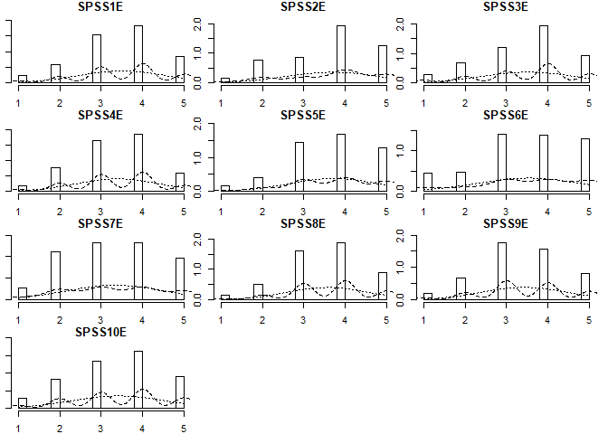
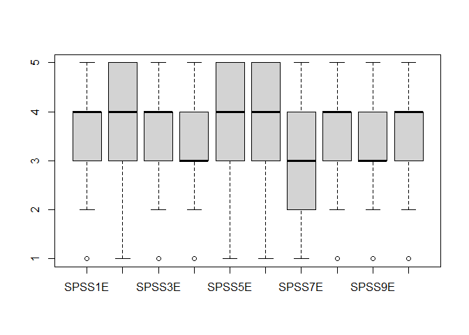
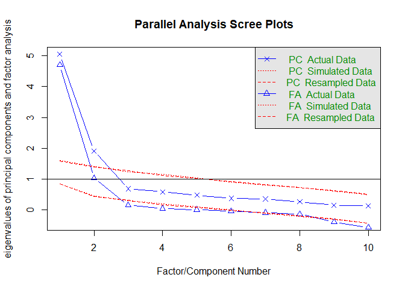

SPSS Attitudes Measure Validation
================
Udi Alter
13/07/2020

``` r
library(readr)
```

    ## Warning: package 'readr' was built under R version 4.0.2

``` r
library(haven)
```

    ## Warning: package 'haven' was built under R version 4.0.2

``` r
library(tidyverse)
```

    ## Warning: package 'tidyverse' was built under R version 4.0.2

    ## -- Attaching packages ------------------------------------------------------------- tidyverse 1.3.0 --

    ## v ggplot2 3.3.2     v dplyr   1.0.0
    ## v tibble  3.0.1     v stringr 1.4.0
    ## v tidyr   1.1.0     v forcats 0.5.0
    ## v purrr   0.3.4

    ## Warning: package 'ggplot2' was built under R version 4.0.2

    ## Warning: package 'forcats' was built under R version 4.0.2

    ## -- Conflicts ---------------------------------------------------------------- tidyverse_conflicts() --
    ## x dplyr::filter() masks stats::filter()
    ## x dplyr::lag()    masks stats::lag()

``` r
library(lavaan)
```

    ## Warning: package 'lavaan' was built under R version 4.0.2

    ## This is lavaan 0.6-6

    ## lavaan is BETA software! Please report any bugs.

``` r
library(psych)
```

    ## 
    ## Attaching package: 'psych'

    ## The following object is masked from 'package:lavaan':
    ## 
    ##     cor2cov

    ## The following objects are masked from 'package:ggplot2':
    ## 
    ##     %+%, alpha

``` r
library(mirt)
```

    ## Warning: package 'mirt' was built under R version 4.0.2

    ## Loading required package: stats4

    ## Loading required package: lattice

``` r
library(rsample)
```

    ## Warning: package 'rsample' was built under R version 4.0.2

``` r
# Uploading raw data
spssdata <- readxl::read_xlsx("spssdata.xlsx", col_names = TRUE)
View(spssdata)


# Selecting only SPSS-related columns
spss.data <- spssdata %>% 
             select(SPSS1E,
                    SPSS2E,
                    SPSS3E,
                    SPSS4E,
                    SPSS5E,
                    SPSS6E,
                    SPSS7E,
                    SPSS8E,
                    SPSS9E,
                    SPSS10E)


# Descriptive Statistics
multi.hist(spss.data) 
```

<!-- -->

``` r
summary(spss.data)
```

    ##      SPSS1E          SPSS2E          SPSS3E          SPSS4E          SPSS5E   
    ##  Min.   :1.000   Min.   :1.000   Min.   :1.000   Min.   :1.000   Min.   :1.0  
    ##  1st Qu.:3.000   1st Qu.:1.000   1st Qu.:2.000   1st Qu.:3.000   1st Qu.:3.0  
    ##  Median :4.000   Median :2.000   Median :2.000   Median :3.000   Median :4.0  
    ##  Mean   :3.494   Mean   :2.326   Mean   :2.489   Mean   :3.381   Mean   :3.7  
    ##  3rd Qu.:4.000   3rd Qu.:3.000   3rd Qu.:3.000   3rd Qu.:4.000   3rd Qu.:5.0  
    ##  Max.   :5.000   Max.   :5.000   Max.   :5.000   Max.   :5.000   Max.   :5.0  
    ##  NA's   :1                       NA's   :1                       NA's   :1    
    ##      SPSS6E          SPSS7E         SPSS8E          SPSS9E         SPSS10E     
    ##  Min.   :1.000   Min.   :1.00   Min.   :1.000   Min.   :1.000   Min.   :1.000  
    ##  1st Qu.:3.000   1st Qu.:2.00   1st Qu.:3.000   1st Qu.:3.000   1st Qu.:2.000  
    ##  Median :4.000   Median :3.00   Median :4.000   Median :3.000   Median :2.000  
    ##  Mean   :3.525   Mean   :3.32   Mean   :3.575   Mean   :3.425   Mean   :2.586  
    ##  3rd Qu.:5.000   3rd Qu.:4.00   3rd Qu.:4.000   3rd Qu.:4.000   3rd Qu.:3.000  
    ##  Max.   :5.000   Max.   :5.00   Max.   :5.000   Max.   :5.000   Max.   :5.000  
    ## 

``` r
describe(spss.data)
```

    ##         vars   n mean   sd median trimmed  mad min max range  skew kurtosis
    ## SPSS1E     1 180 3.49 1.04      4    3.55 1.48   1   5     4 -0.44    -0.30
    ## SPSS2E     2 181 2.33 1.11      2    2.24 1.48   1   5     4  0.58    -0.58
    ## SPSS3E     3 180 2.49 1.11      2    2.42 1.48   1   5     4  0.53    -0.43
    ## SPSS4E     4 181 3.38 0.99      3    3.39 1.48   1   5     4 -0.30    -0.42
    ## SPSS5E     5 180 3.70 1.05      4    3.79 1.48   1   5     4 -0.52    -0.27
    ## SPSS6E     6 181 3.52 1.22      4    3.64 1.48   1   5     4 -0.51    -0.60
    ## SPSS7E     7 181 3.32 1.18      3    3.34 1.48   1   5     4 -0.13    -0.98
    ## SPSS8E     8 181 3.57 0.98      4    3.63 1.48   1   5     4 -0.40    -0.22
    ## SPSS9E     9 181 3.43 1.03      3    3.46 1.48   1   5     4 -0.25    -0.44
    ## SPSS10E   10 181 2.59 1.13      2    2.54 1.48   1   5     4  0.33    -0.71
    ##           se
    ## SPSS1E  0.08
    ## SPSS2E  0.08
    ## SPSS3E  0.08
    ## SPSS4E  0.07
    ## SPSS5E  0.08
    ## SPSS6E  0.09
    ## SPSS7E  0.09
    ## SPSS8E  0.07
    ## SPSS9E  0.08
    ## SPSS10E 0.08

``` r
boxplot(spss.data)
```

<!-- -->

``` r
sum(is.na(spss.data))
```

    ## [1] 3

``` r
sum(is.na(spss.data))/(10*181)
```

    ## [1] 0.001657459

``` r
## Less than 1% missing data, proceeding with complete case analyses.
```

Reverse Code Q 2,3 & 10

``` r
View(spss.data$SPSS2E)
spss.data$SPSS2E <- 6-spss.data$SPSS2E
spss.data$SPSS3E <- 6-spss.data$SPSS3E
spss.data$SPSS10E <- 6-spss.data$SPSS10E

head(spssdata$SPSS10E)
```

    ## [1] 2 1 3 2 1 3

``` r
head(spss.data)
```

    ## # A tibble: 6 x 10
    ##   SPSS1E SPSS2E SPSS3E SPSS4E SPSS5E SPSS6E SPSS7E SPSS8E SPSS9E SPSS10E
    ##    <dbl>  <dbl>  <dbl>  <dbl>  <dbl>  <dbl>  <dbl>  <dbl>  <dbl>   <dbl>
    ## 1      4      4      4      3      3      3      4      4      4       4
    ## 2      4      5      5      4      4      4      4      4      4       5
    ## 3      3      3      3      2      3      2      2      3      3       3
    ## 4      2      4      4      2      2      2      2      2      2       4
    ## 5      4      5      4      3      4      4      3      4      3       5
    ## 6      2      2      2      3      2      1      3      3      3       3

``` r
# Descriptive Statistics
multi.hist(spss.data) 
```

<!-- -->

``` r
summary(spss.data)
```

    ##      SPSS1E          SPSS2E          SPSS3E          SPSS4E          SPSS5E   
    ##  Min.   :1.000   Min.   :1.000   Min.   :1.000   Min.   :1.000   Min.   :1.0  
    ##  1st Qu.:3.000   1st Qu.:3.000   1st Qu.:3.000   1st Qu.:3.000   1st Qu.:3.0  
    ##  Median :4.000   Median :4.000   Median :4.000   Median :3.000   Median :4.0  
    ##  Mean   :3.494   Mean   :3.674   Mean   :3.511   Mean   :3.381   Mean   :3.7  
    ##  3rd Qu.:4.000   3rd Qu.:5.000   3rd Qu.:4.000   3rd Qu.:4.000   3rd Qu.:5.0  
    ##  Max.   :5.000   Max.   :5.000   Max.   :5.000   Max.   :5.000   Max.   :5.0  
    ##  NA's   :1                       NA's   :1                       NA's   :1    
    ##      SPSS6E          SPSS7E         SPSS8E          SPSS9E         SPSS10E     
    ##  Min.   :1.000   Min.   :1.00   Min.   :1.000   Min.   :1.000   Min.   :1.000  
    ##  1st Qu.:3.000   1st Qu.:2.00   1st Qu.:3.000   1st Qu.:3.000   1st Qu.:3.000  
    ##  Median :4.000   Median :3.00   Median :4.000   Median :3.000   Median :4.000  
    ##  Mean   :3.525   Mean   :3.32   Mean   :3.575   Mean   :3.425   Mean   :3.414  
    ##  3rd Qu.:5.000   3rd Qu.:4.00   3rd Qu.:4.000   3rd Qu.:4.000   3rd Qu.:4.000  
    ##  Max.   :5.000   Max.   :5.00   Max.   :5.000   Max.   :5.000   Max.   :5.000  
    ## 

``` r
describe(spss.data)
```

    ##         vars   n mean   sd median trimmed  mad min max range  skew kurtosis
    ## SPSS1E     1 180 3.49 1.04      4    3.55 1.48   1   5     4 -0.44    -0.30
    ## SPSS2E     2 181 3.67 1.11      4    3.76 1.48   1   5     4 -0.58    -0.58
    ## SPSS3E     3 180 3.51 1.11      4    3.58 1.48   1   5     4 -0.53    -0.43
    ## SPSS4E     4 181 3.38 0.99      3    3.39 1.48   1   5     4 -0.30    -0.42
    ## SPSS5E     5 180 3.70 1.05      4    3.79 1.48   1   5     4 -0.52    -0.27
    ## SPSS6E     6 181 3.52 1.22      4    3.64 1.48   1   5     4 -0.51    -0.60
    ## SPSS7E     7 181 3.32 1.18      3    3.34 1.48   1   5     4 -0.13    -0.98
    ## SPSS8E     8 181 3.57 0.98      4    3.63 1.48   1   5     4 -0.40    -0.22
    ## SPSS9E     9 181 3.43 1.03      3    3.46 1.48   1   5     4 -0.25    -0.44
    ## SPSS10E   10 181 3.41 1.13      4    3.46 1.48   1   5     4 -0.33    -0.71
    ##           se
    ## SPSS1E  0.08
    ## SPSS2E  0.08
    ## SPSS3E  0.08
    ## SPSS4E  0.07
    ## SPSS5E  0.08
    ## SPSS6E  0.09
    ## SPSS7E  0.09
    ## SPSS8E  0.07
    ## SPSS9E  0.08
    ## SPSS10E 0.08

``` r
boxplot(spss.data)
```

<!-- -->

``` r
sum(is.na(spss.data))
```

    ## [1] 3

``` r
sum(is.na(spss.data))/(10*181)
```

    ## [1] 0.001657459

``` r
head(spss.data$SPSS10E)
```

    ## [1] 4 5 3 4 5 3

Splitting Data into EFA and CFA. We aim for EFA of N = 82 and CFA of N =
100.

``` r
data.split <- initial_split(spss.data, prop = 1/1.81)

cfa.spss <- training(data.split)
efa.spss <- testing(data.split)

View(efa.spss)
View(cfa.spss)
```

MAP/Parallel

``` r
VSS(efa.spss, plot = F)
```

    ## 
    ## Very Simple Structure
    ## Call: vss(x = x, n = n, rotate = rotate, diagonal = diagonal, fm = fm, 
    ##     n.obs = n.obs, plot = plot, title = title, use = use, cor = cor)
    ## VSS complexity 1 achieves a maximimum of 0.89  with  2  factors
    ## VSS complexity 2 achieves a maximimum of 0.94  with  3  factors
    ## 
    ## The Velicer MAP achieves a minimum of 0.05  with  2  factors 
    ## BIC achieves a minimum of  NA  with  2  factors
    ## Sample Size adjusted BIC achieves a minimum of  NA  with  3  factors
    ## 
    ## Statistics by number of factors 
    ##   vss1 vss2   map dof   chisq    prob sqresid  fit RMSEA BIC SABIC complex
    ## 1 0.83 0.00 0.050  35 8.8e+01 1.7e-06    5.30 0.83 0.137 -65  44.9     1.0
    ## 2 0.89 0.94 0.045  26 2.8e+01 3.7e-01    1.79 0.94 0.025 -87  -4.6     1.1
    ## 3 0.77 0.94 0.065  18 1.7e+01 5.4e-01    1.42 0.95 0.000 -62  -5.6     1.2
    ## 4 0.69 0.94 0.112  11 8.9e+00 6.3e-01    1.23 0.96 0.000 -39  -4.8     1.5
    ## 5 0.73 0.94 0.221   5 5.0e+00 4.2e-01    0.90 0.97 0.000 -17  -1.2     1.5
    ## 6 0.76 0.91 0.272   0 1.6e+00      NA    0.69 0.98    NA  NA    NA     1.6
    ## 7 0.61 0.88 0.425  -4 1.6e-06      NA    0.71 0.98    NA  NA    NA     1.8
    ## 8 0.68 0.89 0.450  -7 9.9e-08      NA    0.77 0.97    NA  NA    NA     1.8
    ##    eChisq    SRMR eCRMS eBIC
    ## 1 1.3e+02 1.3e-01 0.151  -25
    ## 2 7.9e+00 3.3e-02 0.043 -106
    ## 3 3.4e+00 2.1e-02 0.034  -76
    ## 4 1.4e+00 1.4e-02 0.028  -47
    ## 5 6.8e-01 9.7e-03 0.029  -21
    ## 6 1.5e-01 4.6e-03    NA   NA
    ## 7 1.8e-07 5.0e-06    NA   NA
    ## 8 1.1e-08 1.2e-06    NA   NA

``` r
# The Velicer MAP achieves a minimum of 0.04  with  1  factors 


fa.parallel(efa.spss, fa = "both")
```

    ## Warning in fa.stats(r = r, f = f, phi = phi, n.obs = n.obs, np.obs = np.obs, :
    ## The estimated weights for the factor scores are probably incorrect. Try a
    ## different factor score estimation method.
    
    ## Warning in fa.stats(r = r, f = f, phi = phi, n.obs = n.obs, np.obs = np.obs, :
    ## The estimated weights for the factor scores are probably incorrect. Try a
    ## different factor score estimation method.

    ## Warning in fac(r = r, nfactors = nfactors, n.obs = n.obs, rotate = rotate, : An
    ## ultra-Heywood case was detected. Examine the results carefully

<!-- -->

    ## Parallel analysis suggests that the number of factors =  2  and the number of components =  2

``` r
# Parallel analysis suggests that the number of factors =  2  and the number of components =  2 

#The estimated weights for the factor scores are probably incorrect.  Try a different factor score estimation method.An ultra-Heywood case was detected.  Examine the results carefullyThe estimated weights for the factor scores are probably incorrect.  Try a different factor score estimation method.An ultra-Heywood case was detected.  Examine the results carefullyThe estimated weights for the factor scores are probably incorrect.  Try a different factor score estimation method.An ultra-Heywood case was detected.  Examine the results carefullyParallel analysis suggests that the number of factors =  2  and the number of components =  2 

# Result show 1 factors with MAP and 2 with parallel, to be discussed.
```

``` r
#EFA (trying with 2 factors)

fa(efa.spss, fm = "ml", nfactors = 2, rotate = "Promax")
```

    ## Factor Analysis using method =  ml
    ## Call: fa(r = efa.spss, nfactors = 2, rotate = "Promax", fm = "ml")
    ## Standardized loadings (pattern matrix) based upon correlation matrix
    ##           ML1   ML2   h2   u2 com
    ## SPSS1E   0.88  0.09 0.82 0.18 1.0
    ## SPSS2E  -0.01  0.81 0.66 0.34 1.0
    ## SPSS3E   0.18  0.68 0.55 0.45 1.1
    ## SPSS4E   0.90  0.06 0.83 0.17 1.0
    ## SPSS5E   0.80 -0.07 0.61 0.39 1.0
    ## SPSS6E   0.58 -0.08 0.32 0.68 1.0
    ## SPSS7E   0.68 -0.13 0.44 0.56 1.1
    ## SPSS8E   0.80  0.05 0.67 0.33 1.0
    ## SPSS9E   0.92  0.02 0.85 0.15 1.0
    ## SPSS10E  0.00  0.66 0.43 0.57 1.0
    ## 
    ##                        ML1  ML2
    ## SS loadings           4.56 1.62
    ## Proportion Var        0.46 0.16
    ## Cumulative Var        0.46 0.62
    ## Proportion Explained  0.74 0.26
    ## Cumulative Proportion 0.74 1.00
    ## 
    ##  With factor correlations of 
    ##      ML1  ML2
    ## ML1 1.00 0.21
    ## ML2 0.21 1.00
    ## 
    ## Mean item complexity =  1
    ## Test of the hypothesis that 2 factors are sufficient.
    ## 
    ## The degrees of freedom for the null model are  45  and the objective function was  6.62 with Chi Square of  502.23
    ## The degrees of freedom for the model are 26  and the objective function was  0.35 
    ## 
    ## The root mean square of the residuals (RMSR) is  0.04 
    ## The df corrected root mean square of the residuals is  0.05 
    ## 
    ## The harmonic number of observations is  81 with the empirical chi square  9.22  with prob <  1 
    ## The total number of observations was  81  with Likelihood Chi Square =  25.72  with prob <  0.48 
    ## 
    ## Tucker Lewis Index of factoring reliability =  1.001
    ## RMSEA index =  0  and the 90 % confidence intervals are  0 0.087
    ## BIC =  -88.53
    ## Fit based upon off diagonal values = 0.99
    ## Measures of factor score adequacy             
    ##                                                    ML1  ML2
    ## Correlation of (regression) scores with factors   0.98 0.89
    ## Multiple R square of scores with factors          0.95 0.79
    ## Minimum correlation of possible factor scores     0.90 0.59

``` r
# I always prefer promax rotation and maximum likelihood extraction. These are not universally agreed upon.
# ML extraction is highly prone to Heywood cases. Promax rotation allows for correlations between factors.
```

Factor Analysis using method = ml Call: fa(r = efa.spss, nfactors = 2,
rotate = “Promax”, fm = “ml”) Standardized loadings (pattern matrix)
based upon correlation matrix

``` 
                   ML1  ML2
```

SS loadings 4.42 1.45 Proportion Var 0.44 0.14 Cumulative Var 0.44 0.59
Proportion Explained 0.75 0.25 Cumulative Proportion 0.75 1.00

With factor correlations of ML1 ML2 ML1 1.00 0.35 ML2 0.35 1.00

Mean item complexity = 1 Test of the hypothesis that 2 factors are
sufficient.

The degrees of freedom for the null model are 45 and the objective
function was 5.92 with Chi Square of 449.06 The degrees of freedom for
the model are 26 and the objective function was 0.5

The root mean square of the residuals (RMSR) is 0.04 The df corrected
root mean square of the residuals is 0.05

The harmonic number of observations is 81 with the empirical chi square
11.03 with prob \< 1 The total number of observations was 81 with
Likelihood Chi Square = 37.3 with prob \< 0.07

Tucker Lewis Index of factoring reliability = 0.951 RMSEA index = 0.072
and the 90 % confidence intervals are 0 0.123 BIC = -76.96 Fit based
upon off diagonal values = 0.99 Measures of factor score adequacy  
ML1 ML2 Correlation of (regression) scores with factors 0.97 0.88
Multiple R square of scores with factors 0.94 0.78 Minimum correlation
of possible factor scores 0.87 0.56

\`\`\`
