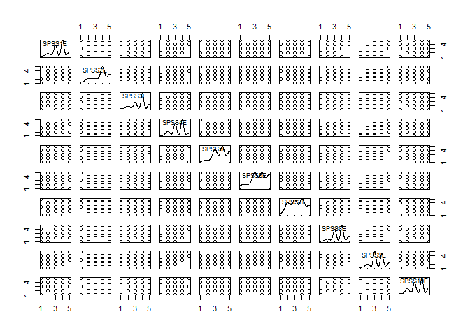

Validation Code for Attitudes toward SPSS (ATSPSS)
================
Alter, Dang, Kunicki, Counsell
Jan 31, 2021

## Setup

``` r
# Packages ----------------------------------------------------------------
library(tidyverse)
```

    ## -- Attaching packages ----------------------------------------- tidyverse 1.3.0 --

    ## v ggplot2 3.3.1     v purrr   0.3.4
    ## v tibble  3.0.1     v dplyr   1.0.0
    ## v tidyr   1.1.0     v stringr 1.4.0
    ## v readr   1.3.1     v forcats 0.5.0

    ## Warning: package 'readr' was built under R version 4.0.2

    ## -- Conflicts -------------------------------------------- tidyverse_conflicts() --
    ## x dplyr::filter() masks stats::filter()
    ## x dplyr::lag()    masks stats::lag()

``` r
library(car)
```

    ## Loading required package: carData

    ## 
    ## Attaching package: 'car'

    ## The following object is masked from 'package:dplyr':
    ## 
    ##     recode

    ## The following object is masked from 'package:purrr':
    ## 
    ##     some

``` r
library(psych)
```

    ## Warning: package 'psych' was built under R version 4.0.2

    ## 
    ## Attaching package: 'psych'

    ## The following object is masked from 'package:car':
    ## 
    ##     logit

    ## The following objects are masked from 'package:ggplot2':
    ## 
    ##     %+%, alpha

``` r
library(mirt) # for multiple IRT
```

    ## Warning: package 'mirt' was built under R version 4.0.2

    ## Loading required package: stats4

    ## Loading required package: lattice

``` r
library(GPArotation) # for Promax rotation
library(MBESS) # for reliability CI
```

    ## Warning: package 'MBESS' was built under R version 4.0.2

    ## 
    ## Attaching package: 'MBESS'

    ## The following object is masked from 'package:psych':
    ## 
    ##     cor2cov

``` r
library(REdaS) # for assumptions
```

    ## Warning: package 'REdaS' was built under R version 4.0.3

    ## Loading required package: grid

``` r
library(faoutlier) # for efa outliers
```

    ## Warning: package 'faoutlier' was built under R version 4.0.3

    ## Loading required package: sem

    ## Warning: package 'sem' was built under R version 4.0.2

    ## Registered S3 methods overwritten by 'lme4':
    ##   method                          from
    ##   cooks.distance.influence.merMod car 
    ##   influence.merMod                car 
    ##   dfbeta.influence.merMod         car 
    ##   dfbetas.influence.merMod        car

    ## 
    ## Attaching package: 'sem'

    ## The following object is masked from 'package:mirt':
    ## 
    ##     fscores

    ## Loading required package: mvtnorm

    ## Loading required package: parallel

``` r
library(mice) # for imputations
```

    ## Warning: package 'mice' was built under R version 4.0.3

    ## 
    ## Attaching package: 'mice'

    ## The following object is masked from 'package:stats':
    ## 
    ##     filter

    ## The following objects are masked from 'package:base':
    ## 
    ##     cbind, rbind

``` r
# Initial Data Setup ------------------------------------------------------
```

## Initial Data Setup

**Uploading raw data**

``` r
full.data <- readxl::read_xlsx("spssdata.xlsx", col_names = TRUE)
# Remove empty rows
full.data <- full.data[1:181, ]
```

**Selecting only SPSS-related columns**

``` r
# Do not select StudentIDE col bc you do not want it included with EFA
# Num of rows corresponds to StudentIDE
spss.data <- full.data %>% 
  select(SPSS1E,
         SPSS2E,
         SPSS3E,
         SPSS4E,
         SPSS5E,
         SPSS6E,
         SPSS7E,
         SPSS8E,
         SPSS9E,
         SPSS10E)
```

**Reverse code SPSS items 2, 3, 10**

``` r
spss.data$SPSS2E <- car::recode(spss.data$SPSS2E, "1 = 5; 2 = 4; 3 = 3; 4 = 2; 5 = 1")
spss.data$SPSS3E <- car::recode(spss.data$SPSS3E, "1 = 5; 2 = 4; 3 = 3; 4 = 2; 5 = 1")
spss.data$SPSS10E <- car::recode(spss.data$SPSS10E, "1 = 5; 2 = 4; 3 = 3; 4 = 2; 5 = 1")

# Descriptive Stats -------------------------------------------------------
```

## Descriptive Statistics

``` r
describe(spss.data)
```

    ##         vars   n mean   sd median trimmed  mad min max range  skew kurtosis
    ## SPSS1E     1 180 3.49 1.04      4    3.55 1.48   1   5     4 -0.44    -0.30
    ## SPSS2E     2 181 3.67 1.11      4    3.76 1.48   1   5     4 -0.58    -0.58
    ## SPSS3E     3 180 3.51 1.11      4    3.58 1.48   1   5     4 -0.53    -0.43
    ## SPSS4E     4 181 3.38 0.99      3    3.39 1.48   1   5     4 -0.30    -0.42
    ## SPSS5E     5 180 3.70 1.05      4    3.79 1.48   1   5     4 -0.52    -0.27
    ## SPSS6E     6 181 3.52 1.22      4    3.64 1.48   1   5     4 -0.51    -0.60
    ## SPSS7E     7 181 3.32 1.18      3    3.34 1.48   1   5     4 -0.13    -0.98
    ## SPSS8E     8 181 3.57 0.98      4    3.63 1.48   1   5     4 -0.40    -0.22
    ## SPSS9E     9 181 3.43 1.03      3    3.46 1.48   1   5     4 -0.25    -0.44
    ## SPSS10E   10 181 3.41 1.13      4    3.46 1.48   1   5     4 -0.33    -0.71
    ##           se
    ## SPSS1E  0.08
    ## SPSS2E  0.08
    ## SPSS3E  0.08
    ## SPSS4E  0.07
    ## SPSS5E  0.08
    ## SPSS6E  0.09
    ## SPSS7E  0.09
    ## SPSS8E  0.07
    ## SPSS9E  0.08
    ## SPSS10E 0.08

**Contingency table of the counts**

``` r
table(spss.data$SPSS1E)
```

    ## 
    ##  1  2  3  4  5 
    ##  8 21 55 66 30

``` r
table(spss.data$SPSS2E)
```

    ## 
    ##  1  2  3  4  5 
    ##  6 28 31 70 46

``` r
table(spss.data$SPSS3E)
```

    ## 
    ##  1  2  3  4  5 
    ## 10 24 43 70 33

``` r
table(spss.data$SPSS4E)
```

    ## 
    ##  1  2  3  4  5 
    ##  6 28 59 67 21

``` r
table(spss.data$SPSS5E)
```

    ## 
    ##  1  2  3  4  5 
    ##  6 15 52 61 46

``` r
table(spss.data$SPSS6E)
```

    ## 
    ##  1  2  3  4  5 
    ## 16 17 51 50 47

``` r
table(spss.data$SPSS7E)
```

    ## 
    ##  1  2  3  4  5 
    ## 10 40 48 48 35

``` r
table(spss.data$SPSS8E)
```

    ## 
    ##  1  2  3  4  5 
    ##  5 18 58 68 32

``` r
table(spss.data$SPSS9E)
```

    ## 
    ##  1  2  3  4  5 
    ##  7 24 64 57 29

``` r
table(spss.data$SPSS10E)
```

    ## 
    ##  1  2  3  4  5 
    ## 10 30 49 59 33

**Missing Data Calculations**

``` r
table(is.na(spss.data))
```

    ## 
    ## FALSE  TRUE 
    ##  1807     3

``` r
# MISSING / (MISSING + NOT MISSING) = PERCENT MISSING 
# 3 / (3 + 1807) = 0.001657459
# 0.001657459 * 100 = 0.1657459

# Less than 1% missing data, proceeding with complete case analyses
```

**Scatterplot Matrix**

``` r
car::scatterplotMatrix(spss.data, smooth = F, regLine = F, col = 'black')
```

<!-- -->

``` r
# Statistical Assumptions -------------------------------------------------
```

## Statistical Assumptions

**Multivariate Normality**

``` r
mardia(spss.data) # Kurtosis = 15.17 >4. Will not assume mvn.
```

<!-- -->

    ## Call: mardia(x = spss.data)
    ## 
    ## Mardia tests of multivariate skew and kurtosis
    ## Use describe(x) the to get univariate tests
    ## n.obs = 178   num.vars =  10 
    ## b1p =  19.29   skew =  572.2  with probability =  0
    ##  small sample skew =  583.62  with probability =  0
    ## b2p =  155.23   kurtosis =  15.17  with probability =  0

**EFA Appropriateness**

``` r
# Barlett's Test of Sphericity tests whether a matrix is significantly different from an identity matrix
bart_spher(spss.data, use = "complete.obs") # p-value < 2.22e-16
```

    ##  Bartlett's Test of Sphericity
    ## 
    ## Call: bart_spher(x = spss.data, use = "complete.obs")
    ## 
    ##      X2 = 969.939
    ##      df = 45
    ## p-value < 2.22e-16

    ## Warning: Used n = 178.

**Kaiser-Meyer-Olkin Statistics**

``` r
KMOS(spss.data, use = "complete.obs")
```

    ## 
    ## Kaiser-Meyer-Olkin Statistics
    ## 
    ## Call: KMOS(x = spss.data, use = "complete.obs")
    ## 
    ## Measures of Sampling Adequacy (MSA):
    ##    SPSS1E    SPSS2E    SPSS3E    SPSS4E    SPSS5E    SPSS6E    SPSS7E    SPSS8E 
    ## 0.9098933 0.7138465 0.7359144 0.8758975 0.9281158 0.9543978 0.9378408 0.9022414 
    ##    SPSS9E   SPSS10E 
    ## 0.8956706 0.6953167 
    ## 
    ## KMO-Criterion: 0.8795382

``` r
# # KMO-Criterion: 0.8795382

# Listwise Deletion / Complete Case Analysis ------------------------------
```

## Listwise Deletion / Complete Case Analysis

``` r
spss.data.withNA <- spss.data # spss data without removing missing values  

# Previous work suggests using listwise deletion when the missing data rates are extremely low (e.g., < 1%; Flora, 2018; Jakobsen et al., 2017).
spss.data <- spss.data[-c(33, 141, 104), ]
full.data <- full.data[-c(33, 141, 104), ] # needed later for convergent/discriminant validity

spss.data <- data.frame(spss.data)
str(spss.data)
```

    ## 'data.frame':    178 obs. of  10 variables:
    ##  $ SPSS1E : num  4 4 3 2 4 2 4 2 3 4 ...
    ##  $ SPSS2E : num  4 5 3 4 5 2 3 2 4 5 ...
    ##  $ SPSS3E : num  4 5 3 4 4 2 1 2 5 5 ...
    ##  $ SPSS4E : num  3 4 2 2 3 3 2 3 3 4 ...
    ##  $ SPSS5E : num  3 4 3 2 4 2 4 3 3 3 ...
    ##  $ SPSS6E : num  3 4 2 2 4 1 4 3 1 5 ...
    ##  $ SPSS7E : num  4 4 2 2 3 3 2 3 4 4 ...
    ##  $ SPSS8E : num  4 4 3 2 4 3 3 3 3 2 ...
    ##  $ SPSS9E : num  4 4 3 2 3 3 2 2 2 4 ...
    ##  $ SPSS10E: num  4 5 3 4 5 3 3 3 4 3 ...

``` r
# Polychoric Correlations -------------------------------------------------
```

## Polychoric Correlations

Using polychoric correlations because the data is categorical (5-point
Likert scale)

``` r
poly.spss.data <- psych::polychoric(spss.data)

# Confidence Intervals for Polychoric Correlations
poly.spss.ci <- (cor.ci(spss.data, poly = TRUE, plot = FALSE))$ci
```

All questions are more correlated w each other than they are with
2,3,10.  
But 2,3, and 10 are more correlated to each other than other Qs.

``` r
# Polychoric correlations 
#         SPSS1E SPSS2 SPSS3 SPSS4 SPSS5 SPSS6 SPSS7 SPSS8 SPSS9 SPSS10
# SPSS1E  1.00                                                         
# SPSS2E  0.38   1.00                                                  
# SPSS3E  0.35   0.69  1.00                                            
# SPSS4E  0.85   0.32  0.37  1.00                                      
# SPSS5E  0.70   0.35  0.27  0.73  1.00                                
# SPSS6E  0.55   0.27  0.23  0.56  0.58  1.00                          
# SPSS7E  0.56   0.23  0.14  0.56  0.55  0.46  1.00                    
# SPSS8E  0.78   0.32  0.35  0.74  0.73  0.61  0.60  1.00              
# SPSS9E  0.81   0.30  0.36  0.86  0.71  0.62  0.58  0.80  1.00        
# SPSS10E 0.26   0.50  0.49  0.23  0.12  0.05  0.02  0.24  0.12  1.00  
# 
# with tau of 
#           1     2      3    4
# SPSS1E  -1.7 -0.98 -0.099 0.96
# SPSS2E  -1.8 -0.87 -0.375 0.65
# SPSS3E  -1.6 -0.87 -0.198 0.90
# SPSS4E  -1.8 -0.87  0.014 1.19
# SPSS5E  -1.8 -1.19 -0.242 0.65
# SPSS6E  -1.3 -0.90 -0.099 0.63
# SPSS7E  -1.6 -0.60  0.085 0.85
# SPSS8E  -1.9 -1.13 -0.141 0.92
# SPSS9E  -1.8 -0.94  0.056 0.98
# SPSS10E -1.6 -0.76 -0.028 0.90

#                 lower       low.e     upper      up.e            p
# SPSS1E-SPSS2   0.16887050  0.17664235 0.5434718 0.5312478 9.079548e-04
# SPSS1E-SPSS3   0.17465588  0.21318482 0.5146427 0.5181914 3.726149e-04
# SPSS1E-SPSS4   0.78519080  0.78091634 0.9174762 0.9255671 4.072009e-11
# SPSS1E-SPSS5   0.56472304  0.57587917 0.8039876 0.7977725 4.379580e-09
# SPSS1E-SPSS6   0.41084593  0.40785055 0.6723976 0.6717997 8.910949e-09
# SPSS1E-SPSS7   0.44246155  0.45931792 0.6554133 0.6577781 1.556977e-12
# SPSS1E-SPSS8   0.68317581  0.69158350 0.8707006 0.8784873 4.876894e-10
# SPSS1E-SPSS9   0.73608915  0.73238399 0.8808369 0.8776634 1.885159e-13
# SPSS1E-SPSS10  0.06383204  0.07985671 0.4235586 0.4389430 1.079513e-02
# SPSS2-SPSS3    0.57585351  0.55548146 0.7960785 0.7906612 1.773393e-10
# SPSS2-SPSS4    0.14048457  0.16054689 0.4682354 0.4556984 7.909665e-04
# SPSS2-SPSS5    0.14592076  0.17132779 0.5078962 0.5290858 1.272468e-03
# SPSS2-SPSS6    0.09761319  0.10129435 0.4236599 0.4183750 2.986255e-03
# SPSS2-SPSS7    0.01264158  0.02486948 0.4094863 0.3987975 4.102340e-02
# SPSS2-SPSS8    0.11990957  0.14378381 0.5035122 0.4973697 3.293996e-03
# SPSS2-SPSS9    0.11236474  0.11084863 0.4642527 0.4523479 2.696680e-03
# SPSS2-SPSS10   0.31105591  0.34478329 0.6759828 0.6747772 5.113361e-05
# SPSS3-SPSS4    0.21587520  0.22649026 0.5014242 0.5046908 1.438261e-05
# SPSS3-SPSS5    0.08900275  0.09603616 0.4184127 0.4261973 4.066957e-03
# SPSS3-SPSS6    0.04225771  0.04150634 0.3988093 0.4030414 1.857167e-02
# SPSS3-SPSS7   -0.07098063 -0.03761515 0.3330107 0.3504434 1.991385e-01
# SPSS3-SPSS8    0.16206539  0.19877498 0.5154120 0.5178433 7.093637e-04
# SPSS3-SPSS9    0.19042942  0.20562359 0.4913661 0.4687905 7.048877e-05
# SPSS3-SPSS10   0.33988689  0.35322563 0.6533612 0.6393377 2.445603e-06
# SPSS4-SPSS5    0.59466093  0.58378680 0.8304520 0.8317860 1.198729e-08
# SPSS4-SPSS6    0.42805579  0.42679598 0.6970149 0.6923697 2.034349e-08
# SPSS4-SPSS7    0.44822513  0.45353566 0.6691855 0.6655332 8.858914e-12
# SPSS4-SPSS8    0.65588302  0.66229602 0.8362994 0.8339377 1.874279e-12
# SPSS4-SPSS9    0.78614000  0.78944582 0.9229891 0.9204481 4.628460e-10
# SPSS4-SPSS10   0.01931504  0.05856965 0.4017179 0.4126999 3.472357e-02
# SPSS5-SPSS6    0.43081303  0.42401965 0.6913717 0.7007675 7.068568e-09
# SPSS5-SPSS7    0.41485564  0.43249621 0.6649197 0.6754108 1.848346e-09
# SPSS5-SPSS8    0.60905393  0.62834793 0.8279978 0.8207409 1.105110e-09
# SPSS5-SPSS9    0.61242858  0.60744953 0.7971656 0.7887236 1.028067e-13
# SPSS5-SPSS10  -0.08318735 -0.06454500 0.3013012 0.2901654 2.600600e-01
# SPSS6-SPSS7    0.30281013  0.30412899 0.5904182 0.5919838 8.873773e-07
# SPSS6-SPSS8    0.48704107  0.48498981 0.7247681 0.7270032 2.888128e-10
# SPSS6-SPSS9    0.52158114  0.53824960 0.7213030 0.7173948 8.437695e-14
# SPSS6-SPSS10  -0.13411414 -0.13011765 0.2524770 0.2393111 5.396638e-01
# SPSS7-SPSS8    0.47833867  0.50498602 0.7030444 0.6960437 2.075162e-11
# SPSS7-SPSS9    0.44284869  0.45441990 0.6921276 0.6886743 1.426607e-09
# SPSS7-SPSS10  -0.16613093 -0.17224627 0.2096711 0.1825448 8.161641e-01
# SPSS8-SPSS9    0.70160731  0.72195955 0.8761606 0.8784479 1.013167e-10
# SPSS8-SPSS10   0.03870663  0.06280274 0.4227541 0.4189204 2.244871e-02
# SPSS9-SPSS10  -0.09202409 -0.07409066 0.3108612 0.3258500 2.797046e-01


# MAP Test/Parallel Analysis ----------------------------------------------
```

## MAP Test & Parallel Analysis (PA)

**MAP Test**

``` r
VSS(spss.data, fm = 'minres', cor = 'poly', plot = F)
```

    ## 
    ## Very Simple Structure
    ## Call: vss(x = x, n = n, rotate = rotate, diagonal = diagonal, fm = fm, 
    ##     n.obs = n.obs, plot = plot, title = title, use = use, cor = cor)
    ## VSS complexity 1 achieves a maximimum of 0.87  with  1  factors
    ## VSS complexity 2 achieves a maximimum of 0.95  with  2  factors
    ## 
    ## The Velicer MAP achieves a minimum of 0.05  with  2  factors 
    ## BIC achieves a minimum of  NA  with  2  factors
    ## Sample Size adjusted BIC achieves a minimum of  NA  with  4  factors
    ## 
    ## Statistics by number of factors 
    ##   vss1 vss2   map dof   chisq    prob sqresid  fit RMSEA BIC SABIC complex
    ## 1 0.87 0.00 0.057  35 2.3e+02 2.6e-31    4.48 0.87 0.179  53 163.7     1.0
    ## 2 0.86 0.95 0.049  26 8.7e+01 1.7e-08    1.57 0.95 0.115 -48  34.6     1.1
    ## 3 0.86 0.95 0.072  18 5.4e+01 1.9e-05    1.27 0.96 0.106 -39  17.6     1.2
    ## 4 0.86 0.94 0.116  11 1.6e+01 1.3e-01    1.17 0.97 0.052 -41  -5.8     1.3
    ## 5 0.86 0.89 0.165   5 4.6e+00 4.7e-01    0.98 0.97 0.000 -21  -5.5     1.4
    ## 6 0.85 0.91 0.240   0 7.6e-01      NA    0.90 0.97    NA  NA    NA     1.5
    ## 7 0.86 0.93 0.410  -4 5.1e-07      NA    0.90 0.97    NA  NA    NA     1.4
    ## 8 0.86 0.95 0.480  -7 1.5e-12      NA    0.85 0.98    NA  NA    NA     1.4
    ##    eChisq    SRMR eCRMS eBIC
    ## 1 2.4e+02 1.2e-01 0.138   57
    ## 2 1.6e+01 3.2e-02 0.042 -119
    ## 3 6.6e+00 2.0e-02 0.032  -87
    ## 4 2.7e+00 1.3e-02 0.026  -54
    ## 5 4.8e-01 5.5e-03 0.016  -25
    ## 6 6.1e-02 2.0e-03    NA   NA
    ## 7 1.0e-07 2.5e-06    NA   NA
    ## 8 1.3e-13 2.9e-09    NA   NA

``` r
# Very Simple Structure
# Call: vss(x = x, n = n, rotate = rotate, diagonal = diagonal, fm = fm,
#           n.obs = n.obs, plot = plot, title = title, use = use, cor = cor)
# VSS complexity 1 achieves a maximimum of 0.87  with  1  factors
# VSS complexity 2 achieves a maximimum of 0.95  with  2  factors
#
# The Velicer MAP achieves a minimum of 0.05  with  2  factors
# BIC achieves a minimum of  NA  with  2  factors
# Sample Size adjusted BIC achieves a minimum of  NA  with  4  factors
```

**Parallel Analysis**

``` r
fa.parallel(spss.data, fm = 'minres', cor = 'poly', fa ='both', n.iter=100)
```

    ## Warning in fa.stats(r = r, f = f, phi = phi, n.obs = n.obs, np.obs = np.obs, :
    ## The estimated weights for the factor scores are probably incorrect. Try a
    ## different factor score estimation method.

    ## Warning in fac(r = r, nfactors = nfactors, n.obs = n.obs, rotate = rotate, : An
    ## ultra-Heywood case was detected. Examine the results carefully

    ## Warning in fa.stats(r = r, f = f, phi = phi, n.obs = n.obs, np.obs = np.obs, :
    ## The estimated weights for the factor scores are probably incorrect. Try a
    ## different factor score estimation method.

    ## Warning in fac(r = r, nfactors = nfactors, n.obs = n.obs, rotate = rotate, : An
    ## ultra-Heywood case was detected. Examine the results carefully

    ## Warning in fa.stats(r = r, f = f, phi = phi, n.obs = n.obs, np.obs = np.obs, :
    ## The estimated weights for the factor scores are probably incorrect. Try a
    ## different factor score estimation method.

    ## Warning in fac(r = r, nfactors = nfactors, n.obs = n.obs, rotate = rotate, : An
    ## ultra-Heywood case was detected. Examine the results carefully

    ## Warning in fa.stats(r = r, f = f, phi = phi, n.obs = n.obs, np.obs = np.obs, :
    ## The estimated weights for the factor scores are probably incorrect. Try a
    ## different factor score estimation method.
    
    ## Warning in fa.stats(r = r, f = f, phi = phi, n.obs = n.obs, np.obs = np.obs, :
    ## The estimated weights for the factor scores are probably incorrect. Try a
    ## different factor score estimation method.
    
    ## Warning in fa.stats(r = r, f = f, phi = phi, n.obs = n.obs, np.obs = np.obs, :
    ## The estimated weights for the factor scores are probably incorrect. Try a
    ## different factor score estimation method.
    
    ## Warning in fa.stats(r = r, f = f, phi = phi, n.obs = n.obs, np.obs = np.obs, :
    ## The estimated weights for the factor scores are probably incorrect. Try a
    ## different factor score estimation method.

    ## Warning in fac(r = r, nfactors = nfactors, n.obs = n.obs, rotate = rotate, : An
    ## ultra-Heywood case was detected. Examine the results carefully

    ## Warning in fa.stats(r = r, f = f, phi = phi, n.obs = n.obs, np.obs = np.obs, :
    ## The estimated weights for the factor scores are probably incorrect. Try a
    ## different factor score estimation method.

    ## Warning in fac(r = r, nfactors = nfactors, n.obs = n.obs, rotate = rotate, : An
    ## ultra-Heywood case was detected. Examine the results carefully

    ## Warning in fa.stats(r = r, f = f, phi = phi, n.obs = n.obs, np.obs = np.obs, :
    ## The estimated weights for the factor scores are probably incorrect. Try a
    ## different factor score estimation method.

    ## Warning in fac(r = r, nfactors = nfactors, n.obs = n.obs, rotate = rotate, : An
    ## ultra-Heywood case was detected. Examine the results carefully

    ## Warning in fa.stats(r = r, f = f, phi = phi, n.obs = n.obs, np.obs = np.obs, :
    ## The estimated weights for the factor scores are probably incorrect. Try a
    ## different factor score estimation method.
    
    ## Warning in fa.stats(r = r, f = f, phi = phi, n.obs = n.obs, np.obs = np.obs, :
    ## The estimated weights for the factor scores are probably incorrect. Try a
    ## different factor score estimation method.
    
    ## Warning in fa.stats(r = r, f = f, phi = phi, n.obs = n.obs, np.obs = np.obs, :
    ## The estimated weights for the factor scores are probably incorrect. Try a
    ## different factor score estimation method.

    ## Warning in fac(r = r, nfactors = nfactors, n.obs = n.obs, rotate = rotate, : An
    ## ultra-Heywood case was detected. Examine the results carefully

    ## Warning in fa.stats(r = r, f = f, phi = phi, n.obs = n.obs, np.obs = np.obs, :
    ## The estimated weights for the factor scores are probably incorrect. Try a
    ## different factor score estimation method.
    
    ## Warning in fa.stats(r = r, f = f, phi = phi, n.obs = n.obs, np.obs = np.obs, :
    ## The estimated weights for the factor scores are probably incorrect. Try a
    ## different factor score estimation method.
    
    ## Warning in fa.stats(r = r, f = f, phi = phi, n.obs = n.obs, np.obs = np.obs, :
    ## The estimated weights for the factor scores are probably incorrect. Try a
    ## different factor score estimation method.

    ## Warning in fac(r = r, nfactors = nfactors, n.obs = n.obs, rotate = rotate, : An
    ## ultra-Heywood case was detected. Examine the results carefully

    ## Warning in fa.stats(r = r, f = f, phi = phi, n.obs = n.obs, np.obs = np.obs, :
    ## The estimated weights for the factor scores are probably incorrect. Try a
    ## different factor score estimation method.
    
    ## Warning in fa.stats(r = r, f = f, phi = phi, n.obs = n.obs, np.obs = np.obs, :
    ## The estimated weights for the factor scores are probably incorrect. Try a
    ## different factor score estimation method.

    ## Warning in fac(r = r, nfactors = nfactors, n.obs = n.obs, rotate = rotate, : An
    ## ultra-Heywood case was detected. Examine the results carefully

    ## Warning in fa.stats(r = r, f = f, phi = phi, n.obs = n.obs, np.obs = np.obs, :
    ## The estimated weights for the factor scores are probably incorrect. Try a
    ## different factor score estimation method.
    
    ## Warning in fa.stats(r = r, f = f, phi = phi, n.obs = n.obs, np.obs = np.obs, :
    ## The estimated weights for the factor scores are probably incorrect. Try a
    ## different factor score estimation method.
    
    ## Warning in fa.stats(r = r, f = f, phi = phi, n.obs = n.obs, np.obs = np.obs, :
    ## The estimated weights for the factor scores are probably incorrect. Try a
    ## different factor score estimation method.
    
    ## Warning in fa.stats(r = r, f = f, phi = phi, n.obs = n.obs, np.obs = np.obs, :
    ## The estimated weights for the factor scores are probably incorrect. Try a
    ## different factor score estimation method.

    ## Warning in fac(r = r, nfactors = nfactors, n.obs = n.obs, rotate = rotate, : An
    ## ultra-Heywood case was detected. Examine the results carefully

    ## Warning in fa.stats(r = r, f = f, phi = phi, n.obs = n.obs, np.obs = np.obs, :
    ## The estimated weights for the factor scores are probably incorrect. Try a
    ## different factor score estimation method.

    ## Warning in fac(r = r, nfactors = nfactors, n.obs = n.obs, rotate = rotate, : An
    ## ultra-Heywood case was detected. Examine the results carefully

    ## Warning in fa.stats(r = r, f = f, phi = phi, n.obs = n.obs, np.obs = np.obs, :
    ## The estimated weights for the factor scores are probably incorrect. Try a
    ## different factor score estimation method.

    ## Warning in fac(r = r, nfactors = nfactors, n.obs = n.obs, rotate = rotate, : An
    ## ultra-Heywood case was detected. Examine the results carefully

    ## Warning in fa.stats(r = r, f = f, phi = phi, n.obs = n.obs, np.obs = np.obs, :
    ## The estimated weights for the factor scores are probably incorrect. Try a
    ## different factor score estimation method.

    ## Warning in fac(r = r, nfactors = nfactors, n.obs = n.obs, rotate = rotate, : An
    ## ultra-Heywood case was detected. Examine the results carefully

    ## Warning in fa.stats(r = r, f = f, phi = phi, n.obs = n.obs, np.obs = np.obs, :
    ## The estimated weights for the factor scores are probably incorrect. Try a
    ## different factor score estimation method.
    
    ## Warning in fa.stats(r = r, f = f, phi = phi, n.obs = n.obs, np.obs = np.obs, :
    ## The estimated weights for the factor scores are probably incorrect. Try a
    ## different factor score estimation method.

    ## Warning in fac(r = r, nfactors = nfactors, n.obs = n.obs, rotate = rotate, : An
    ## ultra-Heywood case was detected. Examine the results carefully

    ## Warning in fa.stats(r = r, f = f, phi = phi, n.obs = n.obs, np.obs = np.obs, :
    ## The estimated weights for the factor scores are probably incorrect. Try a
    ## different factor score estimation method.

    ## Warning in fac(r = r, nfactors = nfactors, n.obs = n.obs, rotate = rotate, : An
    ## ultra-Heywood case was detected. Examine the results carefully

    ## Warning in fa.stats(r = r, f = f, phi = phi, n.obs = n.obs, np.obs = np.obs, :
    ## The estimated weights for the factor scores are probably incorrect. Try a
    ## different factor score estimation method.

    ## Warning in fac(r = r, nfactors = nfactors, n.obs = n.obs, rotate = rotate, : An
    ## ultra-Heywood case was detected. Examine the results carefully

    ## Warning in fa.stats(r = r, f = f, phi = phi, n.obs = n.obs, np.obs = np.obs, :
    ## The estimated weights for the factor scores are probably incorrect. Try a
    ## different factor score estimation method.

<!-- -->

    ## Parallel analysis suggests that the number of factors =  2  and the number of components =  2

``` r
# Parallel analysis suggests that the number of factors =  2  and the number of components =  2
```

Both MAP and PA suggest 2F. PA should be interpreted w caution for
polychoric correlations  
Next, running 1F, 2F and 3F model. i.e., 1 above and 1 below suggested
num. of factors to help determine which model fits best

``` r
# EFA 1 Factor ------------------------------------------------------------
```

## EFA 1 Factor

``` r
efa1 <- fa(r = spss.data, fm = 'minres', rotate = "oblimin", cor = 'poly', nfactors = 1)
```

**EFA 1 Results**

``` r
# Factor Analysis using method =  minres
# Call: fa(r = spss.data, nfactors = 1, rotate = "oblimin", fm = "minres", 
#          cor = "poly")
# Standardized loadings (pattern matrix) based upon correlation matrix
#           MR1    h2   u2 com
# SPSS1E  0.89 0.791 0.21   1
# SPSS2E  0.45 0.203 0.80   1   *
# SPSS3E  0.44 0.197 0.80   1   *
# SPSS4E  0.89 0.801 0.20   1
# SPSS5E  0.80 0.642 0.36   1
# SPSS6E  0.66 0.429 0.57   1
# SPSS7E  0.63 0.393 0.61   1
# SPSS8E  0.88 0.768 0.23   1
# SPSS9E  0.90 0.803 0.20   1
# SPSS10E 0.27 0.071 0.93   1   **
# 
#                 MR1
# SS loadings    5.10
# Proportion Var 0.51
# 
# Mean item complexity =  1
# Test of the hypothesis that 1 factor is sufficient.
# 
# The degrees of freedom for the null model are  45  and the objective function was  7.36 with Chi Square of  1272.53
# The degrees of freedom for the model are 35  and the objective function was  1.36 
# 
# The root mean square of the residuals (RMSR) is  0.12 
# The df corrected root mean square of the residuals is  0.14 
# 
# The harmonic number of observations is  178 with the empirical chi square  238.29  with prob <  4.4e-32 
# The total number of observations was  178  with Likelihood Chi Square =  234.19  with prob <  2.6e-31 
# 
# Tucker Lewis Index of factoring reliability =  0.791
# RMSEA index =  0.179  and the 90 % confidence intervals are  0.158 0.201
# BIC =  52.83
# Fit based upon off diagonal values = 0.94
# Measures of factor score adequacy             
#                                                   MR1
# Correlation of (regression) scores with factors   0.97
# Multiple R square of scores with factors          0.95
# Minimum correlation of possible factor scores     0.90
```

**EFA Interpretation**  
\* RMSR = 0.12 = BAD  
\* Prop. var explained = 0.51  
\* SPSS10E = BAD factor loading (\<.4) and communality (0.07)  
\* SPSS2E and SPSS3E factor loading almost \<.4 and communality almost
\<.2  
\* 1 factor model is BAD

**EFA Outliers Check**

``` r
# fS1 <- forward.search(spss.data, 1, criteria = c("mah", "GOF"))
# gcdresult1 <- gCD(spss.data, 1)
# ldresults1 <- LD(spss.data, 1)
#
# plot(gcdresult1)
# plot(fS1)
# plot(ldresults1)

# EFA 2 Factors -----------------------------------------------------------
```

## EFA 2 Factors

``` r
efa2 <- fa(r = spss.data, fm = 'minres', cor = 'poly', nfactors = 2)
```

**EFA 2 Results**

``` r
# Factor Analysis using method =  minres
# Call: fa(r = spss.data, nfactors = 2, fm = "minres", cor = "poly")
# Standardized loadings (pattern matrix) based upon correlation matrix
#           MR1   MR2   h2   u2 com
# SPSS1E   0.85  0.08 0.78 0.22 1.0
# SPSS2E   0.05  0.79 0.66 0.34 1.0
# SPSS3E   0.02  0.82 0.69 0.31 1.0
# SPSS4E   0.88  0.04 0.80 0.20 1.0
# SPSS5E   0.82 -0.02 0.66 0.34 1.0
# SPSS6E   0.69 -0.04 0.45 0.55 1.0
# SPSS7E   0.71 -0.12 0.44 0.56 1.1
# SPSS8E   0.86  0.04 0.77 0.23 1.0
# SPSS9E   0.93 -0.03 0.83 0.17 1.0
# SPSS10E -0.09  0.66 0.39 0.61 1.0
# 
#                       MR1  MR2
# SS loadings           4.74 1.75
# Proportion Var        0.47 0.17 PROP EXPLAINED PER FACTOR
# Cumulative Var        0.47 0.65 *
# Proportion Explained  0.73 0.27
# Cumulative Proportion 0.73 1.00
# 
# With factor correlations of 
#       R1  MR2
# MR1 1.00 0.42
# MR2 0.42 1.00
# 
# Mean item complexity =  1
# Test of the hypothesis that 2 factors are sufficient.
# 
# The degrees of freedom for the null model are  45  and the objective function was  7.36 with Chi Square of  1272.53
# The degrees of freedom for the model are 26  and the objective function was  0.51 
# 
# The root mean square of the residuals (RMSR) is  0.03 
# The df corrected root mean square of the residuals is  0.04 
# 
# The harmonic number of observations is  178 with the empirical chi square  16.17  with prob <  0.93 
# The total number of observations was  178  with Likelihood Chi Square =  87  with prob <  1.7e-08 
# 
# Tucker Lewis Index of factoring reliability =  0.913
# RMSEA index =  0.115  and the 90 % confidence intervals are  0.089 0.142
# BIC =  -47.72
# Fit based upon off diagonal values = 1
# Measures of factor score adequacy             
#                                                   MR1  MR2
# Correlation of (regression) scores with factors   0.98 0.91
# Multiple R square of scores with factors          0.95 0.84
# Minimum correlation of possible factor scores     0.90 0.67
```

**EFA 2 Interpretation**  
\* RMSR = 0.03 = WOW\! huge decrease by adding just 1 more factor  
\* Prop. var explained = 0.65, 14% raw difference from 1F model  
\* No poor factor loadings or low communalities  
\* Column and row parsimony is pretty amazing  
\* Notice that all negatively worded items load onto factor 2 & all
positively worded items load onto factor 1  
\* 2F prob wins, but let’s try 3F next anyways

**EFA 2 Outliers Check**

``` r
# fS2 <- forward.search(spss.data, 2, criteria = c("mah", "GOF"))
# gcdresult2 <- gCD(spss.data, 2)
# ldresults2 <- LD(spss.data, 2)
# 
# plot(gcdresult2)
# plot(fS2)
# plot(ldresults2)

# EFA 3 Factors -----------------------------------------------------------
```

## EFA 3 Factors

``` r
efa3 <- fa(r = spss.data, fm = 'minres', cor = 'poly', nfactors = 3)
```

**EFA 3 Results**

``` r
# Factor Analysis using method =  minres
# Call: fa(r = spss.data, nfactors = 3, fm = "minres", cor = "poly")
# Standardized loadings (pattern matrix) based upon correlation matrix
#           MR1   MR2   MR3   h2    u2 com
# SPSS1E   0.88  0.02  0.11 0.81 0.190 1.0
# SPSS2E  -0.01  0.98 -0.09 0.94 0.064 1.0
# SPSS3E   0.12  0.65  0.23 0.60 0.401 1.3
# SPSS4E   0.93 -0.04  0.15 0.85 0.145 1.1
# SPSS5E   0.78  0.07 -0.17 0.68 0.322 1.1
# SPSS6E   0.64  0.07 -0.22 0.49 0.513 1.3
# SPSS7E   0.65 -0.01 -0.22 0.47 0.531 1.2
# SPSS8E   0.86  0.04  0.00 0.77 0.231 1.0
# SPSS9E   0.93 -0.03 -0.01 0.83 0.165 1.0
# SPSS10E  0.01  0.48  0.41 0.47 0.532 1.9
# 
# MR1  MR2  MR3
# SS loadings           4.75 1.73 0.43
# Proportion Var        0.47 0.17 0.04
# Cumulative Var        0.47 0.65 0.69  *
# Proportion Explained  0.69 0.25 0.06
# Cumulative Proportion 0.69 0.94 1.00
# 
# With factor correlations of 
#     MR1  MR2  MR3
# MR1 1.00 0.39 0.01
# MR2 0.39 1.00 0.16
# MR3 0.01 0.16 1.00
# 
# Mean item complexity =  1.2
# Test of the hypothesis that 3 factors are sufficient.
# 
# The degrees of freedom for the null model are  45  and the objective function was  7.36 with Chi Square of  1272.53
# The degrees of freedom for the model are 18  and the objective function was  0.32 
# 
# The root mean square of the residuals (RMSR) is  0.02 
# The df corrected root mean square of the residuals is  0.03 
# 
# The harmonic number of observations is  178 with the empirical chi square  6.59  with prob <  0.99 
# The total number of observations was  178  with Likelihood Chi Square =  53.87  with prob <  1.9e-05 
# 
# Tucker Lewis Index of factoring reliability =  0.926
# RMSEA index =  0.106  and the 90 % confidence intervals are  0.074 0.139
# BIC =  -39.4
# Fit based upon off diagonal values = 1
# Measures of factor score adequacy             
# MR1  MR2  MR3
# Correlation of (regression) scores with factors   0.98 0.97 0.72
# Multiple R square of scores with factors          0.96 0.95 0.51
# Minimum correlation of possible factor scores     0.91 0.89 0.03
```

**EFA 3 Interpretation**  
\* RMSR = 0.02 = MEH only decreased by 0.01 after adding an additional
factor - not worth it bc RMSR always decreases when adding an additional
factor.  
\* Prop. var explained = 0.69, 4% raw difference from 2F model  
\* No low communalities, BUT  
\* In general, column and row parsimony is not nearly as good as 2F
model  
\* Concluding that 2F wins bc improvements in model fit isn’t worth it.
Additionally, column and row parsimony for 3F is worse than 2F model

**EFA 3 Outliers Check**

``` r
# fS3 <- forward.search(spss.data, 3, criteria = c("mah", "GOF"))
# gcdresult3 <- gCD(spss.data, 3)
# ldresults3 <- LD(spss.data, 3)
# 
# plot(gcdresult3)
# plot(fS3)
# plot(ldresults3)

# Likelihood Ratio Test for EFA 2 vs. EFA 3 -------------------------------
```

## Likelihood Ratio Test (LRT) for EFA 2 vs. EFA 3

``` r
lrt <- anova(efa2, efa3)
```

    ## Model 1 = fa(r = spss.data, nfactors = 2, fm = "minres", cor = "poly")
    ## Model 2 = fa(r = spss.data, nfactors = 3, fm = "minres", cor = "poly")

**LRT Results**

``` r
# ANOVA Test for Difference Between Models
# 
# df d.df chiSq d.chiSq PR test empirical d.empirical test.echi    BIC d.BIC
# 1 26      87.00                     16.17                       -47.72      
# 2 18    8 53.87   33.13  0 4.14      6.59        9.59       1.2 -39.40  8.32
```

**LRT Interpretation**

``` r
# Lower BIC indicates better fit, therefore, model 1 (i.e., 2-factor EFA) has a better fit than model 2 (3-factor EFA)  
```

For several reasons (e.g., quantitative, interpretabilty, etc.), the 2
Factor model fits the data better than  
a 3 factor model. Next, we will try various oblique rotations on the 2
Factor model to get the best row and  
column parsimony.

``` r
# Bifactor Model Attempt --------------------------------------------------
```

## Bifactor Model (unidentified)

``` r
bf_attempt <- psych::schmid(model = poly.spss.data$rho, nfactors = 2, fm = 'minres', rotate = 'oblimin', na.obs = NA, option = 'equal')
```

    ## 
    ## Three factors are required for identification -- general factor loadings set to be equal. 
    ## Proceed with caution. 
    ## Think about redoing the analysis with alternative values of the 'option' setting.

``` r
# Three factors are required for identification -- general factor loadings set to be equal. 
# Proceed with caution. 
# Think about redoing the analysis with alternative values of the 'option' setting.
# 
# Schmid-Leiman analysis 
# Call: psych::schmid(model = poly.spss.data$rho, nfactors = 2, fm = "minres", 
#                     rotate = "oblimin", option = "equal", na.obs = NA)
# 
# Schmid Leiman Factor loadings greater than  0.2 
# g   F1*   F2*   h2   u2   p2
# SPSS1E  0.61  0.64       0.78 0.22 0.47
# SPSS2E  0.54        0.60 0.66 0.34 0.45
# SPSS3E  0.55        0.62 0.69 0.31 0.44
# SPSS4E  0.60  0.67       0.80 0.20 0.45
# SPSS5E  0.52  0.62       0.66 0.34 0.41
# SPSS6E  0.42  0.52       0.45 0.55 0.39
# SPSS7E  0.38  0.54       0.44 0.56 0.33
# SPSS8E  0.59  0.65       0.77 0.23 0.45
# SPSS9E  0.58  0.70       0.83 0.17 0.41
# SPSS10E 0.37        0.50 0.39 0.61 0.35
# 
# With eigenvalues of:
#   g F1* F2* 
#   2.7 2.7 1.0 
# 
# general/max  1   max/min =   2.7
# mean percent general =  0.42    with sd =  0.05 and cv of  0.11 
# 
# The orthogonal loadings were 
# Unstandardized loadings based upon covariance matrix
# F1   F2   h2   u2   H2   U2
# SPSS1E  0.85 0.26 0.78 0.22 0.78 0.22
# SPSS2E  0.22 0.78 0.66 0.34 0.66 0.34
# SPSS3E  0.20 0.81 0.69 0.31 0.69 0.31
# SPSS4E  0.87 0.23 0.80 0.20 0.80 0.20
# SPSS5E  0.80 0.16 0.66 0.34 0.66 0.34
# SPSS6E  0.66 0.10 0.45 0.55 0.45 0.55
# SPSS7E  0.66 0.03 0.44 0.56 0.44 0.56
# SPSS8E  0.85 0.22 0.77 0.23 0.77 0.23
# SPSS9E  0.90 0.16 0.83 0.17 0.83 0.17
# SPSS10E 0.06 0.62 0.39 0.61 0.39 0.61
# 
# F1   F2
# SS loadings    4.61 1.88
# Proportion Var 0.46 0.19
# Cumulative Var 0.46 0.65
# 
# The degrees of freedom are 26  and the fit is  0.51 
# 
# The root mean square of the residuals is  0.03 
# The df corrected root mean square of the residuals is  0.04
```

As indicated by the warning, at least three specific factors required
for identification (in an EFA context).  
As a result, the 2 Factor model still fits the data best.

``` r
# Reliability -------------------------------------------------------------
```

## Reliability Analyses

Since the 2 Factor model is multidimensional, we calculated reliability
for each factor.  
We use psych::omega() as recommended by Flora (2020)

### **Reliability Calculated Per Factor**

``` r
# split dataset into each factor
spss.data.f1 <- spss.data %>% select(-c(SPSS2E, SPSS3E, SPSS10E)) 
spss.data.f2 <- spss.data %>% select(c(SPSS2E, SPSS3E, SPSS10E)) 
```

#### **Using psych::omega()**

``` r
# poly = TRUE because we want to use the polychoric correlation matrix instead of Pearson because of our categorical data
# since nfactors = 1, only omega total is meaningful 
omega(m = spss.data.f1, poly = TRUE, plot = F, nfactors = 1) # Omega Total 0.93   
```

    ## Omega_h for 1 factor is not meaningful, just omega_t

    ## Warning in schmid(m, nfactors, fm, digits, rotate = rotate, n.obs = n.obs, :
    ## Omega_h and Omega_asymptotic are not meaningful with one factor

    ## Omega 
    ## Call: omegah(m = m, nfactors = nfactors, fm = fm, key = key, flip = flip, 
    ##     digits = digits, title = title, sl = sl, labels = labels, 
    ##     plot = plot, n.obs = n.obs, rotate = rotate, Phi = Phi, option = option, 
    ##     covar = covar)
    ## Alpha:                 0.93 
    ## G.6:                   0.93 
    ## Omega Hierarchical:    0.93 
    ## Omega H asymptotic:    1 
    ## Omega Total            0.93 
    ## 
    ## Schmid Leiman Factor loadings greater than  0.2 
    ##           g  F1*   h2   u2 p2
    ## SPSS1E 0.88      0.78 0.22  1
    ## SPSS4E 0.90      0.81 0.19  1
    ## SPSS5E 0.81      0.66 0.34  1
    ## SPSS6E 0.67      0.44 0.56  1
    ## SPSS7E 0.65      0.42 0.58  1
    ## SPSS8E 0.88      0.77 0.23  1
    ## SPSS9E 0.91      0.83 0.17  1
    ## 
    ## With eigenvalues of:
    ##   g F1* 
    ## 4.7 0.0 
    ## 
    ## general/max  8.504964e+16   max/min =   1
    ## mean percent general =  1    with sd =  0 and cv of  0 
    ## Explained Common Variance of the general factor =  1 
    ## 
    ## The degrees of freedom are 14  and the fit is  0.24 
    ## The number of observations was  178  with Chi Square =  40.74  with prob <  2e-04
    ## The root mean square of the residuals is  0.03 
    ## The df corrected root mean square of the residuals is  0.03
    ## RMSEA index =  0.103  and the 10 % confidence intervals are  0.068 0.142
    ## BIC =  -31.81
    ## 
    ## Compare this with the adequacy of just a general factor and no group factors
    ## The degrees of freedom for just the general factor are 14  and the fit is  0.24 
    ## The number of observations was  178  with Chi Square =  40.74  with prob <  2e-04
    ## The root mean square of the residuals is  0.03 
    ## The df corrected root mean square of the residuals is  0.03 
    ## 
    ## RMSEA index =  0.103  and the 10 % confidence intervals are  0.068 0.142
    ## BIC =  -31.81 
    ## 
    ## Measures of factor score adequacy             
    ##                                                  g F1*
    ## Correlation of scores with factors            0.97   0
    ## Multiple R square of scores with factors      0.95   0
    ## Minimum correlation of factor score estimates 0.90  -1
    ## 
    ##  Total, General and Subset omega for each subset
    ##                                                  g  F1*
    ## Omega total for total scores and subscales    0.93 0.93
    ## Omega general for total scores and subscales  0.93 0.93
    ## Omega group for total scores and subscales    0.00 0.00

``` r
omega(m = spss.data.f2, poly = TRUE, plot = F, nfactors = 1) # Omega Total 0.8   
```

    ## Omega_h for 1 factor is not meaningful, just omega_t

    ## Warning in schmid(m, nfactors, fm, digits, rotate = rotate, n.obs = n.obs, :
    ## Omega_h and Omega_asymptotic are not meaningful with one factor

    ## Warning in cov2cor(t(w) %*% r %*% w): diag(.) had 0 or NA entries; non-finite
    ## result is doubtful

    ## Omega 
    ## Call: omegah(m = m, nfactors = nfactors, fm = fm, key = key, flip = flip, 
    ##     digits = digits, title = title, sl = sl, labels = labels, 
    ##     plot = plot, n.obs = n.obs, rotate = rotate, Phi = Phi, option = option, 
    ##     covar = covar)
    ## Alpha:                 0.79 
    ## G.6:                   0.73 
    ## Omega Hierarchical:    0.8 
    ## Omega H asymptotic:    1 
    ## Omega Total            0.8 
    ## 
    ## Schmid Leiman Factor loadings greater than  0.2 
    ##            g  F1*   h2   u2 p2
    ## SPSS2E  0.83      0.70 0.30  1
    ## SPSS3E  0.83      0.68 0.32  1
    ## SPSS10E 0.60      0.36 0.64  1
    ## 
    ## With eigenvalues of:
    ##   g F1* 
    ## 1.7 0.0 
    ## 
    ## general/max  Inf   max/min =   NaN
    ## mean percent general =  1    with sd =  0 and cv of  0 
    ## Explained Common Variance of the general factor =  1 
    ## 
    ## The degrees of freedom are 0  and the fit is  0 
    ## The number of observations was  178  with Chi Square =  0  with prob <  NA
    ## The root mean square of the residuals is  0 
    ## The df corrected root mean square of the residuals is  NA
    ## 
    ## Compare this with the adequacy of just a general factor and no group factors
    ## The degrees of freedom for just the general factor are 0  and the fit is  0 
    ## The number of observations was  178  with Chi Square =  0  with prob <  NA
    ## The root mean square of the residuals is  0 
    ## The df corrected root mean square of the residuals is  NA 
    ## 
    ## Measures of factor score adequacy             
    ##                                                  g F1*
    ## Correlation of scores with factors            0.91   0
    ## Multiple R square of scores with factors      0.83   0
    ## Minimum correlation of factor score estimates 0.67  -1
    ## 
    ##  Total, General and Subset omega for each subset
    ##                                                 g F1*
    ## Omega total for total scores and subscales    0.8 0.8
    ## Omega general for total scores and subscales  0.8 0.8
    ## Omega group for total scores and subscales    0.0 0.0

``` r
# warning message regarding 'non-finite result is doubtful' refers to the NA or NaN values in the output. They should not be trusted, but exist because the input provided has NA values
```

#### **Using MBESS:ci.reliability() for 95% CI**

It’d be nice to provide 95% CI around omega estimate, so we use the
MBESS:ci.reliability() function  
The code below follows Flora (2020), but it runs infinitely…

``` r
# ci.reliability(spss.data.f1, type="categorical", interval.type="perc")  
# ci.reliability(spss.data.f2, type="categorical", interval.type="perc")  
```

Changed the interval.type to = “bca” because the ci.reliability()
documentation recommends it for categorical omega, but it also runs
infinitely…

``` r
# ci.reliability(spss.data.f1, type="categorical", interval.type="bca")  
# ci.reliability(spss.data.f2, type="categorical", interval.type="bca")  
```

The code below runs, but does not account for the categorical nature of
the items - therefore possibly inappropriate estimate of the scale’s
reliability

``` r
ci.reliability(spss.data.f1) # est 0.9077046, ci.lower 0.8816747, ci.upper 0.9337345  
```

    ## $est
    ## [1] 0.9077046
    ## 
    ## $se
    ## [1] 0.01328081
    ## 
    ## $ci.lower
    ## [1] 0.8816747
    ## 
    ## $ci.upper
    ## [1] 0.9337345
    ## 
    ## $conf.level
    ## [1] 0.95
    ## 
    ## $type
    ## [1] "omega"
    ## 
    ## $interval.type
    ## [1] "robust maximum likelihood (wald ci)"

``` r
ci.reliability(spss.data.f2) # est 0.7429931, ci.lower 0.6599966, ci.upper 0.8259896  
```

    ## $est
    ## [1] 0.7429931
    ## 
    ## $se
    ## [1] 0.04234592
    ## 
    ## $ci.lower
    ## [1] 0.6599966
    ## 
    ## $ci.upper
    ## [1] 0.8259896
    ## 
    ## $conf.level
    ## [1] 0.95
    ## 
    ## $type
    ## [1] "omega"
    ## 
    ## $interval.type
    ## [1] "robust maximum likelihood (wald ci)"

Overall, we think that MBESS::ci.reliability will not be appropriate
here so psych::omega() is preferred

### **Reliability Calculated for Overall Scale**

The following code calculates omega for the scale overall (i.e.,
treating it as unidimensional).  
This is often requested/reported, but note that this is not appropriate
for multi-dimensional models (i.e., our 2F model)

#### **Using psych::omega()**

``` r
omega(m = spss.data, poly = TRUE, plot = F, nfactors = 2) # Omega Total for total scores = 0.93, for F1 = 0.94 and for F2 = 0.80   
```

    ## 
    ## Three factors are required for identification -- general factor loadings set to be equal. 
    ## Proceed with caution. 
    ## Think about redoing the analysis with alternative values of the 'option' setting.

    ## Omega 
    ## Call: omegah(m = m, nfactors = nfactors, fm = fm, key = key, flip = flip, 
    ##     digits = digits, title = title, sl = sl, labels = labels, 
    ##     plot = plot, n.obs = n.obs, rotate = rotate, Phi = Phi, option = option, 
    ##     covar = covar)
    ## Alpha:                 0.9 
    ## G.6:                   0.93 
    ## Omega Hierarchical:    0.52 
    ## Omega H asymptotic:    0.55 
    ## Omega Total            0.93 
    ## 
    ## Schmid Leiman Factor loadings greater than  0.2 
    ##            g   F1*   F2*   h2   u2   p2
    ## SPSS1E  0.61  0.64       0.78 0.22 0.47
    ## SPSS2E  0.54        0.60 0.66 0.34 0.45
    ## SPSS3E  0.55        0.62 0.69 0.31 0.44
    ## SPSS4E  0.60  0.67       0.80 0.20 0.45
    ## SPSS5E  0.52  0.62       0.66 0.34 0.41
    ## SPSS6E  0.42  0.52       0.45 0.55 0.39
    ## SPSS7E  0.38  0.54       0.44 0.56 0.33
    ## SPSS8E  0.59  0.65       0.77 0.23 0.45
    ## SPSS9E  0.58  0.70       0.83 0.17 0.41
    ## SPSS10E 0.37        0.50 0.39 0.61 0.35
    ## 
    ## With eigenvalues of:
    ##   g F1* F2* 
    ## 2.7 2.7 1.0 
    ## 
    ## general/max  1   max/min =   2.7
    ## mean percent general =  0.42    with sd =  0.05 and cv of  0.11 
    ## Explained Common Variance of the general factor =  0.42 
    ## 
    ## The degrees of freedom are 26  and the fit is  0.51 
    ## The number of observations was  178  with Chi Square =  87  with prob <  1.7e-08
    ## The root mean square of the residuals is  0.03 
    ## The df corrected root mean square of the residuals is  0.04
    ## RMSEA index =  0.115  and the 10 % confidence intervals are  0.089 0.142
    ## BIC =  -47.72
    ## 
    ## Compare this with the adequacy of just a general factor and no group factors
    ## The degrees of freedom for just the general factor are 35  and the fit is  3.53 
    ## The number of observations was  178  with Chi Square =  608.32  with prob <  9.3e-106
    ## The root mean square of the residuals is  0.28 
    ## The df corrected root mean square of the residuals is  0.32 
    ## 
    ## RMSEA index =  0.303  and the 10 % confidence intervals are  0.283 0.326
    ## BIC =  426.95 
    ## 
    ## Measures of factor score adequacy             
    ##                                                  g  F1*  F2*
    ## Correlation of scores with factors            0.74 0.80 0.74
    ## Multiple R square of scores with factors      0.55 0.64 0.55
    ## Minimum correlation of factor score estimates 0.10 0.27 0.11
    ## 
    ##  Total, General and Subset omega for each subset
    ##                                                  g  F1*  F2*
    ## Omega total for total scores and subscales    0.93 0.94 0.80
    ## Omega general for total scores and subscales  0.52 0.39 0.34
    ## Omega group for total scores and subscales    0.42 0.54 0.47

#### **Using MBESS:ci.reliability() for 95% CI**

``` r
# ci.reliability(spss.data, type="categorical", interval.type="perc") # again, runs infinitely...
# ci.reliability(spss.data, type="categorical", interval.type="bca") # also runs infinitely...
```

The following code runs, but it is not appropriate because it does not
account for categorical nature of items.

``` r
# ci.reliability(spss.data) # est = 0.8677201, ci.lower = 0.8353075, ci.upper = 0.9001326

# Convergent Validity -----------------------------------------------------
```

## Convergent Validity Testing with Quantitative Attitudes Scale

The following section runs Pearson Correlations between ATSPSS scale and
Quantitative Attitudes scale  
to test for convergent validity.  
First, the Quantitative Attitudes scale needs to be setup properly
(e.g., reverse code items).  
**Quantitative Attitudes Setup**

``` r
qa.data <- full.data %>% select(
  MA1E:MA8E
) %>% select(
  -MA6E 
  # removed the item: 'Statistics is a not a worthwhile or necessary subject' based on previous validation paper (Kunicki et al., 2020)
) %>% mutate(
  MA2E = car::recode(MA2E, "1 = 5; 2 = 4; 3 = 3; 4 = 2; 5 = 1"), 
  # reverse code 'Math is one of my most dreaded subjects'
  MA3E = car::recode(MA3E, "1 = 5; 2 = 4; 3 = 3; 4 = 2; 5 = 1"), 
  # reverse code 'I have seldom liked studying mathematics'
  MA7E = car::recode(MA7E, "1 = 5; 2 = 4; 3 = 3; 4 = 2; 5 = 1") 
  # reverse code 'I am not willing to take more than the required amount of statistics courses'
) %>% mutate(
  total = rowSums(.[1:ncol(.)], na.rm = TRUE)
)
# Quantitative Attitudes Factor 1
qa.data.f1 <- qa.data %>% select(
  MA1E:MA4E
) %>% mutate(
  total = rowSums(.[1:ncol(.)], na.rm = TRUE)
)
# Quantitative Attitudes Factor 2
qa.data.f2 <- qa.data %>% select(
  MA5E, MA7E, MA8E
) %>% mutate(
  total = rowSums(.[1:ncol(.)], na.rm = TRUE)
)
```

**ATSPSS Setup**  
Similarly, the ATSPSS needs to be setup by splitting into its two
factors

``` r
# SPSS Attitudes Factor 1
sa.data.f1 <- spss.data.f1 %>% mutate(
  total = rowSums(.[1:ncol(.)], na.rm = TRUE)
)
# SPSS Attitudes Factor 2
sa.data.f2 <- spss.data.f2 %>% mutate(
  total = rowSums(.[1:ncol(.)], na.rm = TRUE)
)
```

Ok, now we’re ready to run the correlations (and scatterplots) for
convergent validity testing.  
**Correlations**

``` r
cor.test(qa.data.f1$total, sa.data.f1$total) # r = 0.1528329 95% [0.005880347 0.293323814] t = 2.0517, df = 176, p-value = 0.04168  
```

    ## 
    ##  Pearson's product-moment correlation
    ## 
    ## data:  qa.data.f1$total and sa.data.f1$total
    ## t = 2.0517, df = 176, p-value = 0.04168
    ## alternative hypothesis: true correlation is not equal to 0
    ## 95 percent confidence interval:
    ##  0.005880347 0.293323814
    ## sample estimates:
    ##       cor 
    ## 0.1528329

``` r
cor.test(qa.data.f1$total, sa.data.f2$total) # r = 0.1854679 95% [0.03945967 0.32372166] t = 2.504, df = 176, p-value = 0.01319  
```

    ## 
    ##  Pearson's product-moment correlation
    ## 
    ## data:  qa.data.f1$total and sa.data.f2$total
    ## t = 2.504, df = 176, p-value = 0.01319
    ## alternative hypothesis: true correlation is not equal to 0
    ## 95 percent confidence interval:
    ##  0.03945967 0.32372166
    ## sample estimates:
    ##       cor 
    ## 0.1854679

``` r
car::scatterplot(qa.data.f1$total, sa.data.f1$total)
```

<!-- -->

``` r
car::scatterplot(qa.data.f1$total, sa.data.f2$total)
```

<!-- -->

``` r
cor.test(qa.data.f2$total, sa.data.f1$total) # r = 0.247044 95% [0.1037284 0.3803096] t = 3.3822, df = 176, p-value = 0.000886  
```

    ## 
    ##  Pearson's product-moment correlation
    ## 
    ## data:  qa.data.f2$total and sa.data.f1$total
    ## t = 3.3822, df = 176, p-value = 0.000886
    ## alternative hypothesis: true correlation is not equal to 0
    ## 95 percent confidence interval:
    ##  0.1037284 0.3803096
    ## sample estimates:
    ##      cor 
    ## 0.247044

``` r
cor.test(qa.data.f2$total, sa.data.f2$total) # r = 0.1250142 95% [-0.02248388  0.26718600] t = 1.6716, df = 176, p-value = 0.09638  
```

    ## 
    ##  Pearson's product-moment correlation
    ## 
    ## data:  qa.data.f2$total and sa.data.f2$total
    ## t = 1.6716, df = 176, p-value = 0.09638
    ## alternative hypothesis: true correlation is not equal to 0
    ## 95 percent confidence interval:
    ##  -0.02248388  0.26718600
    ## sample estimates:
    ##       cor 
    ## 0.1250142

``` r
car::scatterplot(qa.data.f2$total, sa.data.f1$total)
```

<!-- -->

``` r
car::scatterplot(qa.data.f2$total, sa.data.f2$total)
```

<!-- -->

The following section runs Pearson Correlations between ATSPSS scale  
and Quantitative Anxiety scale / Quantitative Hindrances scale  
**Quantitative Anxiety**

``` r
# Set up Quant. Anxiety scale by selecting only the items and calculating total score
qanx.data <- full.data %>% select(
  QANX1E:QANX4E
) %>% mutate(
  total = rowSums(.[1:ncol(.)], na.rm = TRUE)
)

# Ok, now for the correlations  
cor.test(qanx.data$total, sa.data.f1$total) # r = -0.06134227 95% [-0.20656324  0.08652308] t = -0.81533, df = 176, p-value = 0.416  
```

    ## 
    ##  Pearson's product-moment correlation
    ## 
    ## data:  qanx.data$total and sa.data.f1$total
    ## t = -0.81533, df = 176, p-value = 0.416
    ## alternative hypothesis: true correlation is not equal to 0
    ## 95 percent confidence interval:
    ##  -0.20656324  0.08652308
    ## sample estimates:
    ##         cor 
    ## -0.06134227

``` r
cor.test(qanx.data$total, sa.data.f2$total) # r = -0.07568429 95% [-0.22031643  0.07220418] t = -1.007, df = 176, p-value = 0.3153  
```

    ## 
    ##  Pearson's product-moment correlation
    ## 
    ## data:  qanx.data$total and sa.data.f2$total
    ## t = -1.007, df = 176, p-value = 0.3153
    ## alternative hypothesis: true correlation is not equal to 0
    ## 95 percent confidence interval:
    ##  -0.22031643  0.07220418
    ## sample estimates:
    ##         cor 
    ## -0.07568429

``` r
car::scatterplot(qanx.data$total, sa.data.f1$total)
```

<!-- -->

``` r
car::scatterplot(qanx.data$total, sa.data.f2$total)
```

<!-- -->

**Quantitative Hindrances**  
Again, first set up Quant. Hindrances scale by selecting only the items
and calculating total score

``` r
qh.data <- full.data %>% select(
  QHIND1E:QHIND5E
) %>% mutate(
  total = rowSums(.[1:ncol(.)], na.rm = TRUE)
)
# Now for the correlations  
cor.test(qh.data$total, sa.data.f1$total) # r = -0.03837761 95% [-0.1844213  0.1093242] t = -0.50951, df = 176, p-value = 0.611  
```

    ## 
    ##  Pearson's product-moment correlation
    ## 
    ## data:  qh.data$total and sa.data.f1$total
    ## t = -0.50951, df = 176, p-value = 0.611
    ## alternative hypothesis: true correlation is not equal to 0
    ## 95 percent confidence interval:
    ##  -0.1844213  0.1093242
    ## sample estimates:
    ##         cor 
    ## -0.03837761

``` r
cor.test(qh.data$total, sa.data.f2$total) # r = -0.06702523 95% [-0.21201975  0.08085658] t = -0.89119, df = 176, p-value = 0.374  
```

    ## 
    ##  Pearson's product-moment correlation
    ## 
    ## data:  qh.data$total and sa.data.f2$total
    ## t = -0.89119, df = 176, p-value = 0.374
    ## alternative hypothesis: true correlation is not equal to 0
    ## 95 percent confidence interval:
    ##  -0.21201975  0.08085658
    ## sample estimates:
    ##         cor 
    ## -0.06702523

``` r
car::scatterplot(qh.data$total, sa.data.f1$total)
```

<!-- -->

``` r
car::scatterplot(qh.data$total, sa.data.f2$total)
```

<!-- -->

``` r
# Correlations between all Measures ---------------------------------------
```

## Remaining Correlations between All Measures

The following correlations are to fill out the remaining cells of the
convergent/discriminant validity table.

**ATSPSS Factor 1 x ATSPSS Factor 2**

``` r
cor.test(sa.data.f1$total, sa.data.f2$total) # r = 0.2943086 95% [0.1538854 0.4230790]  t = 4.0854, df = 176, p-value = 6.675e-05
```

    ## 
    ##  Pearson's product-moment correlation
    ## 
    ## data:  sa.data.f1$total and sa.data.f2$total
    ## t = 4.0854, df = 176, p-value = 6.675e-05
    ## alternative hypothesis: true correlation is not equal to 0
    ## 95 percent confidence interval:
    ##  0.1538854 0.4230790
    ## sample estimates:
    ##       cor 
    ## 0.2943086

**Quant. Attitudes Factor 1 x Quant. Attitudes Factor 2**

``` r
cor.test(qa.data.f1$total, qa.data.f2$total) # r = 0.4117248 95% [0.2816993 0.5269012] t = 5.9937, df = 176, p-value = 1.132e-08
```

    ## 
    ##  Pearson's product-moment correlation
    ## 
    ## data:  qa.data.f1$total and qa.data.f2$total
    ## t = 5.9937, df = 176, p-value = 1.132e-08
    ## alternative hypothesis: true correlation is not equal to 0
    ## 95 percent confidence interval:
    ##  0.2816993 0.5269012
    ## sample estimates:
    ##       cor 
    ## 0.4117248

**Quant. Attitudes Factor 1 x Quant. Anxiety**

``` r
cor.test(qa.data.f1$total, qanx.data$total) # r = -0.5866839 95% [ -0.6754799 -0.4811158] t = -9.6111, df = 176, p-value < 2.2e-16
```

    ## 
    ##  Pearson's product-moment correlation
    ## 
    ## data:  qa.data.f1$total and qanx.data$total
    ## t = -9.6111, df = 176, p-value < 2.2e-16
    ## alternative hypothesis: true correlation is not equal to 0
    ## 95 percent confidence interval:
    ##  -0.6754799 -0.4811158
    ## sample estimates:
    ##        cor 
    ## -0.5866839

**Quant. Attitudes Factor 1 x Quant. Hindrances**

``` r
cor.test(qa.data.f1$total, qh.data$total) # r = -0.4092008 95% [-0.5247049 -0.2789024] t = -5.9496, df = 176, p-value = 1.418e-08
```

    ## 
    ##  Pearson's product-moment correlation
    ## 
    ## data:  qa.data.f1$total and qh.data$total
    ## t = -5.9496, df = 176, p-value = 1.418e-08
    ## alternative hypothesis: true correlation is not equal to 0
    ## 95 percent confidence interval:
    ##  -0.5247049 -0.2789024
    ## sample estimates:
    ##        cor 
    ## -0.4092008

**Quant. Attitudes Factor 2 x Quant. Anxiety**

``` r
cor.test(qa.data.f2$total, qanx.data$total) # r = -0.3704627 95% [-0.4908038 -0.2362512] t = -5.2912, df = 176, p-value = 3.58e-07
```

    ## 
    ##  Pearson's product-moment correlation
    ## 
    ## data:  qa.data.f2$total and qanx.data$total
    ## t = -5.2912, df = 176, p-value = 3.58e-07
    ## alternative hypothesis: true correlation is not equal to 0
    ## 95 percent confidence interval:
    ##  -0.4908038 -0.2362512
    ## sample estimates:
    ##        cor 
    ## -0.3704627

**Quant. Attitudes Factor 2 x Quant. Hindrances**

``` r
cor.test(qa.data.f2$total, qh.data$total) # r = -0.2618719 95% [-0.3937889 -0.1193856] t = -3.5997, df = 176, p-value = 0.000414
```

    ## 
    ##  Pearson's product-moment correlation
    ## 
    ## data:  qa.data.f2$total and qh.data$total
    ## t = -3.5997, df = 176, p-value = 0.000414
    ## alternative hypothesis: true correlation is not equal to 0
    ## 95 percent confidence interval:
    ##  -0.3937889 -0.1193856
    ## sample estimates:
    ##        cor 
    ## -0.2618719

**Quant. Anxiety x Quant. Hindrances**

``` r
cor.test(qanx.data$total, qh.data$total) # r = 0.6228247 95% [0.5237166 0.7052984] t = 10.561, df = 176, p-value < 2.2e-16
```

    ## 
    ##  Pearson's product-moment correlation
    ## 
    ## data:  qanx.data$total and qh.data$total
    ## t = 10.561, df = 176, p-value < 2.2e-16
    ## alternative hypothesis: true correlation is not equal to 0
    ## 95 percent confidence interval:
    ##  0.5237166 0.7052984
    ## sample estimates:
    ##       cor 
    ## 0.6228247

``` r
# Confirmatory Multidimensional Item Response Theory (MIRT) ---------------
```

## Confirmatory Multidimensional Item Response Theory (MIRT)

``` r
irtmodel <- " 
F1 = SPSS1E, SPSS4E, SPSS5E, SPSS6E, SPSS7E, SPSS8E, SPSS9E
F2 = SPSS2E, SPSS3E, SPSS10E
COV = F1*F2" #asterisk used to call for covariance

cmirtmod <- mirt.model(irtmodel, itemnames = spss.data) 

cmirt <- mirt(data = spss.data, model = cmirtmod, itemtype = 'graded')
```

    ## Iteration: 1, Log-Lik: -2283.137, Max-Change: 2.12118Iteration: 2, Log-Lik: -2107.989, Max-Change: 1.52272Iteration: 3, Log-Lik: -2066.701, Max-Change: 0.62450Iteration: 4, Log-Lik: -2052.254, Max-Change: 0.30491Iteration: 5, Log-Lik: -2045.333, Max-Change: 0.19753Iteration: 6, Log-Lik: -2041.330, Max-Change: 0.15353Iteration: 7, Log-Lik: -2036.849, Max-Change: 0.09569Iteration: 8, Log-Lik: -2035.785, Max-Change: 0.08363Iteration: 9, Log-Lik: -2035.052, Max-Change: 0.07090Iteration: 10, Log-Lik: -2033.525, Max-Change: 0.01605Iteration: 11, Log-Lik: -2033.410, Max-Change: 0.01450Iteration: 12, Log-Lik: -2033.360, Max-Change: 0.01423Iteration: 13, Log-Lik: -2033.288, Max-Change: 0.01212Iteration: 14, Log-Lik: -2033.268, Max-Change: 0.00944Iteration: 15, Log-Lik: -2033.255, Max-Change: 0.00775Iteration: 16, Log-Lik: -2033.210, Max-Change: 0.00584Iteration: 17, Log-Lik: -2033.204, Max-Change: 0.00497Iteration: 18, Log-Lik: -2033.199, Max-Change: 0.00455Iteration: 19, Log-Lik: -2033.184, Max-Change: 0.00469Iteration: 20, Log-Lik: -2033.181, Max-Change: 0.00358Iteration: 21, Log-Lik: -2033.179, Max-Change: 0.00374Iteration: 22, Log-Lik: -2033.170, Max-Change: 0.00498Iteration: 23, Log-Lik: -2033.169, Max-Change: 0.00304Iteration: 24, Log-Lik: -2033.167, Max-Change: 0.00299Iteration: 25, Log-Lik: -2033.159, Max-Change: 0.00462Iteration: 26, Log-Lik: -2033.158, Max-Change: 0.00225Iteration: 27, Log-Lik: -2033.157, Max-Change: 0.00220Iteration: 28, Log-Lik: -2033.153, Max-Change: 0.00162Iteration: 29, Log-Lik: -2033.152, Max-Change: 0.00182Iteration: 30, Log-Lik: -2033.152, Max-Change: 0.00157Iteration: 31, Log-Lik: -2033.150, Max-Change: 0.00185Iteration: 32, Log-Lik: -2033.149, Max-Change: 0.00041Iteration: 33, Log-Lik: -2033.149, Max-Change: 0.00137Iteration: 34, Log-Lik: -2033.149, Max-Change: 0.00092Iteration: 35, Log-Lik: -2033.149, Max-Change: 0.00084Iteration: 36, Log-Lik: -2033.149, Max-Change: 0.00163Iteration: 37, Log-Lik: -2033.148, Max-Change: 0.00033Iteration: 38, Log-Lik: -2033.148, Max-Change: 0.00025Iteration: 39, Log-Lik: -2033.148, Max-Change: 0.00023Iteration: 40, Log-Lik: -2033.148, Max-Change: 0.00017Iteration: 41, Log-Lik: -2033.148, Max-Change: 0.00016Iteration: 42, Log-Lik: -2033.148, Max-Change: 0.00059Iteration: 43, Log-Lik: -2033.148, Max-Change: 0.00021Iteration: 44, Log-Lik: -2033.148, Max-Change: 0.00013Iteration: 45, Log-Lik: -2033.148, Max-Change: 0.00043Iteration: 46, Log-Lik: -2033.148, Max-Change: 0.00034Iteration: 47, Log-Lik: -2033.148, Max-Change: 0.00030Iteration: 48, Log-Lik: -2033.148, Max-Change: 0.00024Iteration: 49, Log-Lik: -2033.148, Max-Change: 0.00021Iteration: 50, Log-Lik: -2033.148, Max-Change: 0.00016Iteration: 51, Log-Lik: -2033.148, Max-Change: 0.00015Iteration: 52, Log-Lik: -2033.148, Max-Change: 0.00053Iteration: 53, Log-Lik: -2033.148, Max-Change: 0.00018Iteration: 54, Log-Lik: -2033.148, Max-Change: 0.00012Iteration: 55, Log-Lik: -2033.148, Max-Change: 0.00038Iteration: 56, Log-Lik: -2033.148, Max-Change: 0.00030Iteration: 57, Log-Lik: -2033.148, Max-Change: 0.00026Iteration: 58, Log-Lik: -2033.148, Max-Change: 0.00021Iteration: 59, Log-Lik: -2033.147, Max-Change: 0.00019Iteration: 60, Log-Lik: -2033.147, Max-Change: 0.00015Iteration: 61, Log-Lik: -2033.147, Max-Change: 0.00013Iteration: 62, Log-Lik: -2033.147, Max-Change: 0.00051Iteration: 63, Log-Lik: -2033.147, Max-Change: 0.00018Iteration: 64, Log-Lik: -2033.147, Max-Change: 0.00011Iteration: 65, Log-Lik: -2033.147, Max-Change: 0.00036Iteration: 66, Log-Lik: -2033.147, Max-Change: 0.00029Iteration: 67, Log-Lik: -2033.147, Max-Change: 0.00025Iteration: 68, Log-Lik: -2033.147, Max-Change: 0.00020Iteration: 69, Log-Lik: -2033.147, Max-Change: 0.00017Iteration: 70, Log-Lik: -2033.147, Max-Change: 0.00014Iteration: 71, Log-Lik: -2033.147, Max-Change: 0.00060Iteration: 72, Log-Lik: -2033.147, Max-Change: 0.00019Iteration: 73, Log-Lik: -2033.147, Max-Change: 0.00012Iteration: 74, Log-Lik: -2033.147, Max-Change: 0.00038Iteration: 75, Log-Lik: -2033.147, Max-Change: 0.00032Iteration: 76, Log-Lik: -2033.147, Max-Change: 0.00027Iteration: 77, Log-Lik: -2033.147, Max-Change: 0.00023Iteration: 78, Log-Lik: -2033.147, Max-Change: 0.00018Iteration: 79, Log-Lik: -2033.147, Max-Change: 0.00016Iteration: 80, Log-Lik: -2033.147, Max-Change: 0.00013Iteration: 81, Log-Lik: -2033.147, Max-Change: 0.00056Iteration: 82, Log-Lik: -2033.147, Max-Change: 0.00018Iteration: 83, Log-Lik: -2033.147, Max-Change: 0.00011Iteration: 84, Log-Lik: -2033.147, Max-Change: 0.00035Iteration: 85, Log-Lik: -2033.147, Max-Change: 0.00030Iteration: 86, Log-Lik: -2033.147, Max-Change: 0.00025Iteration: 87, Log-Lik: -2033.147, Max-Change: 0.00021Iteration: 88, Log-Lik: -2033.147, Max-Change: 0.00017Iteration: 89, Log-Lik: -2033.147, Max-Change: 0.00015Iteration: 90, Log-Lik: -2033.147, Max-Change: 0.00012Iteration: 91, Log-Lik: -2033.147, Max-Change: 0.00053Iteration: 92, Log-Lik: -2033.147, Max-Change: 0.00017Iteration: 93, Log-Lik: -2033.147, Max-Change: 0.00011Iteration: 94, Log-Lik: -2033.147, Max-Change: 0.00033Iteration: 95, Log-Lik: -2033.147, Max-Change: 0.00028Iteration: 96, Log-Lik: -2033.147, Max-Change: 0.00023Iteration: 97, Log-Lik: -2033.147, Max-Change: 0.00020Iteration: 98, Log-Lik: -2033.147, Max-Change: 0.00016Iteration: 99, Log-Lik: -2033.147, Max-Change: 0.00014Iteration: 100, Log-Lik: -2033.147, Max-Change: 0.00055Iteration: 101, Log-Lik: -2033.147, Max-Change: 0.00018Iteration: 102, Log-Lik: -2033.147, Max-Change: 0.00012Iteration: 103, Log-Lik: -2033.147, Max-Change: 0.00037Iteration: 104, Log-Lik: -2033.147, Max-Change: 0.00030Iteration: 105, Log-Lik: -2033.147, Max-Change: 0.00026Iteration: 106, Log-Lik: -2033.147, Max-Change: 0.00021Iteration: 107, Log-Lik: -2033.147, Max-Change: 0.00018Iteration: 108, Log-Lik: -2033.147, Max-Change: 0.00015Iteration: 109, Log-Lik: -2033.146, Max-Change: 0.00013Iteration: 110, Log-Lik: -2033.146, Max-Change: 0.00051Iteration: 111, Log-Lik: -2033.146, Max-Change: 0.00017Iteration: 112, Log-Lik: -2033.146, Max-Change: 0.00011Iteration: 113, Log-Lik: -2033.146, Max-Change: 0.00034Iteration: 114, Log-Lik: -2033.146, Max-Change: 0.00028Iteration: 115, Log-Lik: -2033.146, Max-Change: 0.00024Iteration: 116, Log-Lik: -2033.146, Max-Change: 0.00019Iteration: 117, Log-Lik: -2033.146, Max-Change: 0.00017Iteration: 118, Log-Lik: -2033.146, Max-Change: 0.00013Iteration: 119, Log-Lik: -2033.146, Max-Change: 0.00012Iteration: 120, Log-Lik: -2033.146, Max-Change: 0.00047Iteration: 121, Log-Lik: -2033.146, Max-Change: 0.00016Iteration: 122, Log-Lik: -2033.146, Max-Change: 0.00010

``` r
coef(cmirt , IRTParam = T, simplify = T)
```

    ## $items
    ##            a1    a2    d1    d2     d3     d4
    ## SPSS1E  3.997 0.000 6.957 4.064  0.530 -4.052
    ## SPSS2E  0.000 3.086 6.079 3.087  1.447 -2.197
    ## SPSS3E  0.000 3.066 5.328 3.155  0.960 -3.106
    ## SPSS4E  4.467 0.000 8.295 3.983  0.186 -5.773
    ## SPSS5E  2.774 0.000 5.857 3.631  0.793 -1.996
    ## SPSS6E  1.639 0.000 3.135 2.038  0.207 -1.466
    ## SPSS7E  1.588 0.000 3.655 1.407 -0.080 -1.945
    ## SPSS8E  3.442 0.000 7.028 4.088  0.684 -3.426
    ## SPSS9E  4.560 0.000 8.014 4.228 -0.078 -4.656
    ## SPSS10E 0.000 1.573 3.648 1.811  0.212 -2.034
    ## 
    ## $means
    ## F1 F2 
    ##  0  0 
    ## 
    ## $cov
    ##     F1  F2
    ## F1 1.0 0.5
    ## F2 0.5 1.0

**MIRT Results**

``` r
# $items
#         a1    a2    d1    d2     d3     d4
# SPSS1E  3.997 0.000 6.957 4.064  0.530 -4.052
# SPSS2E  0.000 3.086 6.079 3.087  1.447 -2.197
# SPSS3E  0.000 3.066 5.328 3.155  0.960 -3.106
# SPSS4E  4.467 0.000 8.295 3.983  0.186 -5.773
# SPSS5E  2.774 0.000 5.857 3.631  0.793 -1.996
# SPSS6E  1.639 0.000 3.135 2.038  0.207 -1.466
# SPSS7E  1.588 0.000 3.655 1.407 -0.080 -1.945
# SPSS8E  3.442 0.000 7.028 4.088  0.684 -3.426
# SPSS9E  4.560 0.000 8.014 4.228 -0.078 -4.656
# SPSS10E 0.000 1.573 3.648 1.811  0.212 -2.034
# 
# $means
# F1 F2 
# 0  0 
# 
# $cov
# F1  F2
# F1 1.0 0.5
# F2 0.5 1.0
```

**MIRT Model Fit**

``` r
M2(cmirt, type = "C2")
```

    ##             M2 df           p      RMSEA   RMSEA_5   RMSEA_95      SRMSR
    ## stats 57.45641 34 0.007196968 0.06243163 0.0324369 0.08944299 0.08820926
    ##             TLI       CFI
    ## stats 0.9811121 0.9857292

``` r
#       M2        df           p      RMSEA   RMSEA_5   RMSEA_95      SRMSR       TLI       CFI
# stats 57.45641 34 0.007196968 0.06243163 0.0324369 0.08944299 0.08820926 0.9811121 0.9857292
```

**MIRT Assumptions**

``` r
residuals(cmirt)
```

    ## LD matrix (lower triangle) and standardized values:
    ## 
    ##          SPSS1E  SPSS2E SPSS3E  SPSS4E  SPSS5E SPSS6E SPSS7E  SPSS8E  SPSS9E
    ## SPSS1E       NA   0.424  0.392   0.226  -0.461 -0.199 -0.224  -0.284  -0.249
    ## SPSS2E  127.880      NA -0.424  -0.427   0.264 -0.214 -0.289  -0.323  -0.363
    ## SPSS3E  109.210 128.186     NA  -0.324  -0.279 -0.212 -0.258   0.272  -0.257
    ## SPSS4E   36.465 129.587 74.758      NA  -0.806 -0.196 -0.186  -0.309  -0.292
    ## SPSS5E  151.375  49.721 55.339 462.624      NA  0.271 -0.218  -0.252  -0.197
    ## SPSS6E   28.309  32.688 31.957  27.333  52.439     NA -0.264   0.166  -0.184
    ## SPSS7E   35.818  59.299 47.315  24.502  33.901 49.514     NA  -0.237  -0.244
    ## SPSS8E   57.491  74.379 52.782  67.942  45.266 19.632 40.000      NA  -0.258
    ## SPSS9E   44.141  93.740 46.854  60.503  27.716 24.233 42.376  47.429      NA
    ## SPSS10E 112.082 103.058 87.417 114.234 121.545 64.857 87.976 145.586 163.213
    ##         SPSS10E
    ## SPSS1E    0.397
    ## SPSS2E   -0.380
    ## SPSS3E   -0.350
    ## SPSS4E   -0.401
    ## SPSS5E   -0.413
    ## SPSS6E   -0.302
    ## SPSS7E   -0.352
    ## SPSS8E    0.452
    ## SPSS9E   -0.479
    ## SPSS10E      NA

``` r
# LD matrix (lower triangle) and standardized values:
#   
#           SPSS1E  SPSS2E SPSS3E  SPSS4E  SPSS5E SPSS6E SPSS7E  SPSS8E  SPSS9E SPSS10E
# SPSS1E       NA   0.424  0.392   0.226  -0.461 -0.199 -0.224  -0.284  -0.249   0.397
# SPSS2E  127.880      NA -0.424  -0.427   0.264 -0.214 -0.289  -0.323  -0.363  -0.380
# SPSS3E  109.210 128.186     NA  -0.324  -0.279 -0.212 -0.258   0.272  -0.257  -0.350
# SPSS4E   36.465 129.587 74.758      NA  -0.806 -0.196 -0.186  -0.309  -0.292  -0.401
# SPSS5E  151.375  49.721 55.339 462.624      NA  0.271 -0.218  -0.252  -0.197  -0.413
# SPSS6E   28.309  32.688 31.957  27.333  52.439     NA -0.264   0.166  -0.184  -0.302
# SPSS7E   35.818  59.299 47.315  24.502  33.901 49.514     NA  -0.237  -0.244  -0.352
# SPSS8E   57.491  74.379 52.782  67.942  45.266 19.632 40.000      NA  -0.258   0.452
# SPSS9E   44.141  93.740 46.854  60.503  27.716 24.233 42.376  47.429      NA  -0.479
# SPSS10E 112.082 103.058 87.417 114.234 121.545 64.857 87.976 145.586 163.213      NA

# Sensitivity Analyses ----------------------------------------------------
```

## Sensitivity Analyses

### **Setting up Datasets**

``` r
# missing data is removed using listwise deletion
str(spss.data)
```

    ## 'data.frame':    178 obs. of  10 variables:
    ##  $ SPSS1E : num  4 4 3 2 4 2 4 2 3 4 ...
    ##  $ SPSS2E : num  4 5 3 4 5 2 3 2 4 5 ...
    ##  $ SPSS3E : num  4 5 3 4 4 2 1 2 5 5 ...
    ##  $ SPSS4E : num  3 4 2 2 3 3 2 3 3 4 ...
    ##  $ SPSS5E : num  3 4 3 2 4 2 4 3 3 3 ...
    ##  $ SPSS6E : num  3 4 2 2 4 1 4 3 1 5 ...
    ##  $ SPSS7E : num  4 4 2 2 3 3 2 3 4 4 ...
    ##  $ SPSS8E : num  4 4 3 2 4 3 3 3 3 2 ...
    ##  $ SPSS9E : num  4 4 3 2 3 3 2 2 2 4 ...
    ##  $ SPSS10E: num  4 5 3 4 5 3 3 3 4 3 ...

``` r
# missing data is not removed. This data will be used to imputing missing values later.
str(spss.data.withNA)
```

    ## tibble [181 x 10] (S3: tbl_df/tbl/data.frame)
    ##  $ SPSS1E : num [1:181] 4 4 3 2 4 2 4 2 3 4 ...
    ##  $ SPSS2E : num [1:181] 4 5 3 4 5 2 3 2 4 5 ...
    ##  $ SPSS3E : num [1:181] 4 5 3 4 4 2 1 2 5 5 ...
    ##  $ SPSS4E : num [1:181] 3 4 2 2 3 3 2 3 3 4 ...
    ##  $ SPSS5E : num [1:181] 3 4 3 2 4 2 4 3 3 3 ...
    ##  $ SPSS6E : num [1:181] 3 4 2 2 4 1 4 3 1 5 ...
    ##  $ SPSS7E : num [1:181] 4 4 2 2 3 3 2 3 4 4 ...
    ##  $ SPSS8E : num [1:181] 4 4 3 2 4 3 3 3 3 2 ...
    ##  $ SPSS9E : num [1:181] 4 4 3 2 3 3 2 2 2 4 ...
    ##  $ SPSS10E: num [1:181] 4 5 3 4 5 3 3 3 4 3 ...

### **Assumptions for Maximum Likelihood**

Refer to ‘Statistical Assumptions’ section at the beginning

``` r
# Multivariate Normality
# Linearity
```

### **Treating our 5-Point Likert Scale as Continuous instead of Categorical**

#### **First, let’s do this with the 2 factor EFA model**

##### **Using Pearson correlations, ML estimator and listwise deletion**

``` r
snstvty_efa2 <- fa(r = spss.data, fm = "ml", nfactors = 2)

# Factor Analysis using method =  ml
# Call: fa(r = spss.data, nfactors = 2, fm = "ml")
# Standardized loadings (pattern matrix) based upon correlation matrix
#           ML1   ML2   h2   u2 com
# SPSS1E   0.84  0.06 0.74 0.26   1
# SPSS2E   0.02  0.76 0.59 0.41   1
# SPSS3E   0.02  0.77 0.60 0.40   1
# SPSS4E   0.87  0.00 0.76 0.24   1
# SPSS5E   0.76 -0.01 0.58 0.42   1
# SPSS6E   0.62 -0.03 0.38 0.62   1
# SPSS7E   0.63 -0.08 0.36 0.64   1
# SPSS8E   0.81  0.04 0.68 0.32   1
# SPSS9E   0.90 -0.03 0.78 0.22   1
# SPSS10E -0.07  0.59 0.32 0.68   1
# 
#                       ML1  ML2
# SS loadings           4.29 1.51
# Proportion Var        0.43 0.15
# Cumulative Var        0.43 0.58
# Proportion Explained  0.74 0.26
# Cumulative Proportion 0.74 1.00
# 
# With factor correlations of 
#      ML1  ML2
# ML1 1.00 0.38
# ML2 0.38 1.00
# 
# Mean item complexity =  1
# Test of the hypothesis that 2 factors are sufficient.
# 
# The degrees of freedom for the null model are  45  and the objective function was  5.61 with Chi Square of  969.94
# The degrees of freedom for the model are 26  and the objective function was  0.27 
# 
# The root mean square of the residuals (RMSR) is  0.03 
# The df corrected root mean square of the residuals is  0.04 
# 
# The harmonic number of observations is  178 with the empirical chi square  15.35  with prob <  0.95 
# The total number of observations was  178  with Likelihood Chi Square =  46.19  with prob <  0.0087 
# 
# Tucker Lewis Index of factoring reliability =  0.962
# RMSEA index =  0.066  and the 90 % confidence intervals are  0.033 0.097
# BIC =  -88.53
# Fit based upon off diagonal values = 1
# Measures of factor score adequacy             
#                                                   ML1  ML2
# Correlation of (regression) scores with factors   0.97 0.88
# Multiple R square of scores with factors          0.94 0.78
# Minimum correlation of possible factor scores     0.87 0.56
```

#### **OK, now let’s do the same thing, but with the 3 factor EFA model**

##### **Using Pearson correlations, ML estimator and listwise deletion**

``` r
snstvty_efa3 <- fa(r = spss.data, fm = "ml", nfactors = 3)

# Factor Analysis using method =  ml
# Call: fa(r = spss.data, nfactors = 3, fm = "ml")
# Standardized loadings (pattern matrix) based upon correlation matrix
#           ML1   ML2   ML3   h2    u2 com
# SPSS1E   0.54  0.09  0.32 0.73 0.274 1.7
# SPSS2E   0.12  0.76 -0.10 0.60 0.401 1.1
# SPSS3E  -0.03  0.76  0.06 0.60 0.402 1.0
# SPSS4E   0.06  0.02  0.94 1.00 0.005 1.0
# SPSS5E   0.68  0.01  0.11 0.59 0.408 1.1
# SPSS6E   0.68 -0.02 -0.05 0.41 0.591 1.0
# SPSS7E   0.66 -0.06 -0.02 0.39 0.609 1.0
# SPSS8E   0.89  0.06 -0.07 0.75 0.254 1.0
# SPSS9E   0.64  0.00  0.28 0.76 0.238 1.4
# SPSS10E -0.17  0.58  0.11 0.32 0.676 1.2
# 
#                       ML1  ML2  ML3
# SS loadings           3.18 1.55 1.41
# Proportion Var        0.32 0.15 0.14
# Cumulative Var        0.32 0.47 0.61
# Proportion Explained  0.52 0.25 0.23
# Cumulative Proportion 0.52 0.77 1.00
# 
# With factor correlations of 
#       ML1  ML2  ML3
# ML1 1.00 0.35 0.79
# ML2 0.35 1.00 0.31
# ML3 0.79 0.31 1.00
# 
# Mean item complexity =  1.2
# Test of the hypothesis that 3 factors are sufficient.
# 
# The degrees of freedom for the null model are  45  and the objective function was  5.61 with Chi Square of  969.94
# The degrees of freedom for the model are 18  and the objective function was  0.14 
# 
# The root mean square of the residuals (RMSR) is  0.02 
# The df corrected root mean square of the residuals is  0.04 
# 
# The harmonic number of observations is  178 with the empirical chi square  8.75  with prob <  0.97 
# The total number of observations was  178  with Likelihood Chi Square =  24.53  with prob <  0.14 
# 
# Tucker Lewis Index of factoring reliability =  0.982
# RMSEA index =  0.045  and the 90 % confidence intervals are  0 0.086
# BIC =  -68.74
# Fit based upon off diagonal values = 1
# Measures of factor score adequacy             
#                                                     ML1  ML2  ML3
# Correlation of (regression) scores with factors   0.96 0.88 1.00
# Multiple R square of scores with factors          0.91 0.78 0.99
# Minimum correlation of possible factor scores     0.83 0.56 0.99
```

### **Setup: Imputations for Missing Values**

``` r
imp <- mice(spss.data.withNA, m = 20) 
```

    ## 
    ##  iter imp variable
    ##   1   1  SPSS1E  SPSS3E  SPSS5E
    ##   1   2  SPSS1E  SPSS3E  SPSS5E
    ##   1   3  SPSS1E  SPSS3E  SPSS5E
    ##   1   4  SPSS1E  SPSS3E  SPSS5E
    ##   1   5  SPSS1E  SPSS3E  SPSS5E
    ##   1   6  SPSS1E  SPSS3E  SPSS5E
    ##   1   7  SPSS1E  SPSS3E  SPSS5E
    ##   1   8  SPSS1E  SPSS3E  SPSS5E
    ##   1   9  SPSS1E  SPSS3E  SPSS5E
    ##   1   10  SPSS1E  SPSS3E  SPSS5E
    ##   1   11  SPSS1E  SPSS3E  SPSS5E
    ##   1   12  SPSS1E  SPSS3E  SPSS5E
    ##   1   13  SPSS1E  SPSS3E  SPSS5E
    ##   1   14  SPSS1E  SPSS3E  SPSS5E
    ##   1   15  SPSS1E  SPSS3E  SPSS5E
    ##   1   16  SPSS1E  SPSS3E  SPSS5E
    ##   1   17  SPSS1E  SPSS3E  SPSS5E
    ##   1   18  SPSS1E  SPSS3E  SPSS5E
    ##   1   19  SPSS1E  SPSS3E  SPSS5E
    ##   1   20  SPSS1E  SPSS3E  SPSS5E
    ##   2   1  SPSS1E  SPSS3E  SPSS5E
    ##   2   2  SPSS1E  SPSS3E  SPSS5E
    ##   2   3  SPSS1E  SPSS3E  SPSS5E
    ##   2   4  SPSS1E  SPSS3E  SPSS5E
    ##   2   5  SPSS1E  SPSS3E  SPSS5E
    ##   2   6  SPSS1E  SPSS3E  SPSS5E
    ##   2   7  SPSS1E  SPSS3E  SPSS5E
    ##   2   8  SPSS1E  SPSS3E  SPSS5E
    ##   2   9  SPSS1E  SPSS3E  SPSS5E
    ##   2   10  SPSS1E  SPSS3E  SPSS5E
    ##   2   11  SPSS1E  SPSS3E  SPSS5E
    ##   2   12  SPSS1E  SPSS3E  SPSS5E
    ##   2   13  SPSS1E  SPSS3E  SPSS5E
    ##   2   14  SPSS1E  SPSS3E  SPSS5E
    ##   2   15  SPSS1E  SPSS3E  SPSS5E
    ##   2   16  SPSS1E  SPSS3E  SPSS5E
    ##   2   17  SPSS1E  SPSS3E  SPSS5E
    ##   2   18  SPSS1E  SPSS3E  SPSS5E
    ##   2   19  SPSS1E  SPSS3E  SPSS5E
    ##   2   20  SPSS1E  SPSS3E  SPSS5E
    ##   3   1  SPSS1E  SPSS3E  SPSS5E
    ##   3   2  SPSS1E  SPSS3E  SPSS5E
    ##   3   3  SPSS1E  SPSS3E  SPSS5E
    ##   3   4  SPSS1E  SPSS3E  SPSS5E
    ##   3   5  SPSS1E  SPSS3E  SPSS5E
    ##   3   6  SPSS1E  SPSS3E  SPSS5E
    ##   3   7  SPSS1E  SPSS3E  SPSS5E
    ##   3   8  SPSS1E  SPSS3E  SPSS5E
    ##   3   9  SPSS1E  SPSS3E  SPSS5E
    ##   3   10  SPSS1E  SPSS3E  SPSS5E
    ##   3   11  SPSS1E  SPSS3E  SPSS5E
    ##   3   12  SPSS1E  SPSS3E  SPSS5E
    ##   3   13  SPSS1E  SPSS3E  SPSS5E
    ##   3   14  SPSS1E  SPSS3E  SPSS5E
    ##   3   15  SPSS1E  SPSS3E  SPSS5E
    ##   3   16  SPSS1E  SPSS3E  SPSS5E
    ##   3   17  SPSS1E  SPSS3E  SPSS5E
    ##   3   18  SPSS1E  SPSS3E  SPSS5E
    ##   3   19  SPSS1E  SPSS3E  SPSS5E
    ##   3   20  SPSS1E  SPSS3E  SPSS5E
    ##   4   1  SPSS1E  SPSS3E  SPSS5E
    ##   4   2  SPSS1E  SPSS3E  SPSS5E
    ##   4   3  SPSS1E  SPSS3E  SPSS5E
    ##   4   4  SPSS1E  SPSS3E  SPSS5E
    ##   4   5  SPSS1E  SPSS3E  SPSS5E
    ##   4   6  SPSS1E  SPSS3E  SPSS5E
    ##   4   7  SPSS1E  SPSS3E  SPSS5E
    ##   4   8  SPSS1E  SPSS3E  SPSS5E
    ##   4   9  SPSS1E  SPSS3E  SPSS5E
    ##   4   10  SPSS1E  SPSS3E  SPSS5E
    ##   4   11  SPSS1E  SPSS3E  SPSS5E
    ##   4   12  SPSS1E  SPSS3E  SPSS5E
    ##   4   13  SPSS1E  SPSS3E  SPSS5E
    ##   4   14  SPSS1E  SPSS3E  SPSS5E
    ##   4   15  SPSS1E  SPSS3E  SPSS5E
    ##   4   16  SPSS1E  SPSS3E  SPSS5E
    ##   4   17  SPSS1E  SPSS3E  SPSS5E
    ##   4   18  SPSS1E  SPSS3E  SPSS5E
    ##   4   19  SPSS1E  SPSS3E  SPSS5E
    ##   4   20  SPSS1E  SPSS3E  SPSS5E
    ##   5   1  SPSS1E  SPSS3E  SPSS5E
    ##   5   2  SPSS1E  SPSS3E  SPSS5E
    ##   5   3  SPSS1E  SPSS3E  SPSS5E
    ##   5   4  SPSS1E  SPSS3E  SPSS5E
    ##   5   5  SPSS1E  SPSS3E  SPSS5E
    ##   5   6  SPSS1E  SPSS3E  SPSS5E
    ##   5   7  SPSS1E  SPSS3E  SPSS5E
    ##   5   8  SPSS1E  SPSS3E  SPSS5E
    ##   5   9  SPSS1E  SPSS3E  SPSS5E
    ##   5   10  SPSS1E  SPSS3E  SPSS5E
    ##   5   11  SPSS1E  SPSS3E  SPSS5E
    ##   5   12  SPSS1E  SPSS3E  SPSS5E
    ##   5   13  SPSS1E  SPSS3E  SPSS5E
    ##   5   14  SPSS1E  SPSS3E  SPSS5E
    ##   5   15  SPSS1E  SPSS3E  SPSS5E
    ##   5   16  SPSS1E  SPSS3E  SPSS5E
    ##   5   17  SPSS1E  SPSS3E  SPSS5E
    ##   5   18  SPSS1E  SPSS3E  SPSS5E
    ##   5   19  SPSS1E  SPSS3E  SPSS5E
    ##   5   20  SPSS1E  SPSS3E  SPSS5E

``` r
imp <-  complete(imp)
sum(is.na(imp)) # double checking that there is no missing data
```

    ## [1] 0

### **Treating Our Data as Categorical, but imputed missing values**

#### **First, with the 2 factor EFA model**

``` r
fa(r = imp, fm = "minres", cor = 'poly', nfactors = 2)
```

    ## Factor Analysis using method =  minres
    ## Call: fa(r = imp, nfactors = 2, fm = "minres", cor = "poly")
    ## Standardized loadings (pattern matrix) based upon correlation matrix
    ##           MR1   MR2   h2   u2 com
    ## SPSS1E   0.85  0.08 0.79 0.21 1.0
    ## SPSS2E   0.05  0.79 0.66 0.34 1.0
    ## SPSS3E   0.02  0.82 0.69 0.31 1.0
    ## SPSS4E   0.88  0.04 0.80 0.20 1.0
    ## SPSS5E   0.82 -0.02 0.66 0.34 1.0
    ## SPSS6E   0.68 -0.04 0.45 0.55 1.0
    ## SPSS7E   0.71 -0.12 0.44 0.56 1.1
    ## SPSS8E   0.86  0.05 0.77 0.23 1.0
    ## SPSS9E   0.93 -0.04 0.83 0.17 1.0
    ## SPSS10E -0.09  0.66 0.39 0.61 1.0
    ## 
    ##                        MR1  MR2
    ## SS loadings           4.73 1.75
    ## Proportion Var        0.47 0.18
    ## Cumulative Var        0.47 0.65
    ## Proportion Explained  0.73 0.27
    ## Cumulative Proportion 0.73 1.00
    ## 
    ##  With factor correlations of 
    ##      MR1  MR2
    ## MR1 1.00 0.42
    ## MR2 0.42 1.00
    ## 
    ## Mean item complexity =  1
    ## Test of the hypothesis that 2 factors are sufficient.
    ## 
    ## The degrees of freedom for the null model are  45  and the objective function was  7.32 with Chi Square of  1287.68
    ## The degrees of freedom for the model are 26  and the objective function was  0.49 
    ## 
    ## The root mean square of the residuals (RMSR) is  0.03 
    ## The df corrected root mean square of the residuals is  0.04 
    ## 
    ## The harmonic number of observations is  181 with the empirical chi square  16.18  with prob <  0.93 
    ## The total number of observations was  181  with Likelihood Chi Square =  86.16  with prob <  2.3e-08 
    ## 
    ## Tucker Lewis Index of factoring reliability =  0.916
    ## RMSEA index =  0.113  and the 90 % confidence intervals are  0.087 0.14
    ## BIC =  -49.01
    ## Fit based upon off diagonal values = 1
    ## Measures of factor score adequacy             
    ##                                                    MR1  MR2
    ## Correlation of (regression) scores with factors   0.98 0.91
    ## Multiple R square of scores with factors          0.95 0.84
    ## Minimum correlation of possible factor scores     0.90 0.67

``` r
# Factor Analysis using method =  minres
# Call: fa(r = imp, nfactors = 2, fm = "minres", cor = "poly")
# Standardized loadings (pattern matrix) based upon correlation matrix
# MR1   MR2   h2   u2 com
# SPSS1E   0.85  0.08 0.78 0.22 1.0
# SPSS2E   0.05  0.79 0.66 0.34 1.0
# SPSS3E   0.02  0.82 0.69 0.31 1.0
# SPSS4E   0.88  0.04 0.80 0.20 1.0
# SPSS5E   0.82 -0.02 0.66 0.34 1.0
# SPSS6E   0.68 -0.04 0.45 0.55 1.0
# SPSS7E   0.70 -0.12 0.44 0.56 1.1
# SPSS8E   0.86  0.05 0.77 0.23 1.0
# SPSS9E   0.93 -0.04 0.83 0.17 1.0
# SPSS10E -0.09  0.66 0.39 0.61 1.0
# 
# MR1  MR2
# SS loadings           4.72 1.75
# Proportion Var        0.47 0.18
# Cumulative Var        0.47 0.65
# Proportion Explained  0.73 0.27
# Cumulative Proportion 0.73 1.00
# 
# With factor correlations of 
# MR1  MR2
# MR1 1.00 0.42
# MR2 0.42 1.00
# 
# Mean item complexity =  1
# Test of the hypothesis that 2 factors are sufficient.
# 
# The degrees of freedom for the null model are  45  and the objective function was  7.31 with Chi Square of  1285.8
# The degrees of freedom for the model are 26  and the objective function was  0.49 
# 
# The root mean square of the residuals (RMSR) is  0.03 
# The df corrected root mean square of the residuals is  0.04 
# 
# The harmonic number of observations is  181 with the empirical chi square  16.23  with prob <  0.93 
# The total number of observations was  181  with Likelihood Chi Square =  84.77  with prob <  3.8e-08 
# 
# Tucker Lewis Index of factoring reliability =  0.917
# RMSEA index =  0.112  and the 90 % confidence intervals are  0.086 0.139
# BIC =  -50.39
# Fit based upon off diagonal values = 1
# Measures of factor score adequacy             
# MR1
# Correlation of (regression) scores with factors   0.98
# Multiple R square of scores with factors          0.95
# Minimum correlation of possible factor scores     0.90
# MR2
# Correlation of (regression) scores with factors   0.91
# Multiple R square of scores with factors          0.84
# Minimum correlation of possible factor scores     0.67  
```

#### **Next, with the 3 factor EFA model**

``` r
fa(r = imp, fm = "minres", cor = 'poly', nfactors = 3)
```

    ## Factor Analysis using method =  minres
    ## Call: fa(r = imp, nfactors = 3, fm = "minres", cor = "poly")
    ## Standardized loadings (pattern matrix) based upon correlation matrix
    ##           MR1   MR2   MR3   h2    u2 com
    ## SPSS1E   0.88  0.02  0.11 0.81 0.192 1.0
    ## SPSS2E  -0.01  0.99 -0.07 0.96 0.041 1.0
    ## SPSS3E   0.13  0.62  0.26 0.59 0.405 1.4
    ## SPSS4E   0.93 -0.05  0.14 0.85 0.149 1.1
    ## SPSS5E   0.78  0.08 -0.17 0.68 0.323 1.1
    ## SPSS6E   0.64  0.08 -0.21 0.48 0.520 1.2
    ## SPSS7E   0.65  0.00 -0.22 0.47 0.532 1.2
    ## SPSS8E   0.86  0.04  0.01 0.77 0.234 1.0
    ## SPSS9E   0.93 -0.04 -0.01 0.83 0.168 1.0
    ## SPSS10E  0.02  0.45  0.44 0.48 0.524 2.0
    ## 
    ##                        MR1  MR2  MR3
    ## SS loadings           4.75 1.70 0.46
    ## Proportion Var        0.47 0.17 0.05
    ## Cumulative Var        0.47 0.64 0.69
    ## Proportion Explained  0.69 0.25 0.07
    ## Cumulative Proportion 0.69 0.93 1.00
    ## 
    ##  With factor correlations of 
    ##      MR1  MR2  MR3
    ## MR1 1.00 0.38 0.03
    ## MR2 0.38 1.00 0.20
    ## MR3 0.03 0.20 1.00
    ## 
    ## Mean item complexity =  1.2
    ## Test of the hypothesis that 3 factors are sufficient.
    ## 
    ## The degrees of freedom for the null model are  45  and the objective function was  7.32 with Chi Square of  1287.68
    ## The degrees of freedom for the model are 18  and the objective function was  0.31 
    ## 
    ## The root mean square of the residuals (RMSR) is  0.02 
    ## The df corrected root mean square of the residuals is  0.03 
    ## 
    ## The harmonic number of observations is  181 with the empirical chi square  6.69  with prob <  0.99 
    ## The total number of observations was  181  with Likelihood Chi Square =  53.66  with prob <  2.1e-05 
    ## 
    ## Tucker Lewis Index of factoring reliability =  0.927
    ## RMSEA index =  0.104  and the 90 % confidence intervals are  0.073 0.138
    ## BIC =  -39.92
    ## Fit based upon off diagonal values = 1
    ## Measures of factor score adequacy             
    ##                                                    MR1  MR2  MR3
    ## Correlation of (regression) scores with factors   0.98 0.98 0.72
    ## Multiple R square of scores with factors          0.96 0.97 0.52
    ## Minimum correlation of possible factor scores     0.91 0.93 0.05

``` r
# Factor Analysis using method =  minres
# Call: fa(r = imp, nfactors = 3, fm = "minres", cor = "poly")
# Standardized loadings (pattern matrix) based upon correlation matrix
# MR1   MR2   MR3   h2    u2 com
# SPSS1E   0.88  0.02  0.11 0.81 0.192 1.0
# SPSS2E  -0.01  0.98 -0.08 0.94 0.061 1.0
# SPSS3E   0.12  0.64  0.24 0.60 0.401 1.3
# SPSS4E   0.93 -0.04  0.15 0.85 0.148 1.1
# SPSS5E   0.78  0.07 -0.17 0.68 0.322 1.1
# SPSS6E   0.64  0.07 -0.21 0.48 0.519 1.3
# SPSS7E   0.65  0.00 -0.22 0.47 0.532 1.2
# SPSS8E   0.86  0.04  0.00 0.76 0.236 1.0
# SPSS9E   0.93 -0.04 -0.01 0.83 0.166 1.0
# SPSS10E  0.01  0.47  0.42 0.47 0.528 2.0
# 
# MR1  MR2  MR3
# SS loadings           4.74 1.72 0.43
# Proportion Var        0.47 0.17 0.04
# Cumulative Var        0.47 0.65 0.69
# Proportion Explained  0.69 0.25 0.06
# Cumulative Proportion 0.69 0.94 1.00
# 
# With factor correlations of 
# MR1  MR2  MR3
# MR1 1.00 0.38 0.02
# MR2 0.38 1.00 0.17
# MR3 0.02 0.17 1.00
# 
# Mean item complexity =  1.2
# Test of the hypothesis that 3 factors are sufficient.
# 
# The degrees of freedom for the null model are  45  and the objective function was  7.31 with Chi Square of  1285.8
# The degrees of freedom for the model are 18  and the objective function was  0.3 
# 
# The root mean square of the residuals (RMSR) is  0.02 
# The df corrected root mean square of the residuals is  0.03 
# 
# The harmonic number of observations is  181 with the empirical chi square  6.71  with prob <  0.99 
# The total number of observations was  181  with Likelihood Chi Square =  52.21  with prob <  3.5e-05 
# 
# Tucker Lewis Index of factoring reliability =  0.93
# RMSEA index =  0.102  and the 90 % confidence intervals are  0.071 0.136
# BIC =  -41.37
# Fit based upon off diagonal values = 1
# Measures of factor score adequacy             
# MR1  MR2  MR3
# Correlation of (regression) scores with factors   0.98 0.97 0.72
# Multiple R square of scores with factors          0.96 0.95 0.51
# Minimum correlation of possible factor scores     0.91 0.90 0.03
```

### **Treating Our Data as Categorical, but using pairwise deletion for missing values**

#### **First, with the 2 factor EFA model**

``` r
fa(r = spss.data.withNA, use = "pairwise", fm = "minres", cor = 'poly', nfactors = 2)
```

    ## Factor Analysis using method =  minres
    ## Call: fa(r = spss.data.withNA, nfactors = 2, fm = "minres", use = "pairwise", 
    ##     cor = "poly")
    ## Standardized loadings (pattern matrix) based upon correlation matrix
    ##           MR1   MR2   h2   u2 com
    ## SPSS1E   0.85  0.08 0.79 0.21 1.0
    ## SPSS2E   0.05  0.79 0.66 0.34 1.0
    ## SPSS3E   0.02  0.82 0.69 0.31 1.0
    ## SPSS4E   0.88  0.04 0.80 0.20 1.0
    ## SPSS5E   0.82 -0.02 0.66 0.34 1.0
    ## SPSS6E   0.68 -0.04 0.45 0.55 1.0
    ## SPSS7E   0.70 -0.12 0.44 0.56 1.1
    ## SPSS8E   0.86  0.05 0.77 0.23 1.0
    ## SPSS9E   0.93 -0.04 0.83 0.17 1.0
    ## SPSS10E -0.09  0.66 0.39 0.61 1.0
    ## 
    ##                        MR1  MR2
    ## SS loadings           4.72 1.75
    ## Proportion Var        0.47 0.17
    ## Cumulative Var        0.47 0.65
    ## Proportion Explained  0.73 0.27
    ## Cumulative Proportion 0.73 1.00
    ## 
    ##  With factor correlations of 
    ##      MR1  MR2
    ## MR1 1.00 0.42
    ## MR2 0.42 1.00
    ## 
    ## Mean item complexity =  1
    ## Test of the hypothesis that 2 factors are sufficient.
    ## 
    ## The degrees of freedom for the null model are  45  and the objective function was  7.31 with Chi Square of  1284.96
    ## The degrees of freedom for the model are 26  and the objective function was  0.49 
    ## 
    ## The root mean square of the residuals (RMSR) is  0.03 
    ## The df corrected root mean square of the residuals is  0.04 
    ## 
    ## The harmonic number of observations is  180 with the empirical chi square  16.09  with prob <  0.93 
    ## The total number of observations was  181  with Likelihood Chi Square =  84.89  with prob <  3.6e-08 
    ## 
    ## Tucker Lewis Index of factoring reliability =  0.917
    ## RMSEA index =  0.112  and the 90 % confidence intervals are  0.086 0.139
    ## BIC =  -50.27
    ## Fit based upon off diagonal values = 1
    ## Measures of factor score adequacy             
    ##                                                    MR1  MR2
    ## Correlation of (regression) scores with factors   0.98 0.91
    ## Multiple R square of scores with factors          0.95 0.83
    ## Minimum correlation of possible factor scores     0.90 0.67

``` r
# Factor Analysis using method =  minres
# Call: fa(r = spss.data.withNA, nfactors = 2, fm = "minres", use = "pairwise", 
#          cor = "poly")
# Standardized loadings (pattern matrix) based upon correlation matrix
# MR1   MR2   h2   u2 com
# SPSS1E   0.85  0.08 0.79 0.21 1.0
# SPSS2E   0.05  0.79 0.66 0.34 1.0
# SPSS3E   0.02  0.82 0.69 0.31 1.0
# SPSS4E   0.88  0.04 0.80 0.20 1.0
# SPSS5E   0.82 -0.02 0.66 0.34 1.0
# SPSS6E   0.68 -0.04 0.45 0.55 1.0
# SPSS7E   0.70 -0.12 0.44 0.56 1.1
# SPSS8E   0.86  0.05 0.77 0.23 1.0
# SPSS9E   0.93 -0.04 0.83 0.17 1.0
# SPSS10E -0.09  0.66 0.39 0.61 1.0
# 
# MR1  MR2
# SS loadings           4.72 1.75
# Proportion Var        0.47 0.17
# Cumulative Var        0.47 0.65
# Proportion Explained  0.73 0.27
# Cumulative Proportion 0.73 1.00
# 
# With factor correlations of 
# MR1  MR2
# MR1 1.00 0.42
# MR2 0.42 1.00
# 
# Mean item complexity =  1
# Test of the hypothesis that 2 factors are sufficient.
# 
# The degrees of freedom for the null model are  45  and the objective function was  7.31 with Chi Square of  1284.96
# The degrees of freedom for the model are 26  and the objective function was  0.49 
# 
# The root mean square of the residuals (RMSR) is  0.03 
# The df corrected root mean square of the residuals is  0.04 
# 
# The harmonic number of observations is  180 with the empirical chi square  16.09  with prob <  0.93 
# The total number of observations was  181  with Likelihood Chi Square =  84.89  with prob <  3.6e-08 
# 
# Tucker Lewis Index of factoring reliability =  0.917
# RMSEA index =  0.112  and the 90 % confidence intervals are  0.086 0.139
# BIC =  -50.27
# Fit based upon off diagonal values = 1
# Measures of factor score adequacy             
# MR1  MR2
# Correlation of (regression) scores with factors   0.98 0.91
# Multiple R square of scores with factors          0.95 0.83
# Minimum correlation of possible factor scores     0.90 0.67
```

#### **Next, with the 3 factor EFA model**

``` r
fa(r = spss.data.withNA, use = "pairwise", fm = "minres", cor = 'poly', nfactors = 3)
```

    ## Factor Analysis using method =  minres
    ## Call: fa(r = spss.data.withNA, nfactors = 3, fm = "minres", use = "pairwise", 
    ##     cor = "poly")
    ## Standardized loadings (pattern matrix) based upon correlation matrix
    ##           MR1   MR2   MR3   h2    u2 com
    ## SPSS1E   0.88  0.02  0.11 0.81 0.191 1.0
    ## SPSS2E  -0.01  0.99 -0.08 0.95 0.051 1.0
    ## SPSS3E   0.13  0.63  0.24 0.59 0.406 1.4
    ## SPSS4E   0.93 -0.04  0.14 0.85 0.148 1.1
    ## SPSS5E   0.78  0.07 -0.17 0.67 0.325 1.1
    ## SPSS6E   0.64  0.07 -0.21 0.48 0.519 1.3
    ## SPSS7E   0.65  0.00 -0.22 0.47 0.533 1.2
    ## SPSS8E   0.86  0.04  0.00 0.77 0.235 1.0
    ## SPSS9E   0.93 -0.04 -0.01 0.83 0.166 1.0
    ## SPSS10E  0.02  0.46  0.43 0.47 0.526 2.0
    ## 
    ##                        MR1  MR2  MR3
    ## SS loadings           4.74 1.71 0.45
    ## Proportion Var        0.47 0.17 0.04
    ## Cumulative Var        0.47 0.65 0.69
    ## Proportion Explained  0.69 0.25 0.06
    ## Cumulative Proportion 0.69 0.94 1.00
    ## 
    ##  With factor correlations of 
    ##      MR1  MR2  MR3
    ## MR1 1.00 0.38 0.02
    ## MR2 0.38 1.00 0.19
    ## MR3 0.02 0.19 1.00
    ## 
    ## Mean item complexity =  1.2
    ## Test of the hypothesis that 3 factors are sufficient.
    ## 
    ## The degrees of freedom for the null model are  45  and the objective function was  7.31 with Chi Square of  1284.96
    ## The degrees of freedom for the model are 18  and the objective function was  0.3 
    ## 
    ## The root mean square of the residuals (RMSR) is  0.02 
    ## The df corrected root mean square of the residuals is  0.03 
    ## 
    ## The harmonic number of observations is  180 with the empirical chi square  6.6  with prob <  0.99 
    ## The total number of observations was  181  with Likelihood Chi Square =  52.43  with prob <  3.2e-05 
    ## 
    ## Tucker Lewis Index of factoring reliability =  0.93
    ## RMSEA index =  0.103  and the 90 % confidence intervals are  0.071 0.136
    ## BIC =  -41.15
    ## Fit based upon off diagonal values = 1
    ## Measures of factor score adequacy             
    ##                                                    MR1  MR2  MR3
    ## Correlation of (regression) scores with factors   0.98 0.98 0.72
    ## Multiple R square of scores with factors          0.96 0.96 0.52
    ## Minimum correlation of possible factor scores     0.91 0.92 0.03

``` r
# Factor Analysis using method =  minres
# Call: fa(r = spss.data.withNA, nfactors = 3, fm = "minres", use = "pairwise", 
#          cor = "poly")
# Standardized loadings (pattern matrix) based upon correlation matrix
# MR1   MR2   MR3   h2    u2 com
# SPSS1E   0.88  0.02  0.11 0.81 0.191 1.0
# SPSS2E  -0.01  0.99 -0.08 0.95 0.051 1.0
# SPSS3E   0.13  0.63  0.24 0.59 0.406 1.4
# SPSS4E   0.93 -0.04  0.14 0.85 0.148 1.1
# SPSS5E   0.78  0.07 -0.17 0.67 0.325 1.1
# SPSS6E   0.64  0.07 -0.21 0.48 0.519 1.3
# SPSS7E   0.65  0.00 -0.22 0.47 0.533 1.2
# SPSS8E   0.86  0.04  0.00 0.77 0.235 1.0
# SPSS9E   0.93 -0.04 -0.01 0.83 0.166 1.0
# SPSS10E  0.02  0.46  0.43 0.47 0.526 2.0
# 
# MR1  MR2  MR3
# SS loadings           4.74 1.71 0.45
# Proportion Var        0.47 0.17 0.04
# Cumulative Var        0.47 0.65 0.69
# Proportion Explained  0.69 0.25 0.06
# Cumulative Proportion 0.69 0.94 1.00
# 
# With factor correlations of 
# MR1  MR2  MR3
# MR1 1.00 0.38 0.02
# MR2 0.38 1.00 0.19
# MR3 0.02 0.19 1.00
# 
# Mean item complexity =  1.2
# Test of the hypothesis that 3 factors are sufficient.
# 
# The degrees of freedom for the null model are  45  and the objective function was  7.31 with Chi Square of  1284.96
# The degrees of freedom for the model are 18  and the objective function was  0.3 
# 
# The root mean square of the residuals (RMSR) is  0.02 
# The df corrected root mean square of the residuals is  0.03 
# 
# The harmonic number of observations is  180 with the empirical chi square  6.6  with prob <  0.99 
# The total number of observations was  181  with Likelihood Chi Square =  52.43  with prob <  3.2e-05 
# 
# Tucker Lewis Index of factoring reliability =  0.93
# RMSEA index =  0.103  and the 90 % confidence intervals are  0.071 0.136
# BIC =  -41.15
# Fit based upon off diagonal values = 1
# Measures of factor score adequacy             
# MR1  MR2  MR3
# Correlation of (regression) scores with factors   0.98 0.98 0.72
# Multiple R square of scores with factors          0.96 0.96 0.52
# Minimum correlation of possible factor scores     0.91 0.92 0.03
```

### **Oblique Rotations for 2 Factor EFA**

Since we decided the 2 factor EFA fit the data best, we’re going to try
various oblique rotations  
to find the one that provides the best row and column parsimony:  
**BentlerQ**

``` r
efa2temp <- fa(r = spss.data, fm = 'minres', cor = 'poly', rotate = 'bentlerQ', nfactors = 2)
#           MR1   MR2   h2   u2 com
# SPSS1E   0.85  0.08 0.78 0.22 1.0
# SPSS2E   0.04  0.79 0.66 0.34 1.0
# SPSS3E   0.02  0.82 0.69 0.31 1.0
# SPSS4E   0.88  0.04 0.80 0.20 1.0
# SPSS5E   0.82 -0.02 0.66 0.34 1.0
# SPSS6E   0.69 -0.05 0.45 0.55 1.0
# SPSS7E   0.71 -0.12 0.44 0.56 1.1
# SPSS8E   0.86  0.04 0.77 0.23 1.0
# SPSS9E   0.93 -0.04 0.83 0.17 1.0
# SPSS10E -0.09  0.66 0.39 0.61 1.0
```

**GeominQ**

``` r
efa2temp <- fa(r = spss.data, fm = 'minres', cor = 'poly', rotate = 'geominQ', nfactors = 2)
#           MR1   MR2   h2   u2 com
# SPSS1E   0.85  0.09 0.78 0.22 1.0
# SPSS2E   0.05  0.79 0.66 0.34 1.0
# SPSS3E   0.03  0.82 0.69 0.31 1.0
# SPSS4E   0.88  0.05 0.80 0.20 1.0
# SPSS5E   0.82 -0.01 0.66 0.34 1.0
# SPSS6E   0.68 -0.04 0.45 0.55 1.0
# SPSS7E   0.70 -0.11 0.44 0.56 1.1
# SPSS8E   0.86  0.05 0.77 0.23 1.0
# SPSS9E   0.92 -0.03 0.83 0.17 1.0
# SPSS10E -0.08  0.65 0.39 0.61 1.0
```

**Quartimin**

``` r
efa2temp <- fa(r = spss.data, fm = 'minres', cor = 'poly', rotate = "quartimin", nfactors = 2)

#         MR1   MR2   h2   u2 com
# SPSS1E   0.85  0.08 0.78 0.22 1.0
# SPSS2E   0.05  0.79 0.66 0.34 1.0
# SPSS3E   0.02  0.82 0.69 0.31 1.0
# SPSS4E   0.88  0.04 0.80 0.20 1.0
# SPSS5E   0.82 -0.02 0.66 0.34 1.0
# SPSS6E   0.69 -0.04 0.45 0.55 1.0
# SPSS7E   0.71 -0.12 0.44 0.56 1.1
# SPSS8E   0.86  0.04 0.77 0.23 1.0
# SPSS9E   0.93 -0.03 0.83 0.17 1.0
# SPSS10E -0.09  0.66 0.39 0.61 1.0
```

**Promax**

``` r
efa2temp <- fa(r = spss.data, fm = 'minres', cor = 'poly', rotate = "Promax", nfactors = 2)

# MR1   MR2   h2   u2 com
# SPSS1E   0.85  0.09 0.78 0.22   1
# SPSS2E   0.08  0.78 0.66 0.34   1
# SPSS3E   0.06  0.81 0.69 0.31   1
# SPSS4E   0.87  0.05 0.80 0.20   1
# SPSS5E   0.81  0.00 0.66 0.34   1
# SPSS6E   0.68 -0.03 0.45 0.55   1
# SPSS7E   0.70 -0.11 0.44 0.56   1
# SPSS8E   0.86  0.05 0.77 0.23   1
# SPSS9E   0.92 -0.02 0.83 0.17   1
# SPSS10E -0.06  0.64 0.39 0.61   1
```

Overall, none of the rotations were significantly better than the
default oblimin rotation.  
So, we decided to just stick with oblimin.
